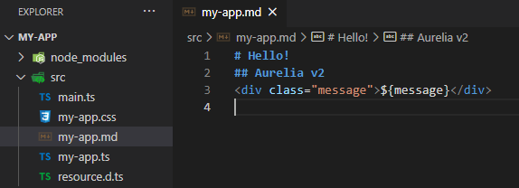

# Markdown Integration

One of the interesting features of Aurelia 2 is the use of different file types such as Markdown as View along with HTML. To do this, follow the steps below:

Create a skeleton with `Webpack` as a bundler and add `markdown-loader` configuration at the end of the`rules` as following:

```javascript
// webpack.config.js

// ...
module: {
  rules: [
    // ...
    { test: /\.md$/i, use: ['@aurelia/webpack-loader', 'markdown-loader'], exclude: /node_modules/ }
  ]
},
// ...
```

For this setting to work, you need to install the related package as well.

```bash
npm i markdown-loader -D
```

As a final step, we need to introduce the `.md` files into the TypeScript so find the `resource.d.ts` under `src` folder and **append** the following code into it.

```typescript
declare module '*.md' {
  import { IContainer, PartialBindableDefinition } from 'aurelia';
  export const name: string;
  export const template: string;
  export default template;
  export const dependencies: string[];
  export const containerless: boolean | undefined;
  export const bindables: Record<string, PartialBindableDefinition>;
  export const shadowOptions: { mode: 'open' | 'closed' } | undefined;
  export function register(container: IContainer);
}
```

Now, you are able to define`Markdown`files for your views and use them beside HTML files.

```text
my-app.css
my-app.html or my-app.md
my-app.ts
```



