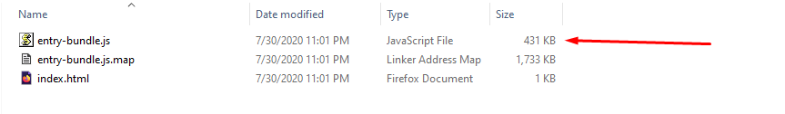

# TailwindCSS Integration

## What is Tailwind CSS?

Tailwind CSS is a highly customizable, low-level CSS framework that gives you all of the building blocks you need to build bespoke designs without any annoying opinionated styles you have to fight to override.

for more information take a look at [Tailwind CSS](https://tailwindcss.com/)

## How to configure an Aurelia 2 project with Tailwind CSS?

1- Run the following command in your terminal

```bash
npx makes aurelia
```

2- Use your type of project, I am using Default Typescript with Webpack and CSS.


3- Install Tailwind CSS in your project via this command

```bash
npm i tailwindcss -D
or
yarn add tailwindcss -D
```

4- After installation go to the root folder and run the below command too

```bash
./node_modules/.bin/tailwind init
```

This command will create a `tailwind.config.js` file in the root folder beside the `webpack.config.js` file with the following content

```typescript
module.exports = {
  purge: [],
  theme: {
    extend: {},
  },
  variants: {},
  plugins: [],
}
```

5- Open your `webpack.config.js` file and add the below line into the `postcssLoader` literal object as a first item in `plugins` array. \(Just like the picture\)

```typescript
require('tailwindcss')('tailwind.config.js'),
```


6- Add these lines to the **top** of your main CSS file \(for example `my-app.css`\)

```css
@tailwind base;
@tailwind components;
@tailwind utilities;
```

## How to test it?

In an easy way you can add the following Tailwind CSS snippet code to your project.

```css
<div class="p-6">
    <div class="bg-red-100 border border-red-400 text-red-700 px-4 py-3 rounded relative" role="alert">
      <strong class="font-bold">Holy smokes!</strong>
      <span class="block sm:inline">Something seriously bad happened.</span>
      <span class="absolute top-0 bottom-0 right-0 px-4 py-3">
        <svg class="fill-current h-6 w-6 text-red-500" role="button" xmlns="http://www.w3.org/2000/svg" viewBox="0 0 20 20"><title>Close</title><path d="M14.348 14.849a1.2 1.2 0 0 1-1.697 0L10 11.819l-2.651 3.029a1.2 1.2 0 1 1-1.697-1.697l2.758-3.15-2.759-3.152a1.2 1.2 0 1 1 1.697-1.697L10 8.183l2.651-3.031a1.2 1.2 0 1 1 1.697 1.697l-2.758 3.152 2.758 3.15a1.2 1.2 0 0 1 0 1.698z"/></svg>
      </span>
    </div>
</div>
```

I have added this to `my-app.html` now you can run the project by

```bash
npm run start
or
yarn run
```

Seems everything works


## What is PurgeCSS?

[Purgecss](https://github.com/FullHuman/purgecss) is a tool to remove unused CSS. It can be used as part of your development workflow. Purgecss comes with a JavaScript API, a CLI, and plugins for popular build tools.

## Why do we need PurgeCSS with Tailwind CSS?

Purgecss is particularly effective with Tailwind because Tailwind generates thousands of utility classes for you, most of which you probably won't actually use. For more information, you can read [Controlling File Size](https://tailwindcss.com/docs/controlling-file-size/).

If you run the `build` command, you will see the final bundle side is huge \(even in production mode\)

```bash
npm run build
or
yarn build
```


## How can we enable PurgeCSS?

Open the `tailwind.config.js` file and replace

```typescript
purge: [],
```

with

```typescript
purge: {
  enabled: true,
  content: ['./src/**/*.html'],
},
```

Now, execute the `build` command again and see the result.



