# Validating Data

This documentation explains how to validate the user input for your app using the validation plugin.
The plugin gives you enough flexibility to write your own rules rather than being tied to any external validation library.


**Here's what you'll learn...**

* How to register and customize the plugin
* How to define the validation rules
* How to validate the data
* How to apply model-based validation rules


> Note If you have already used the `aurelia-validation` plugin previously and are migrating your existing Aurelia app to Aurelia vNext then [jump straight to the migration guide](validating-data.md#migration-guide-and-breaking-changes).

## Getting started

* Install the plugin using:

  ```bash
  npm i @aurelia/validation @aurelia/validation-html
  ```

* Register the plugin in your app with:

  ```typescript
  import { ValidationHtmlConfiguration } from '@aurelia/validation-html';
  import Aurelia from 'aurelia';

  Aurelia
    .register(ValidationHtmlConfiguration)
    .app(component)
    .start();
  ```

* Inject the infra to your view-model and define rules, and use `validate` binding behavior in your markup.

  
  

  ```typescript
  import { IValidationRules } from '@aurelia/validation';
  import { IValidationController } from '@aurelia/validation-html';

  export class AwesomeComponent {
    private person: Person; // Let us assume that we want to validate instance of Person class
    public constructor(
      @newInstanceForScope(IValidationController) private validationController: IValidationController,
      @IValidationRules validationRules: IValidationRules
    ) {
      this.person = new Person();

      validationRules
        .on(this.person)
        .ensure('name')
          .required()
        .ensure('age')
          .required()
          .min(42);
    }

    public async submit() {
      const result = await this.validationController.validate();
      if(result.valid) {
        // Yay!! make that fetch now
      }
    }
  }
  ```

  

  

  ```html
  <form submit.delegate="submit()">
    <input value.bind="person.name & validate">
    <input value.bind="person.age & validate">
  </form>
  ```

  
  

  > `@newInstanceForScope(IValidationController)` injects a new instance of validation controller which is made available to the children of `awesome-component`. More on validation controller [later](validating-data.md#validation-controller).

Here is one similar playable demo, if you want to explore on you own!

<!--<iframe style="width: 100%; height: 400px; border: 0;" loading="lazy" src="https://gist.dumber.app/?gist=3a45de5a62157688181c0c78e5bcd570&open=src%2Fmy-app.ts&open=src%2Fmy-app.html&open=src%2Fmain.ts"></iframe>-->
<!-- {% embed url="https://gist.dumber.app/?gist=3a45de5a62157688181c0c78e5bcd570&open=src%2Fmy-app.ts&open=src%2Fmy-app.html&open=src%2Fmain.ts" %} -->


That's all you need to do to get started with the plugin.
However, read on to understand how the plugin functions, and offers flexible API to support your app.

## Architecture

This section gives a high-level architectural overview.

### Overview

There are three different interrelated packages for validation.
The relation between the packages are depicted in the following diagram.


* `@aurelia/validation`: Provides the core validation functionality. Hosts the validator, out-of-the-box rule implementations, and the validation message provider.
* `@aurelia/validation-html`: Provides the view-specific functionalities such as validation controller, `validate` binding behavior, and subscribers. It wraps the `@aurelia/validation` package so that you do not need to register both packages.
* `@aurelia/validation-i18n`: Provides localized implementation of the validation message provider and validation controller. Wraps the `@aurelia/validation-html` package.

The rest of the document assumes that validation is view is more common scenario.
For that reason, the demos are mostly integrated with view.

### How does it work

* The validationRules (`IValidationRules` instance) allows defining validation rules on a class or object/instance. The defined rules are stored as metadata in a global registry.
  
* The instance of `PropertyRule` instance hold the collection of rules defined for a property. In simplified terms it can be described by the diagram below.
  
* The validator (`IValidator` instance) allows you to execute a [validate instruction](validating-data.md#validator-and-validate-instruction), which instructs which object and property needs to be validated. The validator gets the matching rules from the RulesRegistry (see the diagram above), and executes those.
  
* The last piece of the puzzle is to getting the rules executed on demand. For this the validation controller (`IValidationController` instance) is used along with the `validate` binding behavior (more on these later). The binding behavior registers the property binding with the validation controller, and on configured event, instructs the controller to validate the binding. The validation controller eventually ends up invoking the `IValidator#validate` with certain instruction which triggers the workflow shown in the last diagram. The following diagram shows a simplified version of this.
  

The following sections describe the API in more detail, which will help understanding the concepts further.

## Registering the plugin

The plugin can be registered as follows.

```typescript
import { ValidationHtmlConfiguration } from '@aurelia/validation-html';
import Aurelia from 'aurelia';

Aurelia
  .register(ValidationHtmlConfiguration)
  .app(component)
  .start();
```

This sets up the plugin with the required dependency registrations.
The registration can be customized as well as shown below.

```typescript
import { ValidationHtmlConfiguration } from '@aurelia/validation-html';
import Aurelia from 'aurelia';

Aurelia
  .register(ValidationHtmlConfiguration.customize((options) => {
    // customization callback
    options.DefaultTrigger = customDefaultTrigger;
  }))
  .app(component)
  .start();
```

Following options are available for customizations.

* From `@aurelia/validation`
  * `ValidatorType`: Custom implementation of `IValidator`. Defaults to `StandardValidator`.
  * `MessageProviderType`: Custom implementation of `IValidationMessageProvider`. Defaults to `ValidationMessageProvider`.
  * `ValidationControllerFactoryType`: Custom implementation of factory for `IValidationController`; Defaults to `ValidationControllerFactory`.
  * `CustomMessages`: Custom validation messages.
* From `@aurelia/validation-html`
  * `HydratorType`: Custom implementation of `IValidationHydrator`. Defaults to `ModelValidationHydrator`.
  * `DefaultTrigger`: Default validation trigger. Defaults to `blur`.
  * `UseSubscriberCustomAttribute`: Use the `validation-errors` custom attribute. Defaults to `true`.
  * `SubscriberCustomElementTemplate`: Custom template for `validation-container` custom element. Defaults to the default template of the custom element.

These options are explained in details in the respective sections.
Note that the categorization of the options are done with the intent of clarifying the origin package of each option.
However, as the `@aurelia/validation-html` wraps `@aurelia/validation` all the customization options are available when the `@aurelia/validation-html` package is registered.

The `@aurelia/validation-i18n` package is skipped intentionally for now, as it is discussed in details [later](./validating-data.md#i18n-support).

## Defining rules

Let us also consider the following `Person` class, and we want to define validation rules for this class or instance of this class.

```typescript
export interface Address {
  line1: string;
  line2?: string;
  city: string;
  pin: number;
}

export class Person {
  public constructor(
    public name: string,
    public age: number,
    public email: string,
    public pets: string[],
    public address: Address,
  ) { }
}
```

To define rules use the `IValidationRules` fluent API.
In order to do that you need to use the `@IValidationRules` constructor parameter decorator which will inject an transient instance of `IValidationRules` object.
This is shown in the following example.




```typescript
import { IValidationRules } from '@aurelia/validation';

export class AwesomeComponent {
  public constructor(
    @IValidationRules validationRules: IValidationRules
  ) { }
}
```




The fluent API syntax has following parts.

1. Start applying ruleset on a target using `.on`. The target can be an object instance or class.
2. Select a property from the target using `.ensure`.
3. Associate rules with the property using `.required`, `.matches` etc.
4. Customize the property rules using `.wthMessage`, `.when` etc.

### Specify validation target using `.on`

Be it is an object instance or class, both can be used as validation target using `.on`.




```typescript
const person: Person = new Person(...);
validationRules
  .on(person);
```




```typescript
validationRules
  .on(Person);
```




Specifying the target serves two purposes.
Firstly, this initiates an empty collection of rules (ruleset) for the target.
Secondly, this helps providing the typing information from the target to the subsequent methods which in turn provides with intellisense for the property names (see next section).

### Specifying target property for validation using `.ensure`

The `.ensure` method can be use used select a property of the target for validation.
This adds an instance of `PropertyRule` to the ruleset for the object.
The property can be defined using a string or an arrow function expression.

```typescript
validationRules
  .on(person)
  .ensure('name')                   // string literal
  //...
  .ensure((p) => p.age)             // arrow function expression
  //...
  .ensure("address.line1")          // nested property using string literal
  //...
  .ensure((p) => address.line2)     // nested property using an arrow function expression
  //...
```

With TypeScript support, intellisense is available for both the variants.

### Associating validation rules with property

After selecting a property with `.ensure` the next step is to associate rules.
The rules can be built-in or custom.
Irrespective of what kind of rule it is, at the low-level it is nothing but an instance of the rule class.
For example, the "required" validation is implemented by the `RequiredRule` class.
This will be more clear when you will define custom validation rules.
However, let us take a look at the built-in rules first.

**`required`**

Considers the property to be valid if the value is not `null`, and not `undefined`.
In case of string, it must not be empty.

```typescript
validationRules
  .on(person)
  .ensure('name')
  .required();
```

This instantiates a `RequiredRule` for the property.

<!--<iframe style="width: 100%; height: 400px; border: 0;" loading="lazy" src="https://gist.dumber.app/?gist=3a45de5a62157688181c0c78e5bcd570&open=src%2Fmy-app.ts&open=src%2Fmy-app.html&open=src%2Fmain.ts"></iframe>-->
<!-- {% embed url="https://gist.dumber.app/?gist=3a45de5a62157688181c0c78e5bcd570&open=src%2Fmy-app.ts&open=src%2Fmy-app.html&open=src%2Fmain.ts" %} -->


> Note that this is the only built-in rule that considers `null`, `undefined`, or empty string as invalid value. The other built-in rules purposefully consider `null`, `undefined`, or empty string as valid value. This is done to ensure single responsibility for the built-in rules.

**`matches`**

Considers the string property to be valid if the value matches the given pattern described by a regular expression.

```typescript
validationRules
  .on(person)
  .ensure('name')
  .matches(/foo/); // name is valid if it contains the string 'foo'
```

This instantiates a `RegexRule` for the property.

<!--<iframe style="width: 100%; height: 400px; border: 0;" loading="lazy" src="https://gist.dumber.app/?gist=5e0ef6c9fdcdb9d34927ce2e116b0de7&open=src%2Fmy-app.ts&open=src%2Fmy-app.html&open=src%2Fmain.ts"></iframe>-->
<!-- {% embed url="https://gist.dumber.app/?gist=5e0ef6c9fdcdb9d34927ce2e116b0de7&open=src%2Fmy-app.ts&open=src%2Fmy-app.html&open=src%2Fmain.ts" %} -->


**`email`**

This also instantiates a `RegexRule` for the property, but with a specific regex for matching emails.

```typescript
validationRules
  .on(person)
  .ensure('email')
  .email();     // person's email need to be valid
```

<!--<iframe style="width: 100%; height: 400px; border: 0;" loading="lazy" src="https://gist.dumber.app/?gist=dbf7ec616b3d458e0e980f3c29f2d624&open=src%2Fmy-app.ts&open=src%2Fmy-app.html&open=src%2Fmain.ts"></iframe>-->
<!-- {% embed url="https://gist.dumber.app/?gist=dbf7ec616b3d458e0e980f3c29f2d624&open=src%2Fmy-app.ts&open=src%2Fmy-app.html&open=src%2Fmain.ts" %} -->


**`minLength`**

Considers the string property to be valid if the value is at least of the specified length.
Under the hood, it instantiates a `LengthRule` with minimum length constraint.

```typescript
validationRules
  .on(person)
  .ensure('name')
  .minLength(42);     // name must be at least 42 characters long
```

<!--<iframe style="width: 100%; height: 400px; border: 0;" loading="lazy" src="https://gist.dumber.app/?gist=8bd5721cda282b888d0b640326b399bc&open=src%2Fmy-app.ts&open=src%2Fmy-app.html&open=src%2Fmain.ts"></iframe>-->
<!-- {% embed url="https://gist.dumber.app/?gist=8bd5721cda282b888d0b640326b399bc&open=src%2Fmy-app.ts&open=src%2Fmy-app.html&open=src%2Fmain.ts" %} -->


**`maxLength`**

Considers the string property to be valid if the value is at most of the specified length.
Under the hood, it instantiates a `LengthRule` with maximum length constraint.

```typescript
validationRules
  .on(person)
  .ensure('name')
  .maxLength(42);     // name must be at most 42 characters long
```

<!--<iframe style="width: 100%; height: 400px; border: 0;" loading="lazy" src="https://gist.dumber.app/?gist=35d3ca11fdc8089c362de84498be1e15&open=src%2Fmy-app.ts&open=src%2Fmy-app.html&open=src%2Fmain.ts"></iframe>-->
<!-- {% embed url="https://gist.dumber.app/?gist=35d3ca11fdc8089c362de84498be1e15&open=src%2Fmy-app.ts&open=src%2Fmy-app.html&open=src%2Fmain.ts" %} -->


**`minItems`**

Considers the collection (array) property to be valid if the array has at least the number of items specified by the constraint.
Under the hood, it instantiates a `SizeRule` with minimum size constraint.

```typescript
validationRules
  .on(person)
  .ensure('pets')
  .minItems(42);    // a person should have at least 42 pets
```

<!--<iframe style="width: 100%; height: 400px; border: 0;" loading="lazy" src="https://gist.dumber.app/?gist=abd1f558567e7380876c0c685f8d294a&open=src%2Fmy-app.ts&open=src%2Fmy-app.html&open=src%2Fmain.ts"></iframe>-->
<!-- {% embed url="https://gist.dumber.app/?gist=abd1f558567e7380876c0c685f8d294a&open=src%2Fmy-app.ts&open=src%2Fmy-app.html&open=src%2Fmain.ts" %} -->


**`maxItems`**

Considers the collection (array) property to be valid if the array has at most the number of items specified by the constraint.
Under the hood, it instantiates a `SizeRule` with maximum size constraint.

```typescript
validationRules
  .on(person)
  .ensure('pets')
  .maxItems(42);    // a person should have at most 42 pets
```

<!--<iframe style="width: 100%; height: 400px; border: 0;" loading="lazy" src="https://gist.dumber.app/?gist=154f65652c9bc6d3513867c42fde7dd9&open=src%2Fmy-app.ts&open=src%2Fmy-app.html&open=src%2Fmain.ts"></iframe>-->
<!-- {% embed url="https://gist.dumber.app/?gist=154f65652c9bc6d3513867c42fde7dd9&open=src%2Fmy-app.ts&open=src%2Fmy-app.html&open=src%2Fmain.ts" %} -->


**`min`**

Considers the numeric property to be valid if the value is greater than or equal to the given lower bound.
Under the hood, it instantiates a `RangeRule` with `[min,]` interval (if your unfamiliar with the interval notation, you can refer [this](https://en.wikipedia.org/wiki/Interval_%28mathematics%29#Classification_of_intervals).

```typescript
validationRules
  .on(person)
  .ensure('age')
  .min(42);     // a person should be at least 42 years old
```

<!--<iframe style="width: 100%; height: 400px; border: 0;" loading="lazy" src="https://gist.dumber.app/?gist=25537dd2aa59549d040e6965e0fa2f71&open=src%2Fmy-app.ts&open=src%2Fmy-app.html&open=src%2Fmain.ts"></iframe>-->
<!-- {% embed url="https://gist.dumber.app/?gist=25537dd2aa59549d040e6965e0fa2f71&open=src%2Fmy-app.ts&open=src%2Fmy-app.html&open=src%2Fmain.ts" %} -->


**`max`**

Considers the numeric property to be valid if the value is less than or equal to the given upper bound.
Under the hood, it instantiates a `RangeRule` with `[,max]` interval (if your unfamiliar with the interval notation, you can refer [this](https://en.wikipedia.org/wiki/Interval_%28mathematics%29#Classification_of_intervals).

```typescript
validationRules
  .on(person)
  .ensure('age')
  .max(42);     // a person should be at most 42 years old
```

<!--<iframe style="width: 100%; height: 400px; border: 0;" loading="lazy" src="https://gist.dumber.app/?gist=2e7dbfdee0cbab766935c7d46b9f5bb0&open=src%2Fmy-app.ts&open=src%2Fmy-app.html&open=src%2Fmain.ts"></iframe>-->
<!-- {% embed url="https://gist.dumber.app/?gist=2e7dbfdee0cbab766935c7d46b9f5bb0&open=src%2Fmy-app.ts&open=src%2Fmy-app.html&open=src%2Fmain.ts" %} -->


**`range`**

Considers the numeric property to be valid if the value is greater than or equal to the given lower bound and less than or equal to the given upper bound.
Under the hood, it instantiates a `RangeRule` with `[min,max]` interval (if your unfamiliar with the interval notation, you can refer [this](https://en.wikipedia.org/wiki/Interval_%28mathematics%29#Classification_of_intervals).

```typescript
validationRules
  .on(person)
  .ensure('age')
  .range(42, 84);     // a person's age should be between 42 and 84 or equal to these values
```

<!--<iframe style="width: 100%; height: 400px; border: 0;" loading="lazy" src="https://gist.dumber.app/?gist=379e9f3dcc4cc08cd440653d2c0940d8&open=src%2Fmy-app.ts&open=src%2Fmy-app.html&open=src%2Fmain.ts"></iframe>-->
<!-- {% embed url="https://gist.dumber.app/?gist=379e9f3dcc4cc08cd440653d2c0940d8&open=src%2Fmy-app.ts&open=src%2Fmy-app.html&open=src%2Fmain.ts" %} -->


**`between`**

Considers the numeric property to be valid if the value is strictly greater than the given lower bound and strictly less than the given upper bound.
If the value matches any of the boundary value, it is considered invalid.
Under the hood, it instantiates a `RangeRule` with `(min,max)` interval (if your unfamiliar with the interval notation, you can refer [this](https://en.wikipedia.org/wiki/Interval_%28mathematics%29#Classification_of_intervals).

```typescript
validationRules
  .on(person)
  .ensure('age')
  .between(42, 84);     // a person's age should be between 42 and 84, but cannot be equal to any these values
```

<!--<iframe style="width: 100%; height: 400px; border: 0;" loading="lazy" src="https://gist.dumber.app/?gist=450b17bf4a6774807d193172b180c5a2&open=src%2Fmy-app.ts&open=src%2Fmy-app.html&open=src%2Fmain.ts"></iframe>-->
<!-- {% embed url="https://gist.dumber.app/?gist=450b17bf4a6774807d193172b180c5a2&open=src%2Fmy-app.ts&open=src%2Fmy-app.html&open=src%2Fmain.ts" %} -->


**`equals`**

Considers the property to be valid if the value is strictly equal to the expected value.
Under the hood, it instantiates a `EqualsRule`.

```typescript
validationRules
  .on(person)
  .ensure('name')
  .equals('John Doe');  // Only people named 'John Doe' are valid
```

<!--<iframe style="width: 100%; height: 400px; border: 0;" loading="lazy" src="https://gist.dumber.app/?gist=7dbffc2a9961d5f4de1b9669abc8a7c7&open=src%2Fmy-app.ts&open=src%2Fmy-app.html&open=src%2Fmain.ts"></iframe>-->
<!-- {% embed url="https://gist.dumber.app/?gist=7dbffc2a9961d5f4de1b9669abc8a7c7&open=src%2Fmy-app.ts&open=src%2Fmy-app.html&open=src%2Fmain.ts" %} -->


> Have you noticed that the same rule implementation is "alias"ed for multiple validation rules? You will get know another aspect of aliasing rules in the [customizing validation messages](validating-data.md#customizing-rules) section.

**Custom rules**

There are two ways custom rules can be defined.

* `satisfies`

    This is the easiest way of defining a custom rule using an arrow function that has loosely the following signature.

    ```typescript
    (value: any, object?: any) => boolean | Promise<boolean>;
    ```

    The value of the first argument provides the value being validated, whereas the value of the second argument provides the containing object.
    You can use it as follows.

    ```typescript
    // Let us assume that we do not want to accept "John Doe"s as the input for name
    const testNames = [ "John Doe", "Max Mustermann" ];
    validationRules
      .on(person)
      .ensure('name')
      .satisfies((name) => !testNames.includes(name));
    ```

    This is useful for the rules that are used only in one place.
    For example, in one of view-model you need to apply a very specific rule that is not needed elsewhere.
    However, if you want to reuse you rule, then you need to use the `satisfiesRule`.

<!--<iframe style="width: 100%; height: 400px; border: 0;" loading="lazy" src="https://gist.dumber.app/?gist=87d8206a6d1d4037933ea9e383aabf3e&open=src%2Fmy-app.ts&open=src%2Fmy-app.html&open=src%2Fmain.ts"></iframe>-->
<!-- {% embed url="https://gist.dumber.app/?gist=87d8206a6d1d4037933ea9e383aabf3e&open=src%2Fmy-app.ts&open=src%2Fmy-app.html&open=src%2Fmain.ts" %} -->


* `satisfiesRule`

  This lets reuse a rule implementation.
  For this we need to remember two things.
  Firstly, as mentioned before at the [start of this section](validating-data#associating-validation-rules-with-property) any rule can be applied on a property just by instantiating the rule, and associating with the property.
  Secondly, every rule needs to be a subtype of `BaseValidationRule`, as discussed in [before](validating-data#how-does-it-work).

  The method `satisfiesRule` accepts such an instance of a rule implementation and associates it with the property.
  It can be used as follows.

  ```typescript
  import { BaseValidationRule, IValidateable } from '@aurelia/validation';

  class NotTestName extends BaseValidationRule {
    public constructor(
      private testNames: string[],
    ) {
      super();
    }
    public execute(value: any, _object?: IValidateable): boolean {
      return !this.testNames.includes(value);
    }
  }

  //...

  validationRules
    .on(person)
    .ensure(name)
    .satisfiesRule(new NotTestName([ "John Doe", "Max Mustermann" ]));
  ```

<!--<iframe style="width: 100%; height: 400px; border: 0;" loading="lazy" src="https://gist.dumber.app/?gist=a7e99a9c48fa87b800a250f3bfb3761c&open=src%2Fmy-app.ts&open=src%2Fmy-app.html&open=src%2Fmain.ts"></iframe>-->
<!-- {% embed url="https://gist.dumber.app/?gist=a7e99a9c48fa87b800a250f3bfb3761c&open=src%2Fmy-app.ts&open=src%2Fmy-app.html&open=src%2Fmain.ts" %} -->


  You must have noticed that the API for the built rules instantiates a rule implementation.
  For example, the following two are synonymous.

  ```typescript
  validationRules
    .on(person)
    .ensure('name')
    .required();

  // same can be done by this as well
  import { RequiredRule } from "@aurelia/validation";

  validationRules
    .on(person)
    .ensure('name')
    .satisfiesRule(new RequiredRule());
  ```

  Let us look at one last example before moving to next section.
  The following example implements a integer range rule by inheriting the `RangeRule`.

  ```typescript
  import { RangeRule } from "@aurelia/validation";

  class IntegerRangeRule extends RangeRule {
    public execute(value: any, object?: IValidateable): boolean {
      return value === null
      || value === undefined
      || (Number.isInteger(Number(value))
        && (this.isInclusive
          ? value >= this.min && value <= this.max
          : value > this.min && value < this.max
        ));
    }
  }

  //...

  validationRules
    .on(person)
    .ensure(age)
    .satisfiesRule(new IntegerRangeRule(true, { min:42, max: 84 })); // the age must between 42 and 84 (inclusive) and must be an integer.
  ```

<!--<iframe style="width: 100%; height: 400px; border: 0;" loading="lazy" src="https://gist.dumber.app/?gist=94aeaa114ac92d556d762794b651f375&open=src%2Fmy-app.ts&open=src%2Fmy-app.html&open=src%2Fmain.ts"></iframe>-->
<!-- {% embed url="https://gist.dumber.app/?gist=94aeaa114ac92d556d762794b651f375&open=src%2Fmy-app.ts&open=src%2Fmy-app.html&open=src%2Fmain.ts" %} -->


> In the light of using rule *instance*, note that the the lambda in `satisfies` is actually wrapped in an instance of anonymous subclass of `BaseValidationRule`.

**Defining rules for multiple objects**

Rules on multiple objects can be defined by simply using the API in sequence for multiple objects.
An example is shown below.

```typescript
validationRules
  .on(person1)
  .ensure('name')
  .required()

  .on(person2)
  .ensure('age')
  .required()
```

Note that there is no limitation on how many times `on` is applied on an object or in what order.
The following is a perfectly valid rule definition, although such definition can be difficult to understand.

```typescript
validationRules
  .on(person1)
  .ensure('name')
  .required()

  .on(person2)
  .ensure('name')
  .required()
  .ensure('age')
  .required()

  .on(person1)
  .ensure((o) => o.address.line1)
  .required()
  .on(person1)
  .ensure((o) => o.age)
  .required();
```

### Customizing rules

In this section you will learn about how to customize the rule definition.
A common use-case of that will be to customize the validation messages, as in most of the cases, the default validation messages might not fit the real-life requirements.
Apart from that this section also discusses further ways to change the chaining of the rules.

**Customize the display name**

By default, the display name of the property is computed by splitting on capital letters and capitalizing the first letter of the property name.
For example, the property named `age` will appear as "Age" in the validation messages for `age`, or `firstName` becomes "First Name", etc.
It is quite evident that this is limiting in a sense.
However, the display name of the property can easily be changed using `.displayName`.

```typescript
validationRules
  .on(person)
  .ensure("address.line1")
  .displayName("First line of address")
  .required();  // results in validation message: "First line of address is required."
```

<!--<iframe style="width: 100%; height: 400px; border: 0;" loading="lazy" src="https://gist.dumber.app/?gist=fc661ec8026974f6decb580b6da43498&open=src%2Fmy-app.ts&open=src%2Fmy-app.html&open=src%2Fmain.ts"></iframe>-->
<!-- {% embed url="https://gist.dumber.app/?gist=fc661ec8026974f6decb580b6da43498&open=src%2Fmy-app.ts&open=src%2Fmy-app.html&open=src%2Fmain.ts" %} -->


Note that instead of a literal string, a function can also be used to customize the display name.
The function signature is `() => string`;
The following example shows a use case for this where the attempt for a guessing game is validated, and the attempt count is increased with each attempt and shown in the validation message.
Note that some parts of the example is not yet discussed, but those will be addressed in respective sections.

<!--<iframe style="width: 100%; height: 400px; border: 0;" loading="lazy" src="https://gist.dumber.app/?gist=59398645df32122cfeb68e8685e6a4ef&open=src%2Fmy-app.ts&open=src%2Fmy-app.html&open=src%2Fmain.ts"></iframe>-->
<!-- {% embed url="https://gist.dumber.app/?gist=59398645df32122cfeb68e8685e6a4ef&open=src%2Fmy-app.ts&open=src%2Fmy-app.html&open=src%2Fmain.ts" %} -->


**Customize the validation message**

Apart from customizing the display name, you can in fact customize the whole message.
Messages can be customized on a per-instance basis or globally.
Let us first consider the per-instance based customization.

For this, we need to use the `withMessage` method.
The example below shows how it can be used to define different messages for different rule instances.

```typescript
validationRules
  .on(person)
  .ensure("address.line1")
  .required()
  .withMessage("Enter the address line1 to continue.")
  .maxLength(7)
  .withMessage("The address line1 is too long.");
```

<!--<iframe style="width: 100%; height: 400px; border: 0;" loading="lazy" src="https://gist.dumber.app/?gist=cf929a91cb875bd88c27b14e8011e7be&open=src%2Fmy-app.ts&open=src%2Fmy-app.html&open=src%2Fmain.ts"></iframe>-->
<!-- {% embed url="https://gist.dumber.app/?gist=cf929a91cb875bd88c27b14e8011e7be&open=src%2Fmy-app.ts&open=src%2Fmy-app.html&open=src%2Fmain.ts" %} -->


The above examples shows usage of string literal as custom message.
A message template can also be used instead.
The expressions supported in the template are as follows.

* `$object`: The object being validated. Note that any property of the object can thus be accessed in the template.
* `$value`: The value being validated.
* `$displayName`: The display name of the property.
* `$propertyName`: The name of the property.
* `$rule`: The associated rule instance. This is useful to access the properties of the rule instance. For example, you have a custom validation rule, and you want to access the value of some of your rule property in the validation message, this property is what you need to use. This is used in the messages of `RangeRule` to access the "min", and "max" values of the rule instance.
* `$getDisplayName`: It is a function that returns the display name of another given property. This is useful if you want to create a message associating another property.

Let us look at the following example, to understand these better.

<!--<iframe style="width: 100%; height: 400px; border: 0;" loading="lazy" src="https://gist.dumber.app/?gist=311cbeb44313ee9ed54a4b9a4467c7d6&open=src%2Fmy-app.ts&open=src%2Fmy-app.html&open=src%2Fmain.ts"></iframe>-->
<!-- {% embed url="https://gist.dumber.app/?gist=311cbeb44313ee9ed54a4b9a4467c7d6&open=src%2Fmy-app.ts&open=src%2Fmy-app.html&open=src%2Fmain.ts" %} -->


Apart from this the messages the can be customized globally.
You must have noted that same rule implementations are aliased quite frequently.
The same concept is used here as well.

The messages can be customized globally during registering the plugin, using the `CustomMessages` property of the configuration object.




```typescript
import { RequiredRule, RangeRule, } from '@aurelia/validation';
import { ValidationHtmlConfiguration } from '@aurelia/validation-html';
import Aurelia from 'aurelia';

const customMessages: ICustomMessage[] = [
  {
    rule: RequiredRule,
    aliases: [
      { name: 'required', defaultMessage: `\${$displayName} is non-optional.` }
    ],
  },
  {
    rule: RangeRule,
    aliases: [
      { name: 'min', defaultMessage: `\${$displayName} should be at least \${$rule.min}.` },
      { name: 'max', defaultMessage: `\${$displayName} should be at most \${$rule.max}.` },
      { name: 'range', defaultMessage: `\${$displayName} should be between or equal to \${$rule.min} and \${$rule.max}.` },
      { name: 'between', defaultMessage: `\${$displayName} should be between but not equal to \${$rule.min} and \${$rule.max}.` },
    ],
  },
  // ...
];

Aurelia
  .register(
    ValidationHtmlConfiguration
      .customize((options) => {
        options.CustomMessages = customMessages;
      })
  )
  .app(component)
  .start();
```




You are encouraged to play with the following demo; define more rules, change the custom messages, etc. to see it in action.

<!--<iframe style="width: 100%; height: 400px; border: 0;" loading="lazy" src="https://gist.dumber.app/?gist=27399da21435c959a5e4229de5c383b4&open=src%2Fmain.ts&open=src%2Fmy-app.ts&open=src%2Fmy-app.html"></iframe>-->
<!-- {% embed url="https://gist.dumber.app/?gist=27399da21435c959a5e4229de5c383b4&open=src%2Fmain.ts&open=src%2Fmy-app.ts&open=src%2Fmy-app.html" %} -->


Following is the complete list of default messages for the out of the box validation rules.

* `RequiredRule`

  | Alias    | Message template              |
  | -------- | ----------------------------- |
  | required | `${$displayName} is invalid.` |

* `RegexRule`

  | Alias   | Message template                              |
  | ------- | --------------------------------------------- |
  | matches | `${$displayName} is not correctly formatted.` |
  | email   | `${$displayName} is not a valid email.`       |

* `LengthRule`

  | Alias     | Message template                                                                                   |
  | --------- | -------------------------------------------------------------------------------------------------- |
  | minLength | `${$displayName} must be at least ${$rule.length} character${$rule.length === 1 ? '' : 's'}.`      |
  | maxLength | `${$displayName} cannot be longer than ${$rule.length} character${$rule.length === 1 ? '' : 's'}.` |

* `SizeRule`

  | Alias    | Message template                                                                               |
  | -------- | ---------------------------------------------------------------------------------------------- |
  | minItems | `${$displayName} must contain at least ${$rule.count} item${$rule.count === 1 ? '' : 's'}.`    |
  | maxItems | `${$displayName} cannot contain more than ${$rule.count} item${$rule.count === 1 ? '' : 's'}.` |

* `RangeRule`

  | Alias   | Message template                                                                  |
  | ------- | --------------------------------------------------------------------------------- |
  | min     | `${$displayName} must be at least ${$rule.min}.`                                  |
  | max     | `${$displayName} must be at most ${$rule.max}.`                                   |
  | range   | `${$displayName} must be between or equal to ${$rule.min} and ${$rule.max}.`      |
  | between | `${$displayName} must be between but not equal to ${$rule.min} and ${$rule.max}.` |

* `EqualsRule`

  | Alias  | Message template                                  |
  | ------ | ------------------------------------------------- |
  | equals | `${$displayName} must be ${$rule.expectedValue}.` |

Note that a new key can also be added to any out of the box rule, and can be referred from the code using `withMessageKey`.




```typescript
import { RequiredRule } from '@aurelia/validation';
import { ValidationHtmlConfiguration } from '@aurelia/validation-html';
import Aurelia from 'aurelia';

const customMessages: ICustomMessage[] = [
  {
    rule: RequiredRule,
    aliases: [
      { name: 'foobar', defaultMessage: `\${$displayName} is required in foo bar.` }
    ],
  }
];

Aurelia
  .register(
    ValidationConfiguration
      .customize((options) => {
        options.CustomMessages = customMessages;
      })
  )
  .app(component)
  .start();
```




```typescript
// ...
validationRules
  .on(person)
  .ensure('name')
  .required()
  .withMessageKey('foobar');
// ...
```




<!--<iframe style="width: 100%; height: 400px; border: 0;" loading="lazy" src="https://gist.dumber.app/?gist=115bdc1fd460f1469f5500da03064235&open=src%2Fmain.ts&open=src%2Fmy-app.ts&open=src%2Fmy-app.html"></iframe>-->
<!-- {% embed url="https://gist.dumber.app/?gist=115bdc1fd460f1469f5500da03064235&open=src%2Fmain.ts&open=src%2Fmy-app.ts&open=src%2Fmy-app.html" %} -->


If you want to define aliases for your custom rules, you need to decorate the rule class with `validationRule`.

```typescript
import { validationRule, BaseValidationRule } from '@aurelia/validation';

@validationRule({
  aliases: [
    { name: 'key1', defaultMessage: `Message1` },
    { name: 'key2', defaultMessage: `Message2` },
  ]
})
class CustomRule extends BaseValidationRule {
  //...
}
```

Then you can refer the second message by using `.withMessageKey('key2')`.
Refer the demo below, to see this in action.

<!--<iframe style="width: 100%; height: 400px; border: 0;" loading="lazy" src="https://gist.dumber.app/?gist=606cf358fdd58d14cf4848729eec9a48&open=src%2Fmy-app.ts&open=src%2Fmy-app.html&open=src%2Fmain.ts"></iframe>-->
<!-- {% embed url="https://gist.dumber.app/?gist=606cf358fdd58d14cf4848729eec9a48&open=src%2Fmy-app.ts&open=src%2Fmy-app.html&open=src%2Fmain.ts" %} -->


**Conditional Rule**

Often you would want to execute a rule conditionally.
This can be done using the `.when` method.
This method takes a function, with signature `(object: any) => boolean`, as input which is later evaluated during rule evaluation to decide whether or not to execute this rule.
The `object` in the argument of the function is the object being validated.

```typescript
validationRules
  .on(person)
  .ensure("guardianName")
  .required()
  .when((p) => p.age < 18 ); // guardianName is required for a minor
```

<!--<iframe style="width: 100%; height: 400px; border: 0;" loading="lazy" src="https://gist.dumber.app/?gist=7ece8d8c5e13296cacc69a3e8bbcfe39&open=src%2Fmy-app.ts&open=src%2Fmy-app.html&open=src%2Fmain.ts"></iframe>-->
<!-- {% embed url="https://gist.dumber.app/?gist=7ece8d8c5e13296cacc69a3e8bbcfe39&open=src%2Fmy-app.ts&open=src%2Fmy-app.html&open=src%2Fmain.ts" %} -->


**Sequencing Rules**

When multiple rules are defined on a property, the rules are all executed on parallel.
Using `then`, the rules can be chained and executed serially.
This means that if the first rule fails, the second rule is not executed.
A common example is shown below.

```typescript
validationRules
  .on(person)
  .ensure('email')
  .required()
  .email()
  .then()
  .satisfiesRule(new UniqueRule());
```

Assuming there is an implementation of `UniqueRule` that validates the data against the records, existing in data store/backend service.
Such rules can be expensive in nature, and thus it makes sense to execute those when all other preconditions are validated.
In the above example if either of the `required` or `email` rules fails, the `UniqueRule` will never be executed.
Verify this in the demo shown below.

<!--<iframe style="width: 100%; height: 400px; border: 0;" loading="lazy" src="https://gist.dumber.app/?gist=c3ef11edf8feca7cea0275fc179cc160&open=src%2Fmy-app.ts&open=src%2Fmy-app.html"></iframe>-->
<!-- {% embed url="https://gist.dumber.app/?gist=c3ef11edf8feca7cea0275fc179cc160&open=src%2Fmy-app.ts&open=src%2Fmy-app.html" %} -->


### Validating object

So far we have seen how to define validation rules on properties.
Validation rules can also be applied on an object using `ensureObject`, and validate the object as a whole.

```typescript
validationRules
  .on(person)
  .ensureObject()
  .satisfies((p) => p.name === 'Foo' && p.age === 42);
```

<!--<iframe style="width: 100%; height: 400px; border: 0;" loading="lazy" src="https://gist.dumber.app/?gist=70572608599cfee591ba80a9e494dd87&open=src%2Fmy-app.ts&open=src%2Fmy-app.html"></iframe>-->
<!-- {% embed url="https://gist.dumber.app/?gist=70572608599cfee591ba80a9e494dd87&open=src%2Fmy-app.ts&open=src%2Fmy-app.html" %} -->


## Validator and validate instruction

In all the demos so far we have seen usage of validation controller.
Under the hood, validation controller uses the `IValidator` API to perform the validation.

Loosely the interface looks as follows.

```typescript
interface IValidator {
  validate(instruction: ValidateInstruction<any>): Promise<ValidationResult[]>;
}
```

It has only a single method called `validate`, which accepts an instruction that describes what needs to be be validated.

The plugin ships a standard implementation of the `IValidator` interface.
This can be injected to manually perform the validation on objects.
Note that validator is the core component that executes the validation rules without any connection with the view.
This is the main difference between validator and validation controller.
The following example shows how to use it.

```typescript
export class AwesomeComponent {

  private person: Person;
  private errors: string[];

  public constructor(
     @IValidator private validator: IValidator,
     @IValidationRules validationRules: IValidationRules
  ) {
      this.person = new Person();
      validationRules
        .on(this.person)
          .ensure("name")
          .required();
    }

  public async submit(){
    const result = await this.validator.validate(new ValidateInstruction(this.person));
    console.log(result);
    this.errors = result.filter((r) => !r.valid).map((r) => r.message);
  }
}
```

<!--<iframe style="width: 100%; height: 400px; border: 0;" loading="lazy" src="https://gist.dumber.app/?gist=6d5ec84b163215dd47495e41eeb940b8&open=src%2Fmy-app.ts&open=src%2Fmy-app.html&open=src%2Fmain.ts"></iframe>-->
<!-- {% embed url="https://gist.dumber.app/?gist=6d5ec84b163215dd47495e41eeb940b8&open=src%2Fmy-app.ts&open=src%2Fmy-app.html&open=src%2Fmain.ts" %} -->


> An important aspect of the demo above is that it shows how to use `@aurelia/validation` without the `@aurelia/validation-html`.

Let us now focus on the `ValidateInstruction`, which basically instructs the validator, on what to validate.
The instruction can be manipulated using the following optional class properties.

* `object`: The object to validate.
* `propertyName`: The property name to validate.
* `rules`: The specific rules to execute.
* `objectTag`: When present instructs to validate only specific ruleset defined for a object. Tagging is discussed in detail in the respective [section](validating-data.md#tagging-rules)
* `propertyTag`: When present instructs to validate only specific ruleset for a property. Tagging is discussed in detail in the respective [section](validating-data.md#tagging-rules)

Some of the useful combinations are as follows.

| `object` | `propertyName` | `rules` | `objectTag` | `propertyTag` | Details                                                                                    |
| -------- | -------------- | ------- | ----------- | ------------- | ------------------------------------------------------------------------------------------ |
| ✔        |                |         |             |               | The default ruleset defined on the instance or the class are used for validation.          |
| ✔        | ✔              |         |             |               | Only the rules defined for the particular property are used for validation.                |
| ✔        |                | ✔       | -           |               | Only the specified rules are used for validation.                                          |
| ✔        | ✔              | ✔       | -           |               | Only the specified rules that are associated with the property are used for validation.    |
| ✔        |                |         | ✔           |               | Only the tagged ruleset for the object is used for validation.                             |
| ✔        | ✔              |         | ✔           |               | Only the rules for the property in the tagged ruleset are used for validation.             |
| ✔        | ✔              |         | ✔           | ✔             | Only the tagged rules for the property in the tagged ruleset for the object are validated. |

Note that in the presence of `rules` the `objectTag` is ignored.
However, we strongly encourage the usage of tags for executing specific set of rules.
You can find more details on tagging in [Tagging rules](validating-data.md#tagging-rules) section.
Note that the validate instruction is also respected by [validation controller](validating-data.md#validation-controller).

## Tagging rules

Tagging rules involves marking a rule or ruleset for a property or an object with a string identifier, namely tag.
Later the tag can be used to selectively execute specific set of rules.
Note that every set of rules defined on an object has a tag.
When the tag is omitted, a default tag for the ruleset is used for the objects.

Tags can be defined both with objects and properties.
Refer the following examples.

```typescript
/* tagged rule definition */

// default tag
validationRules
  .on(person)
  .ensure('name')

// specific tags on object
validationRules
  .on(person, 'ruleset1')
  //...
  .on(person, 'ruleset2')
  //...

// specific tag on property rules
validationRules
  .on(person)
    .ensure('name')
    .minLength(42)
    .tag('ruleset1')
    .minLength(84)
    .tag('ruleset2')


/* executing tagged rules */

// default tag
validator.validate(new ValidateInstruction(person));
validator.validate(new ValidateInstruction(person, 'name'));

// specific object tag
validator.validate(new ValidateInstruction(person, undefined, 'ruleset1'));

// specific property tag
validator.validate(new ValidateInstruction(person, 'name', undefined, 'ruleset1'));
```

<!--<iframe style="width: 100%; height: 400px; border: 0;" loading="lazy" src="https://gist.dumber.app/?gist=fa08f913ac506f7f150fc6ff8115e589&open=src%2Fmy-app.ts&open=src%2Fmy-app.html"></iframe>-->
<!-- {% embed url="https://gist.dumber.app/?gist=fa08f913ac506f7f150fc6ff8115e589&open=src%2Fmy-app.ts&open=src%2Fmy-app.html" %} -->


## Model-based validation

It is a commonly known best practice to perform the data validation both on the server and the client.
Validating the data on server reduces the coupling between the client and the server as then the service do not have to depend for the data quality, solely on the client.
The client side validation on the other hand is equally important to ensure better user experience, so that the client can quickly provide feedback to the end users, without making a roundtrip to the server.
For this reason, it is often the case that the validation rules are defined on server, and the client ends up duplicating those definitions.

With the support of model-based validation, `@aurelia/validation` plugin tries to reduce the duplication.
For this we assume that the server is capable of communicating the validation rules with the client in form of json data.
The plugin uses an implementation of `IValidationHydrator` to adapt the json data to aurelia validation rules.
Let us see an example of this.

<!--<iframe style="width: 100%; height: 400px; border: 0;" loading="lazy" src="https://gist.dumber.app/?gist=9a27bcf1caec45f5aa5bba4f8831be5d&open=src%2Fmodel-based-rules.ts&open=src%2Fmy-app.ts&open=src%2Fmy-app.html"></iframe>-->
<!-- {% embed url="https://gist.dumber.app/?gist=9a27bcf1caec45f5aa5bba4f8831be5d&open=src%2Fmodel-based-rules.ts&open=src%2Fmy-app.ts&open=src%2Fmy-app.html" %} -->


Let us deconstruct the example.
The method that applies the model based rules is the following (refer `my-app.ts`).

```typescript
validationRules.applyModelBasedRules(Person, personRules);
```

The first argument to the method can be a class or an object instance.
The second argument must be an array of `ModelBasedRule` instances.
This registers the rules for the target class or object instance.
After this the normal validation works as expected, without any further changes.

The `ModelBasedRule` is a simple class that describes the ruleset definition or the json data that describes the validation rules.

```typescript
export class ModelBasedRule {
  public constructor(
    public ruleset: any,
    public tag: string = '__default'
  ) { }
}
```

The constructor of the class as shown above takes 2 arguments.
The first is the ruleset.
The second one is an optional object tag (refer the [validate instruction](validating-data.md#validator-and-validate-instruction)).
The ruleset although typically a plain javascript object, can take any shape that is supported by the implementation of `IValidationHydrator`.

### Default model-based ruleset schema

The out-of-the-box implementation of `IValidationHydrator` supports plain javascript objects with a specific schema.
The expected schema is explained below.

```javascript
{
  "propertyName": {
    // rule definition for this property
    "displayName": "Optional display name for the property",
    "rules": [ // <-- the rules needs to be an array
      // the rules to be validated on parallel needs to go in one object
      {
        "ruleKey1": {  // <-- for the out-of-the-box rule keys see later
          // common properties
          "messageKey": "optional message key",
          "tag": "optional tag",
          "when": "boolean > expression"|function() { return boolean; }, // see later

          // rule specific properties, see later
        },
        "ruleKey2": { /*... */ }
      },
      /**
       * multiple items in the `rules` array means that the subsequent set of rules won't be validated
       * till the preceding rules are successfully validated.
       * It has same effect of sequencing rules using `.then`
       */
      {
        "ruleKey11" : { /*... */ },
        "ruleKey22" : { /*... */ },
      }
    ]
  },
  "navigationProperty": {
    "subProperty": {
      "subSubProperty": { /* rule definition */ } // <-- rules for navigationProperty.subProperty.subSubProperty
    }
  }
}
```

The default implementation also supports defining all the out-of-the-box rules.

| Rule                    | Key         | Rule-specific properties                                                                                                                                                                                                                                                                                                                                                |
| ----------------------- | ----------- | ----------------------------------------------------------------------------------------------------------------------------------------------------------------------------------------------------------------------------------------------------------------------------------------------------------------------------------------------------------------------- |
| Required                | `required`  | None.<br>Example: `{ required: { } }`                                                                                                                                                                                                                                                                                                                                   |
| Regex                   | `regex`     | `pattern`: object describing a `RegExp`. <br>Example: `{ regex: { pattern: { source: 'foo\\d', flag: 'gi' } } }` is equivalent to `/foo\d/gi`                                                                                                                                                                                                                           |
| Maximum length          | `maxLength` | `length`: numeric; maximum length constraint. <br>Example: `{ maxLength: { length: 42 } }`.                                                                                                                                                                                                                                                                             |
| Minimum length          | `minLength` | `length`: numeric; minimum length constraint. <br>Example: `{ minLength: { length: 42 } }`.                                                                                                                                                                                                                                                                             |
| Maximum size            | `maxItems`  | `count`: numeric; maximum size constraint. <br>Example: `{ maxItems: { count: 42 } }`.                                                                                                                                                                                                                                                                                  |
| Minimum size            | `minItems`  | `count`: numeric; minimum size constraint. <br>Example: `{ minItems: { count: 42 } }`.                                                                                                                                                                                                                                                                                  |
| Inclusive numeric range | `range`     | `min`: numeric; lower boundary, optional. <br>`max`: numeric; upper boundary, optional. <br>`isInclusive`: boolean; whether it is an inclusive or exclusive range, defaults to exclusive.<br>Note that either of the `min` or `max` is required.<br>Examples: `{ range: { isInclusive: true, min: 42 } }`, `{ range: { max: 42 } }`, `{ range: { min: 42, max: 84 } }`. |
| Exclusive numeric range | `between`   | Same as `range`. <br>Examples: `{ between: { isInclusive: true, min: 42 } }`, `{ between: { max: 42 } }`, `{ between: { min: 42, max: 84 } }`.                                                                                                                                                                                                                          |
| Equality                | `equals`    | `expectedValue`: any. <br>Examples: `{ equals: { expectedValue: 42 } }`.                                                                                                                                                                                                                                                                                                |

It is also possible to specify a conditional rule, by using a string value that represents a boolean expression.
For example,

```javascript
{ ruleKey: { when: "$object.age > 18" } }
```

Loosely speaking, the expression in `when` will be hydrated to this function expression: `($object) => $object.age > 18`.
Alternatively, if the ruleset is not a plain json, rather a javascript object, a function can be used as well.

```javascript
{ ruleKey: { when: function(person) { return object.age > 18; } } }
```

### Custom rule hydrator

You would want to create custom rule hydrator if you have either one of these use-cases.

1. You have custom rules, and you want to use those in model-based rule json data.
1. You have your own schema for rules or the rules metadata is not even a JSON data.

Implementing a custom hydrator ends up implementing the following interface.

```typescript
export interface IValidationHydrator {
  readonly astDeserializer: Deserializer;
  readonly parser: IExpressionParser;
  readonly messageProvider: IValidationMessageProvider;
  hydrate(raw: any, validationRules: IValidationRules): any;
  hydrateRuleset(ruleset: any, validationRules: IValidationRules): IPropertyRule[];
}
```

Additionally, you need to register your custom hydrator implementation using the `HydratorType` customization option as shown below.

```typescript
import Aurelia from 'aurelia';
import { ValidationConfiguration } from '@aurelia/validation';
import { CustomModelValidationHydrator } './custom-model-validation-hydrator';

Aurelia
  .register(
    ValidationConfiguration.customize((options) => {
      options.HydratorType = CustomModelValidationHydrator; // <-- register the hydrator
    })
  )
  //...
```

Note that the second use-case as stated above probably needs an completely new implementation of this interface, which is in its own merit out-of-the-scope of this documentation.
This section focusses rather on the first use-case.
To that end, you can easily subclass the default implementation to support your custom rule.
Refer the example and the demo below.




```typescript
import { ModelValidationHydrator } from "@aurelia/validation";

export class CustomModelValidationHydrator extends ModelValidationHydrator {

  protected hydrateRule(ruleName: string, ruleConfig: any): IValidationRule {
    switch (ruleName) {
      case 'customRule1':
        return this.hydrateCustomRule1(ruleConfig);

      // here goes more cases for other custom rules

      default:
        return super.hydrateRule(ruleName, ruleConfig);
    }
  }

  private hydrateCustomRule1(ruleConfig: any) {
    const rule = new CustomRule1(ruleConfig.ruleProperty1, ruleConfig.rulePropertyN);
    this.setCommonRuleProperties(ruleConfig, rule);
    return rule;
  }
}
```





```typescript
import Aurelia from 'aurelia';
import { ValidationConfiguration } from '@aurelia/validation';
import { MyApp } from './my-app';
import { CustomModelValidationHydrator } './custom-model-validation-hydrator';

Aurelia
  .register(
    ValidationConfiguration.customize((options) => {
      options.HydratorType = CustomModelValidationHydrator; // <-- register the hydrator
    })
  )
  .app(MyApp)
  .start();
```




<!--<iframe style="width: 100%; height: 400px; border: 0;" loading="lazy" src="https://gist.dumber.app/?gist=d07e3aed9e606424a8f9526d14ebcfe8&open=src%2Fcustom-model-validation-hydrator.ts&open=src%2Fmain.ts&open=src%2Finteger-range-rule.ts&open=src%2Fmodel-based-rules.ts"></iframe>-->
<!-- {% embed url="https://gist.dumber.app/?gist=d07e3aed9e606424a8f9526d14ebcfe8&open=src%2Fcustom-model-validation-hydrator.ts&open=src%2Fmain.ts&open=src%2Finteger-range-rule.ts&open=src%2Fmodel-based-rules.ts" %} -->


## Validation controller

So far the functionalities of the `@aurelia/validation` have been discussed.
The part regarding the integration with view has been kept out of the discussion so far.
This section starts addressing that.

The validation controller is the implementation of `IValidationController` interface.
It acts as a bridge between the validator and the other related components, such as view, binding, and subscribers.
The capabilities of validation controller is discussed below.

### Injecting a controller instance

An instance of the validation controller can be injected using the `@newInstanceForScope(IValidationController)`, and the `@IValidationController` decorator.
The `@newInstanceForScope(IValidationController)` decorator creates a new instance of the validation controller and registers the instance with the dependency inject container.
This same instance can later be made available to the child components using the `@IValidationController` decorator.

```typescript
// parent-ce.ts
import { customElement } from '@aurelia/runtime';
import { newInstanceForScope } from '@aurelia/kernel';
import { IValidationController } from '@aurelia/validation-html';

@customElement({name:'parent-ce', template:`<child-ce></child-ce>`})
export class ParentCe {
  public constructor(
    // new instance of validation controller; let us name it c1
    @newInstanceForScope(IValidationController) private controller: IValidationController
  ) { }
}

// child-ce.ts
import { IValidationController } from '@aurelia/validation';

export class Parent {
  public constructor(
    // the c1 instance is injected here
    @IValidationController private controller: IValidationController
  ) { }
}
```

> The design decision is made keeping the following frequent use case in mind.
> The manual/final validation happens in the "root"/"parent" component/custom element.
> The child components such as other custom elements define the necessary validation rules in the custom element level, as well as uses the `validate` binding behavior to mark the validation targets in the view/markup.
> This helps showing the validation messages near the validation targets.
> Creating a new instance of the validation controller and registering the instance with the dependency injection container, makes the same instance available to the child components level.
> The instance can then be used for registering the validation targets (see [`validate` binding behavior](validating-data.md#validate-binding-behavior)), which makes it possible to execute all the validation rules defined in the children with a single instance of controller.

A new instance of validation controller can always be injected using the `@newInstanceOf(IValidationController)` decorator.
See this action in the demo below.

<!--<iframe style="width: 100%; height: 400px; border: 0;" loading="lazy" src="https://gist.dumber.app/?gist=86d6dddcdf06e16bdf8a7b788aa15959&open=src%2Fmy-app.ts&open=src%2Fmy-app.html&open=src%2Fperson-partial.ts&open=src%2Fperson-partial.html"></iframe>-->
<!-- {% embed url="https://gist.dumber.app/?gist=86d6dddcdf06e16bdf8a7b788aa15959&open=src%2Fmy-app.ts&open=src%2Fmy-app.html&open=src%2Fperson-partial.ts&open=src%2Fperson-partial.html" %} -->


### `validate` and `reset`

The `validate` method can be used to explicitly/manually perform the validation.
The usage examples are as follows.

```typescript
// validate all registered objects and bindings.
await validationController.validate();

// validate specific instruction
await validationController.validate(new ValidateInstruction(person));
await validationController.validate(new ValidateInstruction(person, 'name'));
```

> This method is in essence similar to the `validate` method in validator.
> However, there are some differences.
> If the method is called with an instruction, the instruction is executed.
> Otherwise all the [registered objects](validating-data.md#addObject-and-removeObject), as well as the [registered bindings](validating-data.> md#validate-binding-behavior) are validated.
> After the validation, all the [registered subscribers](validating-data.md#subscribing-to-validation-result) are notified of the change.
> Refer the [visual representation of the workflow](validating-data.md#how-does-it-work) to understand it better.
> To know more about `ValidateInstruction` refer [this](validating-data.md#Validator-and-validate-instruction).

The `reset` method on the other hand removes the errors from the validation controller.
It also has an optional argument of type `ValidateInstruction` which when provided instructs the controller to remove errors for specific object, and/or properties.
Note that other properties of the instruction object has no effect on resetting the errors.

<!--<iframe style="width: 100%; height: 400px; border: 0;" loading="lazy" src="https://gist.dumber.app/?gist=56355313e67c8f53565d8475cac55cb1&open=src%2Fmy-app.ts&open=src%2Fmy-app.html"></iframe>-->
<!-- {% embed url="https://gist.dumber.app/?gist=56355313e67c8f53565d8475cac55cb1&open=src%2Fmy-app.ts&open=src%2Fmy-app.html" %} -->


### `revalidateErrors`

With the `revalidateErrors` method, it is possible to verify whether the current set of errors are still there.
Note that it does not validates all objects and bindings, as it is done in `validate` method.
It is useful when you don't want to get a new set of errors, and rather check on the current status of the existing set of errors.

```typescript
await validationController.revalidateErrors();
```

<!--<iframe style="width: 100%; height: 400px; border: 0;" loading="lazy" src="https://gist.dumber.app/?gist=950d94ec248471cd37647b811053daba&open=src%2Fmy-app.ts&open=src%2Fmy-app.html"></iframe>-->
<!-- {% embed url="https://gist.dumber.app/?gist=950d94ec248471cd37647b811053daba&open=src%2Fmy-app.ts&open=src%2Fmy-app.html" %} -->


### `addObject` and `removeObject`

The method `addObject` registers an object explicitly to validation controller.
Validation controller automatically validates the object every time the `validate` method is called.
This is useful when you can to validate some object in your view-model, that does not have any direct reference to the view.

The object can be unregistered by calling the `removeObject` method.
This also removes the associated errors of the object.

```typescript
// add object
validationController.addObject(person);

// remove object
validationController.removeObject(person);
```

<!--<iframe style="width: 100%; height: 400px; border: 0;" loading="lazy" src="https://gist.dumber.app/?gist=6a97821e6e13db71aafd50967856841c&open=src%2Fmy-app.ts&open=src%2Fmy-app.html"></iframe>-->
<!-- {% embed url="https://gist.dumber.app/?gist=6a97821e6e13db71aafd50967856841c&open=src%2Fmy-app.ts&open=src%2Fmy-app.html" %} -->


### `addError` and `removeError`

Use the `addError` method to manually add an error to the controller.
The signature of this method is as follows.

```typescript
addError(message: string, object: any, propertyName?: string): ValidationResult;
```

Note that this method returns an instance of `ValidationResult` which later can be used with `removeError` to clear the error.

```typescript
// add error
const result= validationController.addError("Some critical error", person);

// remove error
validationController.removeError(result);
```

Note that the errors added by the `addError` method, never gets revalidated when `revalidateErrors` is called.
If the error needs to be removed, it must be done using `removeError` method.

<!--<iframe style="width: 100%; height: 400px; border: 0;" loading="lazy" src="https://gist.dumber.app/?gist=b5db8659d6b46dacb7dfc1c72e646780&open=src%2Fmy-app.ts&open=src%2Fmy-app.html"></iframe>-->
<!-- {% embed url="https://gist.dumber.app/?gist=b5db8659d6b46dacb7dfc1c72e646780&open=src%2Fmy-app.ts&open=src%2Fmy-app.html" %} -->


### `addSubscriber` and `removeSubscriber`

The subscribers can be added or removed using `addSubscriber` and `removeSubscriber` methods respectively.
Whenever, the validation controller performs validation or resets errors, the registered subscribers are notified of the change in validation results.
To unsubscribe the validation results notification, the subscriber needs to be removed.

The subscriber interface is rather simple, consisting of only one method.

```typescript
interface ValidationResultsSubscriber {
  handleValidationEvent(event: ValidationEvent): void;
}
```

The notification event data looks loosely like following.

```typescript
class ValidationEvent {
  public kind: 'validate' | 'reset';
  public addedResults: ValidationResultTarget[];
  public removedResults: ValidationResultTarget[];
}

class ValidationResultTarget {
  public result: ValidationResult;
  public targets: Element[];
}

class ValidationResult<TRule extends BaseValidationRule = BaseValidationRule> {
    public valid: boolean;
    public message: string | undefined;
    public propertyName: string | undefined;
    public object: any;
    public rule: TRule | undefined;
    public propertyRule: PropertyRule | undefined;
    // `true` if the validation result is added manually.
    public isManual: boolean = false;
}
```

What the subscribers do with the event data, depends on the subscribers.
A obvious use-case is to present the errors to the end-users.
In fact the [out-of-the-box subscribers](validating-data.md#displaying-errors) are used for the purpose only.
Below is one example of how you can create a custom subscriber.

<!--<iframe style="width: 100%; height: 400px; border: 0;" loading="lazy" src="https://gist.dumber.app/?gist=51923879d83c2dc7016141343e73cd31&open=src%2Fresult-subscriber.ts&open=src%2Fmy-app.ts&open=src%2Fmy-app.html"></iframe>-->
<!-- {% embed url="https://gist.dumber.app/?gist=51923879d83c2dc7016141343e73cd31&open=src%2Fresult-subscriber.ts&open=src%2Fmy-app.ts&open=src%2Fmy-app.html" %} -->


## `validate` binding behavior

The `validate` binding behavior, as the name suggests adds the validation behavior to a property binding.
In other words, it "mark"s the associated property binding as a target for validation, by registering the binding to the validation controller.
This is how the validation controller comes to know of the bindings that needs to be validated when `validationController.validate()` method is called.

You must have noticed plenty example of the `validate` binding behavior in the demos so far.
For completeness, this can be used as follows.

```html
<html-element target.bind="source & validate:[trigger]:[validationController]:[rules]"></html-element>
```

Note that the binding behavior has three optional arguments, namely trigger, validation controller, and rules.

### Validation trigger

This dictates when the validation is performed.
The valid values are as follows.

* `manual`: Use the controller's `validate()` method to validate all bindings.
<!--<iframe style="width: 100%; height: 400px; border: 0;" loading="lazy" src="https://gist.dumber.app/?gist=3e158b91575b79de1bbaf3a13f320ed1&open=src%2Fmy-app.html&open=src%2Fmy-app.ts"></iframe>-->
<!-- {% embed url="https://gist.dumber.app/?gist=3e158b91575b79de1bbaf3a13f320ed1&open=src%2Fmy-app.html&open=src%2Fmy-app.ts" %} -->


* `blur`:  Validate the binding when the binding's target element fires a DOM "blur" event.
<!--<iframe style="width: 100%; height: 400px; border: 0;" loading="lazy" src="https://gist.dumber.app/?gist=8a4cba70eaf4cc2d698ddb8c96524c10&open=src%2Fmy-app.html&open=src%2Fmy-app.ts"></iframe>-->
<!-- {% embed url="https://gist.dumber.app/?gist=8a4cba70eaf4cc2d698ddb8c96524c10&open=src%2Fmy-app.html&open=src%2Fmy-app.ts" %} -->


* `focusout`:  Validate the binding when the binding's target element fires a DOM "focusout" event. This is useful when the actual input is wrapped in a custom element and the `validate` binding behavior is used on the custom element. In that case the `blur` trigger does not work as the `blur` event does not bubble. See the difference in action below.
<!--<iframe style="width: 100%; height: 400px; border: 0;" loading="lazy" src="https://gist.dumber.app/?gist=ba271394705e4b8c040f9090c634baff&open=src%2Fmy-app.html&open=src%2Fmy-app.ts"></iframe>-->
<!-- {% embed url="https://gist.dumber.app/?gist=ba271394705e4b8c040f9090c634baff&open=src%2Fmy-app.html&open=src%2Fmy-app.ts" %} -->


* `change`: Validate the binding when the source property property is updated (usually triggered by some change in view).
<!--<iframe style="width: 100%; height: 400px; border: 0;" loading="lazy" src="https://gist.dumber.app/?gist=56010d78f8e00e6a329c7ce622d99f0a&open=src%2Fmy-app.html&open=src%2Fmy-app.ts"></iframe>-->
<!-- {% embed url="https://gist.dumber.app/?gist=56010d78f8e00e6a329c7ce622d99f0a&open=src%2Fmy-app.html&open=src%2Fmy-app.ts" %} -->


* `changeOrBlur`: Validate the binding when the binding's target element fires a DOM "blur" event as well as when the source property is updated.
<!--<iframe style="width: 100%; height: 400px; border: 0;" loading="lazy" src="https://gist.dumber.app/?gist=be889598bc49d871ee462877985e36ea&open=src%2Fmy-app.html&open=src%2Fmy-app.ts"></iframe>-->
<!-- {% embed url="https://gist.dumber.app/?gist=be889598bc49d871ee462877985e36ea&open=src%2Fmy-app.html&open=src%2Fmy-app.ts" %} -->


* `changeOrFocusout`: Validate the binding when the binding's target element fires a DOM "focusout" event as well as when the source property is updated.
<!--<iframe style="width: 100%; height: 400px; border: 0;" loading="lazy" src="https://gist.dumber.app/?gist=e3a8a0609c2b723caa9c59b7309f81ce&open=src%2Fmy-app.html&open=src%2Fmy-app.ts"></iframe>-->
<!-- {% embed url="https://gist.dumber.app/?gist=e3a8a0609c2b723caa9c59b7309f81ce&open=src%2Fmy-app.html&open=src%2Fmy-app.ts" %} -->


 There is an important point to note about the `changeOrEVENT` triggers.
 The change-triggered validation is ineffective till the associated property is validated once, either by manually calling `ValidationController#validate` or by event-triggered (`blur` or `focusout`) validation.
 This prevents showing validation failure message immediately in case of an incomplete input, which might be the case if validation is triggered for every change.
 Note the distinction made between incomplete and invalid input.
 The event-triggered validation is ineffective until the property is dirty; i.e. any changes were made to the property.
 This prevents showing a validation failure message when there is a `blur` or `focusout` event without changing the property.
 This behavior delays "punish"ing the user and "reward"s eagerly.

The examples aboves shows an explicit usage of trigger.
However this is a optional value; when used it overrides the default trigger configured.
When the value is omitted the default trigger is used for that instance.
The default validation trigger is `focusout`, although it can be changed using the `DefaultTrigger` registration customization option.

```typescript
import { ValidationHtmlConfiguration, ValidationTrigger } from '@aurelia/validation-html';
import Aurelia from 'aurelia';

Aurelia
  .register(ValidationHtmlConfiguration.customize((options) => {
    // customization callback
    options.DefaultTrigger = ValidationTrigger.changeOrFocusout;
  }))
  .app(component)
  .start();
```

### Explicit validation controller

The binding behavior by default registers the binding to the closest (in terms of dependency injection container) available instance of validation controller.
Note that the validation controller instance can be made available for the scope using the `@newInstanceForScope` decorator (refer [Injecting a controller instance](validating-data.md#injecting-a-controller-instance) for more details).
If no instance of validation controller is available, it throws error.

However, an instance of validation can be explicitly bound to the binding behavior, using the positional argument.
This is useful when you need to use multiple instances of validation controller to perform different set of validation.
In the example below, there are two injected controllers and the property `person.age` the `validationController2` is used.
Playing with the example you can see that the `person.age` does not get validated by the scoped validation controller instance.

<!--<iframe style="width: 100%; height: 400px; border: 0;" loading="lazy" src="https://gist.dumber.app/?gist=4c914071a28238425ac1b6f8e664901b&open=src%2Fmy-app.html&open=src%2Fmy-app.ts"></iframe>-->
<!-- {% embed url="https://gist.dumber.app/?gist=4c914071a28238425ac1b6f8e664901b&open=src%2Fmy-app.html&open=src%2Fmy-app.ts" %} -->


## Displaying errors

The validation controller maintains the active list of validation results which can be iterated to display the errors in UI.

```html
<ul>
  <li repeat.for="result of validationController.results">
    <template if.bind="!result.valid">${result}</template>
  </li>
</ul>
```

<!--<iframe style="width: 100%; height: 400px; border: 0;" loading="lazy" src="https://gist.dumber.app/?gist=eadef7045bb99a4ebe251c5efd69ead5&open=src%2Fmy-app.html&open=src%2Fmy-app.ts"></iframe>-->
<!-- {% embed url="https://gist.dumber.app/?gist=eadef7045bb99a4ebe251c5efd69ead5&open=src%2Fmy-app.html&open=src%2Fmy-app.ts" %} -->


There are also some out-of-the-box components that can be used to display the errors.
These are discussed in the following sections.

## `validation-errors` custom attribute

This custom attribute can be used to bind the errors for children the target elements.

```html
<div validation-errors.from-view="nameErrors"> <!--binds all errors for name to the "nameErrors" property-->
  <input value.bind="person.name & validate">
  <div>
    <span repeat.for="error of nameErrors">${error.result.message}</span>
  </div>
</div>
<div validation-errors.from-view="ageErrors"> <!--binds all errors for age to the "ageErrors" property-->
  <input value.bind="person.age & validate">
  <div>
    <span repeat.for="error of ageErrors">${error.result.message}</span>
  </div>
</div>
```

Note that this in itself does not show any error, unless errors are iterated to be bound with the view.
An example can be seen below.

<!--<iframe style="width: 100%; height: 400px; border: 0;" loading="lazy" src="https://gist.dumber.app/?gist=5c6bffb7f9fdcfccac6dfb57b1e6523e&open=src%2Fmy-app.html&open=src%2Fmy-app.ts"></iframe>-->
<!-- {% embed url="https://gist.dumber.app/?gist=5c6bffb7f9fdcfccac6dfb57b1e6523e&open=src%2Fmy-app.html&open=src%2Fmy-app.ts" %} -->


A point to note is that multiple validation targets can also be used for a single `validation-errors` custom attribute, and the errors for multiple targets will be captured the same way.

```html
<div validation-errors.from-view="errors"> <!--binds all errors for name, and age to the "errors" property-->
  <input value.bind="person.name & validate">
  <input value.bind="person.age & validate">
  <div>
    <span repeat.for="error of errors">${error.result.message}</span>
  </div>
</div>
```

The usage of this custom element can be deactivated by using `UseSubscriberCustomAttribute` configuration option.

```typescript
import { ValidationHtmlConfiguration } from '@aurelia/validation-html';
import Aurelia from 'aurelia';

Aurelia
  .register(ValidationHtmlConfiguration.customize((options) => {
    // customization callback
    options.UseSubscriberCustomAttribute = false;
  }))
  .app(component)
  .start();
```

This is useful if you have a custom attribute of the same name, and want to use that over this out-of-the-box custom attribute.

### `validation-container` custom element

The `validation-container`custom element also has similar goal of capturing the validation errors for the children target elements.
Additionally, it provides a template to display the errors as well.
This helps in reducing the boilerplate created by the `validation-errors` custom attribute.
For example, using this custom element, displaying the errors reduces to the following.

```html
<validation-container>
  <input value.bind="person.name & validate">
</validation-container>
<validation-container>
  <input value.bind="person.age & validate">
</validation-container>
```

<!--<iframe style="width: 100%; height: 400px; border: 0;" loading="lazy" src="https://gist.dumber.app/?gist=a8eaf96a1aab35d142055086bd717cab&open=src%2Fmy-app.ts&open=src%2Fmy-app.html"></iframe>-->
<!-- {% embed url="https://gist.dumber.app/?gist=a8eaf96a1aab35d142055086bd717cab&open=src%2Fmy-app.ts&open=src%2Fmy-app.html" %} -->


There are couple of important points to note about the examples shown above.
The first validation target shown in the example uses the default template of the custom element.
This custom element template is based on two `slot`s as shown below.

```html
<slot>
  <!--meant for validation target-->
</slot>
<slot name='secondary'>
  <!--here goes error-->
</slot>
```

The results of using the default template may not also suite your app or esthetics.
However content can be injected into the slot from Light DOM (in case you are unfamiliar with the concepts, you are encouraged to give this [excellent article](https://developers.google.com/web/fundamentals/web-components/shadowdom#styling) a read) as shown in the example.
Although traditionally the default slot is meant for the validation target(s), it can also be used to inject the error template, as shown in the example above.

It is quite understandable that the CSS-containment of the Shadow DOM can come in the way of styling the custom element as per your need.
It can be argued that this can be facilitated using CSS variables extensively.
However, there is a far easy alternative to reach the same goal is offered by facilitating the customization of the whole template.
To this end, use the `SubscriberCustomElementTemplate` configuration option.

<!--<iframe style="width: 100%; height: 400px; border: 0;" loading="lazy" src="https://gist.dumber.app/?gist=a0e2134dcfffc0fd32bbdfa0bb8405a3&open=src%2Fmain.ts&open=src%2Fvalidation-container-template.html&open=src%2Fmy-app.ts&open=src%2Fmy-app.html"></iframe>-->
<!-- {% embed url="https://gist.dumber.app/?gist=a0e2134dcfffc0fd32bbdfa0bb8405a3&open=src%2Fmain.ts&open=src%2Fvalidation-container-template.html&open=src%2Fmy-app.ts&open=src%2Fmy-app.html" %} -->


There is another aspect of this configuration option.
When a `null`, `undefined`, or '' (empty string) is used as the value for this configuration option, it deactivates the usage of this custom element.
This is in sense similar to the `UseSubscriberCustomAttribute` configuration option.

### `ValidationResultPresenterService`

Unlike the previous two approaches, this is a standalone service that manipulates the DOM directly.
That it adds elements to DOM for every new errors and removes elements from DOM that are associated with old errors.

To use this, you need to instantiate it and register it with the validation controller.

```typescript
import { IValidationController, ValidationResultPresenterService } from '@aurelia/validation';

export class MyApp {
  private presenter: ValidationResultPresenterService;

  public constructor(
     @newInstanceForScope(IValidationController) private validationController: IValidationController,
  ) {
      this.presenter = new ValidationResultPresenterService();
      this.validationController.addSubscriber(this.presenter);
  }
}
```

<!--<iframe style="width: 100%; height: 400px; border: 0;" loading="lazy" src="https://gist.dumber.app/?gist=1d2eadca8b559d169819bd2ca93888a6&open=src%2Fmy-app.ts&open=src%2Fmy-app.html"></iframe>-->
<!-- {% embed url="https://gist.dumber.app/?gist=1d2eadca8b559d169819bd2ca93888a6&open=src%2Fmy-app.ts&open=src%2Fmy-app.html" %} -->


The error rendering process can be completely overridden in the child classes.
The use methods for overriding are described below.

* `add`: this adds a new error to DOM. Override this if you want to completely change the process of adding new errors.
* `remove`: this removes an old error from the DOM. Override this if you want to completely change the process of removing old errors.
* `getValidationMessageContainer`: As the name suggests it provides container element with respect to current target. The default behavior is to look for an element with the attribute `validation-result-container` that is contained by the parent element of the current target element. If there is none found a `div` is created with the attribute and appended to the parent element.
* `showResults`: This is the method that appends the errors to the container. By default a `span` with the error message is added for every errors whereas the valid results are skipped.

To avoid direct DOM manipulation, it is highly encouraged to use the previously mentioned custom attribute, and custom element.

> One commonality across these components is that all these are different implementations of the [`ValidationResultsSubscriber` interface](validating-data.md#addSubscriber-and-removeSubscriber).

<!-- TODO -->
<!-- ## Integrations with other libraries

v8n? -->

## I18N Support

If you are already using the `aurelia/i18n` plugin, then you would naturally want the localization support for validation as well.
The out-of-the-box localization support is provided by the `@aurelia/validation-i18n` package.
The plugin has dependency on [`@aurelia/i18n` package](internationalization.md).
It assumes that the `@aurelia/i18n` package is correctly registered/configured and simply uses the I18N services to provide the translations.

To add the localization support you must first register the plugin.

```typescript
import Aurelia from 'aurelia';
import { ValidationI18nConfiguration } from '@aurelia/validation-i18n'; // <-- get the configuration
import { I18nConfiguration } from '@aurelia/i18n';
import { MyApp } from './my-app';
import * as en from "./locales/en.json";
import * as de from "./locales/de.json";

Aurelia
  .register(
    I18nConfiguration.customize((options) => { // <-- take care of I18N configuration as you see fit
      options.initOptions = {
        resources: {
          en: { translation: en },
          de: { translation: de },
        }
      };
    }),
    ValidationI18nConfiguration // <-- register the configuration
  )
  .app(MyApp)
  .start();

```

Note that the `@aurelia/validation-i18n` wraps the `@aurelia/validation` plugin.
Stated differently, it [customizes](validating-data.md#registering-the-plugin) the `@aurelia/validation` plugin with custom implementations of the following:

* Validation controller factory ( see the `ValidationControllerFactoryType` customization option): This ensures that the validation controller reacts to locale change.
* Message provider (see the `MessageProviderType` customization option): This ensures that localized error message templates, and property names are used to create the error messages. With this place, the evaluated `expr` in `withMessageKey(expr)` is used as an I18N key, and the value is looked up in the I18N resources. This happens also for the display names of the properties, where the property name is used as the I18N key.

Check the demo to see this in action.

<!--<iframe style="width: 100%; height: 400px; border: 0;" loading="lazy" src="https://gist.dumber.app/?gist=b4994288b5c91cc9d9eb94def72fca26&open=src%2Fmy-app.ts&open=src%2Fmain.ts&open=src%2Flocales%2Fen.json&open=src%2Flocales%2Fde.json"></iframe>-->
<!-- {% embed url="https://gist.dumber.app/?gist=b4994288b5c91cc9d9eb94def72fca26&open=src%2Fmy-app.ts&open=src%2Fmain.ts&open=src%2Flocales%2Fen.json&open=src%2Flocales%2Fde.json" %} -->


All the configuration options of the `@aurelia/validation` plugin are also available from `@aurelia/validation-i18n`.
This means it even allows you provide your own implementation of message provider or validation controller factory!
Apart from that it has two additional configuration options that dictates how the value of the I18N keys are looked up.

* `DefaultNamespace`

  By default the value of the keys are searched in `translation` namespace.
  Using this configuration option that can be changed.
  This is useful if you want to keep the validation resources separate from your regular 18N resources.
  See the example below.

<!--<iframe style="width: 100%; height: 400px; border: 0;" loading="lazy" src="https://gist.dumber.app/?gist=7659284c799ec6215968ef9111ff2b95&open=src%2Fmain.ts&open=src%2Flocales%2Fen-validation.json&open=src%2Flocales%2Fde-validation.json"></iframe>-->
<!-- {% embed url="https://gist.dumber.app/?gist=7659284c799ec6215968ef9111ff2b95&open=src%2Fmain.ts&open=src%2Flocales%2Fen-validation.json&open=src%2Flocales%2Fde-validation.json" %} -->


* `DefaultKeyPrefix`

  Instead of using a separate namespace a key prefix can be used for the keys related to validation resources.
  This is shown in the example below.

<!--<iframe style="width: 100%; height: 400px; border: 0;" loading="lazy" src="https://gist.dumber.app/?gist=8631eae51a833f27411725c8ab85ec5a&open=src%2Fmain.ts&open=src%2Flocales%2Fen.json&open=src%2Flocales%2Fde.json"></iframe>-->
<!-- {% embed url="https://gist.dumber.app/?gist=8631eae51a833f27411725c8ab85ec5a&open=src%2Fmain.ts&open=src%2Flocales%2Fen.json&open=src%2Flocales%2Fde.json" %} -->


  Naturally, the `DefaultNamespace` and the `DefaultKeyPrefix` can be used together.

<!--<iframe style="width: 100%; height: 400px; border: 0;" loading="lazy" src="https://gist.dumber.app/?gist=54309a17b89925b4fadb50f068f5bdf9&open=src%2Fmain.ts&open=src%2Flocales%2Fen-ns1.json&open=src%2Flocales%2Fde-ns1.json"></iframe>-->
<!-- {% embed url="https://gist.dumber.app/?gist=54309a17b89925b4fadb50f068f5bdf9&open=src%2Fmain.ts&open=src%2Flocales%2Fen-ns1.json&open=src%2Flocales%2Fde-ns1.json" %} -->


It should not come as any surprise that localization also works for [model-based rules](validating-data.md#model-based-validation), when appropriate `messageKey` is specified in the rule definition.

<!--<iframe style="width: 100%; height: 400px; border: 0;" loading="lazy" src="https://gist.dumber.app/?gist=9bc5b730ad55625131845d68d6c645b3&open=src%2Fmy-app.ts&open=src%2Fmodel-based-rules.ts&open=src%2Flocales%2Fen.json&open=src%2Flocales%2Fde.json"></iframe>-->
<!-- {% embed url="https://gist.dumber.app/?gist=9bc5b730ad55625131845d68d6c645b3&open=src%2Fmy-app.ts&open=src%2Fmodel-based-rules.ts&open=src%2Flocales%2Fen.json&open=src%2Flocales%2Fde.json" %} -->


## Migration Guide and Breaking Changes

This section outlines the breaking changes introduced by `@aurelia/validation*` as compared to the predecessor `aurelia-validation`.
However, it is recommended that you read the documentation as there are many new features that has been added.

* Instead of a single validation package, the functionalities are arranged in [three different packages](validating-data.md#architecture). These are `@aurelia/validation` (provides core functionalities), `@aurelia/validation-html` (provides integration with view), and `@aurelia/validation-i18n` (provides localization support for validation in view).
* Usage of `ValidationRules` in terms of defining rules is bit different. The example below shows the difference. Refer the [Defining rules](validating-data.md#defining-rules) section for the details.

  ```typescript
  // aurelia-validation
    ValidationRules
      .ensure('firstName')
      .required()
      .on(this.person);

  // @aurelia/validation
  import { IValidationRules } from '@aurelia/validation';
  //...
  constructor(
    @IValidationRules validationRules: IValidationRules
  ) {
    ValidationRules
      .on(this.person)
      .ensure('firstName')
      .required();
  }
  ```

* Named registration of reusable custom rules is not supported any longer in favor of simply using an instance of the rule implementation. The example below shows the difference. Refer the [Customizing rules](validating-data.md#customizing-rules) section for the details.

  ```typescript
  // aurelia-validation
  ValidationRules.customRule(
    'customRule',
    // rule body
    // rule config
  );

  ValidationRules
    .ensure('property')
      .satisfiesRule('customRule' ...);

  // @aurelia/validation
  class CustomRule extends BaseValidationRule { // of implements IValidationRule
    // rule config
    public execute() {
      // rule body
    }
  }

  validationRules
    .on(obj)
    .ensure('property')
      .satisfiesRule(new CustomRule(...));
  ```

* Validator interface has been changed to have only one method named `validate` equipped with validate instruction. Refer the [Validator and validate instruction](validating-data.md#validator-and-validate-instruction) section for the details.
* Usage of validation controller factory is changed. Instead of using `controllerFactory.createForCurrentScope();` you need to use the argument decorator `@newInstanceForScope(IValidationController)` syntax. Refer the [Injecting a controller instance](validating-data.md#injecting-a-controller-instance) section for the details.
* No validation renderer in favor of `ValidationResultsSubscriber`. Refer the [`addSubscriber` and `removeSubscriber`](validating-data.md#addSubscriber-and-removeSubscriber) section for the details.
