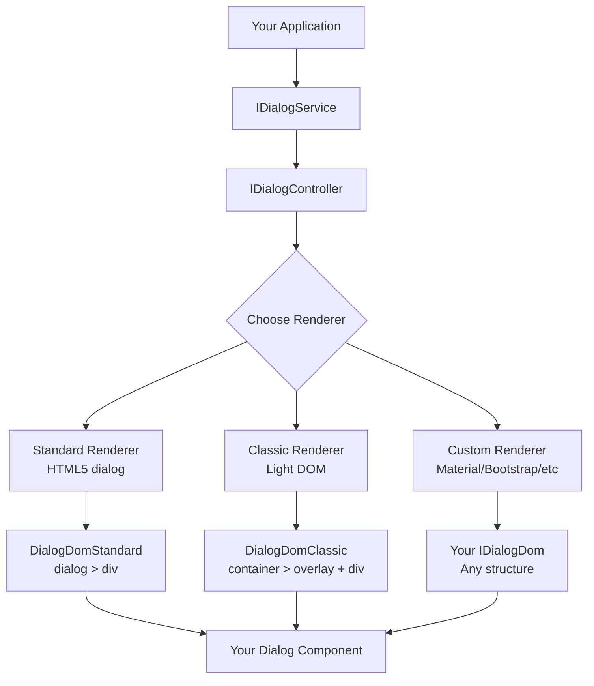
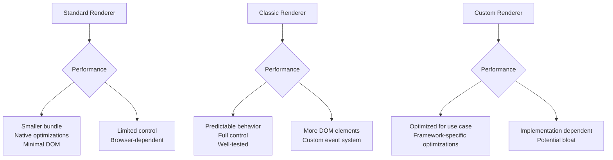
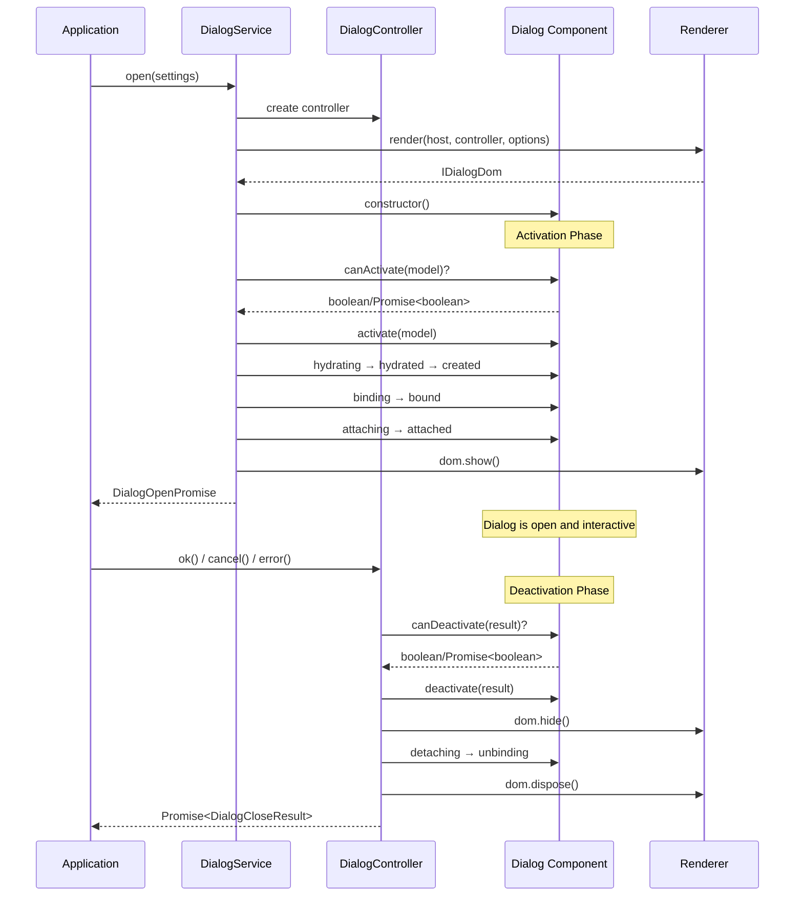
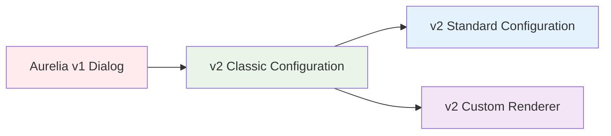

# Dialog

## Introduction

The Aurelia dialog plugin is a modular and pluggable system that serves as a bridge between Aurelia and different UI framework dialog implementations. Rather than being a single dialog implementation, it provides an extensible architecture where different renderers can be plugged in to support various dialog styles and behaviors.

The plugin comes with two built-in renderer implementations:
- Standard: Uses the modern HTML5 `<dialog>` element
- Classic: A light DOM implementation similar to Aurelia v1 (ideal for migration)

The modular design makes it easy to create custom renderers for specific UI frameworks or design requirements.


**Here's what you'll learn...**

* How to install & configure the plugin with different renderers
* Understanding the modular renderer architecture
* How to use the Standard and Classic implementations
* How to create your own custom dialog renderer
* Advanced configuration and lifecycle management


## Plugin Architecture

The dialog plugin is built around a modular renderer system that bridges Aurelia with any UI framework:



### Core Interfaces

| Interface | Purpose | Implementation |
|-----------|---------|----------------|
| `IDialogService` | Main API for opening/managing dialogs | Single service per app |
| `IDialogController` | Controls individual dialog instances | One per dialog |
| `IDialogDomRenderer<TOptions>` | Pluggable renderer interface | Standard, Classic, or Custom |
| `IDialogDom` | Dialog DOM abstraction | Renderer-specific implementation |


**Modular Benefits**
- Choose between built-in renderers (Standard, Classic)
- Create custom renderers for specific UI frameworks
- Mix different renderers within the same application
- Migrate gradually from v1 dialog implementations


## Installing The Plugin

Aurelia provides three configuration options for the dialog plugin:

### Option 1: Standard Configuration (Recommended)

Uses the modern HTML5 `<dialog>` element with native modal behavior:

```typescript
import { DialogConfigurationStandard } from '@aurelia/dialog';
import { Aurelia } from 'aurelia';

Aurelia.register(DialogConfigurationStandard).app(MyApp).start();
```

Best for: New applications, modern browsers, native accessibility features

### Option 2: Classic Configuration (Migration-Friendly)

Uses a light DOM implementation similar to Aurelia v1:

```typescript
import { DialogConfigurationClassic } from '@aurelia/dialog';
import { Aurelia } from 'aurelia';

Aurelia.register(DialogConfigurationClassic).app(MyApp).start();
```

Best for: Migrating from Aurelia v1, custom styling requirements, older browser support

### Option 3: Base Configuration (Custom Renderer)

Provides the core infrastructure without a default renderer:

```typescript
import { DialogConfiguration } from '@aurelia/dialog';
import { Aurelia } from 'aurelia';

Aurelia.register(DialogConfiguration.customize(settings => {
  // Register your custom renderer here
  settings.renderer = MyCustomRenderer;
})).app(MyApp).start();
```

Best for: Custom UI framework integration, specific design requirements

## Choosing the Right Configuration

Use this guide to select the best dialog configuration for your project:




| Factor | Standard | Classic | Custom |
|--------|----------|---------|---------|
| Browser Support | Modern (dialog support) | All browsers | Depends on implementation |
| Accessibility | Built-in | Manual setup | Manual setup |
| Styling Control | Limited backdrop | Full control | Full control |
| Animation Support | Via callbacks | Via callbacks | Full control |
| Migration from v1 | Requires changes | Minimal changes | Complete rewrite |
| UI Framework Integration | Limited | Some styling | Perfect integration |





Choose Standard When:
- Building a new application
- Modern browser support is acceptable
- You want native accessibility features
- Simple styling requirements
- You prefer web standards

Choose Classic When:
- Migrating from Aurelia v1
- Need full styling control
- Supporting older browsers
- Complex z-index management required
- Custom event handling needed

Choose Custom When:
- Integrating with UI frameworks (Material, Bootstrap, Ant Design)
- Specific design system requirements
- Need complete control over DOM structure
- Building reusable dialog library
- Advanced animation requirements










### Global Configuration

Each configuration can be customized to set global defaults for all dialogs. Call `.customize()` on your chosen configuration:




Configure global defaults for the Standard renderer:

```typescript
import { DialogConfigurationStandard } from '@aurelia/dialog';
import { Aurelia } from 'aurelia';

Aurelia
  .register(DialogConfigurationStandard.customize((settings) => {
    // Global service settings
    settings.rejectOnCancel = true; // Treat cancellation as promise rejection

    // Global Standard renderer options
    settings.options.modal = true; // Always open as modal by default
    settings.options.show = (dom) => {
      // Custom show animation for all dialogs
      return dom.root.animate([
        { transform: 'scale(0.8)', opacity: 0 },
        { transform: 'scale(1)', opacity: 1 }
      ], { duration: 200 }).finished;
    };
    settings.options.hide = (dom) => {
      // Custom hide animation for all dialogs
      return dom.root.animate([
        { transform: 'scale(1)', opacity: 1 },
        { transform: 'scale(0.8)', opacity: 0 }
      ], { duration: 200 }).finished;
    };
    settings.options.overlayStyle = 'background: rgba(0, 0, 0, 0.6)';
  }))
  .app(MyApp)
  .start();
```



Configure global defaults for the Classic renderer:

```typescript
import { DialogConfigurationClassic } from '@aurelia/dialog';
import { Aurelia } from 'aurelia';

Aurelia
  .register(DialogConfigurationClassic.customize((settings) => {
    // Global service settings
    settings.rejectOnCancel = true; // Treat cancellation as promise rejection

    // Global Classic renderer options
    settings.options.lock = false; // Allow ESC key and overlay clicks
    settings.options.overlayDismiss = true; // Click outside to close
    settings.options.keyboard = ['Escape', 'Enter']; // Keys that close dialog
    settings.options.startingZIndex = 2000; // Higher z-index for overlays
    settings.options.show = (dom) => {
      // Custom show animation
      return dom.contentHost.animate([
        { transform: 'translateY(-50px)', opacity: 0 },
        { transform: 'translateY(0)', opacity: 1 }
      ], { duration: 300 }).finished;
    };
    settings.options.hide = (dom) => {
      // Custom hide animation
      return dom.contentHost.animate([
        { transform: 'translateY(0)', opacity: 1 },
        { transform: 'translateY(-50px)', opacity: 0 }
      ], { duration: 300 }).finished;
    };
  }))
  .app(MyApp)
  .start();
```



If it's desirable to change some of the default implementations, we can **instead** use the export named `DialogConfiguration` and pass in the list of implementation for the main interfaces:

```typescript
import { DialogConfiguration } from '@aurelia/dialog';

Aurelia
  .register(DialogConfiguration.customize(
    settings => {
      // customize settings here if needed
    }))
  .app(MyApp)
  .start();
```

## Using The Default Implementations

### The Dialog Settings

There are two levels where dialog behaviors can be configured:

* Global level via `IDialogGlobalSettings`
* Single dialog level via dialog service `.open()` call, or the property `settings` on a dialog controller.

Normally, the global settings would be changed during the app startup/or before, while the single dialog settings would be changed during the contruction of the dialog view model, via the `open` method.

1. An example of configuring the **global** dialog settings:
    - For the standard implementation:
        Make all dialogs, by default:
        * show as modal
        * has some basic animation in & out

        ```ts
        Aurelia
          .reigster(DialogConfigurationStandard.customize((settings) => {
            settings.options.modal = true;
            settings.options.show = (dom) => dom.root.animate(...);
            settings.options.hide = (dom) => dom.root.animate(...);
          }))
          .app(MyApp)
          .start();
        ```
    - For the classic implementation:
        Make all dialogs, by default:
        * not dismissable by clicking outside of it, or hitting the ESC key
        * have starting CSS `z-index` of 5
        *   if not locked, closable by hitting the `ESC` key

            ```ts
            Aurelia
              .register(DialogConfigurationClassic.customize((settings) => {
                settings.options.lock = true;
                settings.options.startingZIndex = 5;
                settings.options.keyboard = true;
              }))
              .app(MyApp)
              .start();
            ```

2. An example of configuring a single dialog, via `open` method of the dialog service:
    - For the standard implementation:
        Displaying an alert dialog

        ```ts
        dialogService.open({
          component: Alert,
          options: {
            // block the entire screen with this alert box
            modal: true,
            show: dom => dom.root.animate(...),
            hide: dom => dom.root.animate(...)
          }
        })
        ```

    - For the classic implementation:
        Displaying an alert dialog, which has `z-index` value as 10 to stay on top of all other dialogs, and will be dismissed when the user hits the `ESC` key.

        ```typescript
        dialogService.open({
          component: Alert,
          options: {
            lock: false,
            startingZIndex: 10,
          }
        });
        ```

The main settings that are available in the `open` method of the dialog service:

* `component` can be class reference or instance, or a function that resolves to such, or a promise of such.
* `template` can be HTML elements, string or a function that resolves to such, or a promise of such.
* `model` the data to be passed to the `canActivate` and `activate` methods of the view model if implemented.
* `host` allows providing the element which will parent the dialog - if not provided the document body will be used.
* `renderer` allows providing a custom renderer to be used, instead of the pre-registered one. This allows a single dialog service to be able to use multiple renderers for different purposes: default for modals, and a different one for notifications, alert etc...
* `container` allows specifying the DI Container instance to be used for the dialog. If not provided a new child container will be created from the root one.
* `rejectOnCancel` is a boolean that must be set to `true` if cancellations should be treated as rejection. The reason will be an `IDialogCancelError` - the property `wasCancelled` will be set to `true` and if cancellation data was provided it will be set to the `value` property.
* `options` options passed to the renderer.

## Renderer Options Reference

Each renderer supports different configuration options. Here are the complete option sets:

### Standard Renderer Options (`DialogRenderOptionsStandard`)

```typescript
interface DialogRenderOptionsStandard {
  modal?: boolean;                                    // Default: true
  overlayStyle?: string | Partial<CSSStyleDeclaration>;
  show?: (dom: DialogDomStandard) => void | Promise<void>;
  hide?: (dom: DialogDomStandard) => void | Promise<void>;
  closedby?: 'any' | 'closerequest' | 'none';
}
```

Option Details:
- `modal`: Controls whether the dialog opens as modal (`showModal()`) or modeless (`show()`). Modal dialogs block interaction with the rest of the page and display a backdrop.
- `overlayStyle`: CSS styling for the `::backdrop` pseudo-element (only applies when `modal: true`). Can be a CSS string or style object.
- `show`: Animation callback called when dialog is shown. Return a Promise to wait for animations.
- `hide`: Animation callback called when dialog is hidden. Return a Promise to wait for animations.
- `closedby`: HTML5 dialog attribute controlling which user actions can close the dialog. See [MDN documentation](https://developer.mozilla.org/en-US/docs/Web/HTML/Reference/Elements/dialog#closedby).

Default Global Settings:
```typescript
{
  modal: true,
  rejectOnCancel: false
}
```

### Classic Renderer Options (`DialogRenderOptionsClassic`)

```typescript
interface DialogRenderOptionsClassic {
  lock?: boolean;                                     // Default: true
  keyboard?: DialogActionKey[];                       // ['Escape', 'Enter'] when lock: false, [] when lock: true
  mouseEvent?: 'click' | 'mouseup' | 'mousedown';    // Default: 'click'
  overlayDismiss?: boolean;                           // Default: !lock
  startingZIndex?: number;                            // Default: 1000
  show?: (dom: DialogDomClassic) => void | Promise<void>;
  hide?: (dom: DialogDomClassic) => void | Promise<void>;
}

type DialogActionKey = 'Escape' | 'Enter';
```

Option Details:
- `lock`: When `true`, prevents dialog dismissal via ESC key or overlay clicks. Takes precedence over `keyboard` and `overlayDismiss`.
- `keyboard`: Array of keys that close the dialog. `'Escape'` cancels, `'Enter'` confirms. When `lock: false`, defaults to `['Enter', 'Escape']`. When `lock: true`, defaults to `[]`.
- `mouseEvent`: Which mouse event type triggers overlay dismiss logic.
- `overlayDismiss`: When `true`, clicking outside the dialog cancels it. Defaults to `!lock` value.
- `startingZIndex`: Base z-index for dialog wrapper and overlay elements.
- `show`/`hide`: Animation callbacks with access to `DialogDomClassic` instance.

Default Global Settings:
```typescript
{
  lock: true,
  startingZIndex: 1000,
  rejectOnCancel: false
}
```

### DOM Structure Comparison



Uses the native HTML5 `<dialog>` element:

```html
<dialog>                    <!-- HTMLDialogElement, root -->
  <div>                     <!-- contentHost -->
    <!-- Your component content renders here -->
  </div>
</dialog>
```

Characteristics:
- Native modal behavior with `showModal()`
- Built-in ESC key handling
- Native `::backdrop` pseudo-element
- Accessibility features built-in
- Limited styling control of backdrop



Uses traditional light DOM elements:

```html
<au-dialog-container>       <!-- wrapper/root -->
  <au-dialog-overlay>       <!-- overlay for backdrop -->
  </au-dialog-overlay>
  <div>                     <!-- contentHost -->
    <!-- Your component content renders here -->
  </div>
</au-dialog-container>
```

Characteristics:
- Full styling control over all elements
- Custom event management system
- Z-index stacking control
- Compatible with older browsers
- Similar to Aurelia v1 behavior



## Service & Controller APIs

### IDialogService Interface

```typescript
interface IDialogService {
  readonly controllers: IDialogController[];

  /**
   * Opens a new dialog.
   * @param settings - Dialog settings for this dialog instance.
   * @returns DialogOpenPromise - Promise resolving to dialog controller and open result
   */
  open<TOptions, TModel = any, TComponent extends object = any>(
    settings: IDialogSettings<TOptions, TModel, TComponent>
  ): DialogOpenPromise;

  /**
   * Closes all open dialogs at the time of invocation.
   * @returns Promise<IDialogController[]> - Controllers whose close operation was cancelled
   */
  closeAll(): Promise<IDialogController[]>;
}
```

### IDialogController Interface

```typescript
interface IDialogController {
  readonly settings: IDialogLoadedSettings;
  /**
   * A promise that will be fulfilled once this dialog has been closed
   */
  readonly closed: Promise<DialogCloseResult>;

  ok(value?: unknown): Promise<DialogCloseResult<'ok'>>;
  cancel(value?: unknown): Promise<DialogCloseResult<'cancel'>>;
  error(value?: unknown): Promise<void>;
}
```

### DialogOpenPromise Interface

The `open()` method returns a special promise with additional methods:

```typescript
interface DialogOpenPromise extends Promise<DialogOpenResult> {
  /**
   * Add a callback that will be invoked when a dialog has been closed
   */
  whenClosed<TResult1, TResult2>(
    onfulfilled?: (value: DialogCloseResult) => TResult1 | Promise<TResult1>,
    onrejected?: (reason: unknown) => TResult2 | Promise<TResult2>
  ): Promise<TResult1 | TResult2>;
}
```

### Dialog Settings Interface

Complete settings interface with all available options:

```typescript
interface IDialogSettings<TOptions = any, TModel = any, TComponent extends object = object> {
  /**
   * Custom renderer for the dialog
   */
  renderer?: Constructable<IDialogDomRenderer<TOptions>> | IDialogDomRenderer<TOptions>;

  /**
   * Component constructor, instance, or function returning component/promise
   */
  component?: CustomElementType<Constructable<TComponent>>
    | Constructable<TComponent>
    | (() => (Constructable<TComponent> | TComponent | Promise<TComponent | Constructable<TComponent>>));

  /**
   * Template string, Element, or function returning template/promise
   */
  template?: string | Element | Promise<string | Element>
    | (() => string | Element | Promise<string | Element>);

  /**
   * Data passed to component lifecycle hooks
   */
  model?: TModel;

  /**
   * Element that will parent the dialog (defaults to document.body)
   */
  host?: Element;

  /**
   * DI container for dialog creation (child container created if not provided)
   */
  container?: IContainer;

  /**
   * Renderer-specific configuration options
   */
  options?: TOptions;

  /**
   * When true, cancellation is treated as promise rejection
   */
  rejectOnCancel?: boolean;
}
```

An important feature of the dialog plugin is that it is possible to resolve and close a dialog (using `cancel`/`ok`/`error` methods on the controller) in the same context where it's open.

*   Example of controlling the opening and closing of a dialog in promise style:

    ```typescript
    import { EditPerson } from './edit-person';
    import { IDialogService, DialogDeactivationStatuses } from '@aurelia/dialog';

    export class Welcome {
      static inject = [IDialogService];

      person = { firstName: 'Wade', middleName: 'Owen', lastName: 'Watts' };
      constructor(dialogService) {
        this.dialogService = dialogService;
      }

      submit() {
        this.dialogService
          .open({ component: () => EditPerson, model: this.person })
          .then(openDialogResult => {
            // Note:
            // We get here when the dialog is opened,
            // and we are able to close dialog
            setTimeout(() => {
              openDialogResult.dialog.cancel('Failed to finish editing after 3 seconds');
            }, 3000);

            // each dialog controller should expose a promise for attaching callbacks
            // to be executed for when it has been closed
            return openDialogResult.dialog.closed;
          })
          .then((response) => {
            if (response.status === 'ok') {
              console.log('good');
            } else {
              console.log('bad');
            }
            console.log(response);
          });
      }
    }
    ```
*   Example of controlling the opening and closing of a dialog using `async/await`:

    ```typescript
    import { EditPerson } from './edit-person';
    import { IDialogService, DialogDeactivationStatuses } from '@aurelia/dialog';

    export class Welcome {
      static inject = [IDialogService];

      person = { firstName: 'Wade', middleName: 'Owen', lastName: 'Watts' };
      constructor(dialogService) {
        this.dialogService = dialogService;
      }

      async submit() {
        const { dialog } = await this.dialogService.open({
          component: () => EditPerson,
          model: this.person
        });
        // Note:
        // We get here when the dialog is opened,
        // and we are able to close dialog
        setTimeout(() => {
          dialog.cancel('Failed to finish editing after 3 seconds');
        }, 3000);

        const response = await dialog.closed;
        if (response.status === 'ok') {
          console.log('good');
        } else {
          console.log('bad');
        }
        console.log(response);
      }
    }
    ```

By default, when an application is destroyed, the dialog service of that application will also try to close all the open dialogs that are registered with it via `closeAll` method. It can also be used whenever there's a need to forcefully close all open dialogs, as per following example:

Given an error list, open a dialog for each error, and close all of them after 5 seconds.

```typescript
import { Alert } from './dialog-alert';
import { IDialogService, DialogDeactivationStatuses } from '@aurelia/dialog';

export class Welcome {
  static inject = [IDialogService];

  constructor(dialogService) {
    this.dialogService = dialogService;
  }

  notifyErrors(errors) {
    // for each of the error in the given error
    errors.forEach(error => {
      this.dialogService.open({ component: () => Alert, model: error });
    });

    setTimeout(() => this.dialogService.closeAll(), 5000);
  }
}
```

If there's no need for the opening result of a dialog, and only the response of it after the dialog has been closed, there is a `whenClosed` method exposed on the returned promise of the `open` method of the dialog service, that should help reduce some boilerplate code, per following example:

```typescript
import { EditPerson } from './edit-person';
import { IDialogService, DialogDeactivationStatuses } from '@aurelia/dialog';

export class Welcome {
  static inject = [IDialogService];

  person = { firstName: 'Wade', middleName: 'Owen', lastName: 'Watts' };
  constructor(dialogService) {
    this.dialogService = dialogService;
  }

  submit() {
    this.dialogService
      .open({ component: () => EditPerson, model: this.person })
      .whenClosed(response => {
        console.log('The edit dialog has been closed');
        if (response.status === 'ok') {
          console.log('good');
        } else {
          console.log('bad');
        }
        console.log(response);
      })
      .catch(err => {
        console.log('Failed to edit person information');
      });
  }
}
```

**Template Only Dialogs**

The dialog service supports rendering dialogs with only template specified. A template only dialog can be open like the following examples:

```typescript
dialogService.open({
  template: () => fetch('https://some-server.com/alert-dialog.html').then(r => r.text()),
  template: () => '<div>Welcome to Aurelia</div>',
  template: '<div>Are you ready?</div>'
})
```

**Retrieving the dialog controller**

By default, the dialog controller of a dialog will be assigned automatically to the property `$dialog` on the component view model. To specify this in TypeScript, the component class can implement the interface `IDialogCustomElementViewModel`:

```typescript
import { IDialogController, IDialogCustomElementViewModel } from '@aurelia/dialog';

class MyDialog implements IDialogCustomElementViewModel {
  $dialog: IDialogController;

  closeDialog() {
    this.$dialog.ok('All good!');
  }
}
```


Note that the property `$dialog` will only be ready after the contructor.


If it's desirable to retrieve the associated dialog controller of a dialog during the constructor of the component, `IDialogController` can be inject to achieve the same effect:

```typescript
import { resolve } from 'aurelia';
import { IDialogController } from '@aurelia/dialog';

class MyDialog {
  constructor() {
    // change some settings
    resolve(IDialogController).settings.zIndex = 100;
  }
}
```

This means it's also possible to control the dialog from template only dialog via the `$dialog` property. An example of this is: Open an alert dialog, and display an "Ok" button to close it, without using any component:

```typescript
dialogService.open({
  template: `<div>
    Please check the oven!
    <button click.trigger="$dialog.ok()">Close and check</button>
  </div>`
})
```

### The Default Dialog Renderer

By default, the dialog DOM structure is rendered as follow:

```
> (1) Dialog host element
  > (2) Dialog Wrapper Element
    > (3) Dialog Overlay Element
    > (4) Dialog Content Host Element
```

The Dialog host element is the target where an application chooses to add the dialog to, this is normally the document body, if not supplied in the settings of the `open` method of the dialog service.

An example of the html structure when document body is the dialog host:

```html
<body>
  <au-dialog-container> <!-- wrapper -->
    <au-dialog-overlay> <!-- overlay -->
    <div> <!-- dialog content host -->
```

#### Centering/Uncentering dialog position

By default, the dialog content host is centered horizontally and vertically. It can be changed via `IDialogDom` injection:

```typescript
import { resolve } from 'aurelia';
import { IDialogDom, DefaultDialogDom } from '@aurelia/dialog';

export class MyDialog {
  constructor(dialogDom: DefaultDialogDom = resolve(IDialogDom)) {
    dialogDom.contentHost.style.margin = "0 auto"; // only center horizontally
  }
}
```


Note that the `contentHost` property on a `DefaultDialogDom` object is the same with the host element of a component. You can inject `IDialogDom` and retrieve the host element via `contentHost` property, or inject `INode`/`Element`/`HTMLElement` to retrieve it.


#### Styling the overlay

1. For the standard implementation

    The overlay of a `<dialog>` element is only "rendered" when it's shown as modal. Which means the following example will not "trigger" any overlay:

    ```ts
    dialogService.open({
      component: Alert,
      options: {
        overlayStyle: 'rgba(0,0,0,0.5)'
      }
    })
    ```
    as `options.modal` value is not `true`.

    When `options.modal` is `true`, the overlay can be specified using `options.overlayStyle` like the following example:

    ```ts
    dialogService.open({
      component: Alert,
      options: {
        modal: true,
        overlayStyle: 'rgba(0,0,0,0.5)'
      }
    })
    ```

    Note that the overlay of a modal dialog dom can also be configured from the dialog dom itself, like the following example:

    ```ts
    import { resolve } from 'aurelia';
    import { IDialogDom, DialogDomStandard } from '@aurelia/dialog';

    export class MyDialog {
      constructor(dialogDom = resolve(IDialogDom) as DialogDomStandard) {
        dialogDom.setOverlayStyle("rgba(0, 0, 0, 0.5)");
      }
    }
    ```

2. For the classic implementation

    By default, the overlay of a dialog is transparent. Though it's often desirable to add 50% opacity and a background color of black to the modal. To achieve this in dialog, retrieve the `IDialogDom` instance and modify the `overlay` element `style`:

    ```typescript
    import { resolve } from 'aurelia';
    import { IDialogDom, DefaultDialogDom } from '@aurelia/dialog';

    export class MyDialog {
      constructor(dialogDom: DefaultDialogDom = resolve(IDialogDom)) {
        dialogDom.overlay.style.backgroundColor = "rgba(0, 0, 0, 0.5)";
      }
    }
    ```

## Creating Custom Dialog Renderers

The dialog plugin's modular architecture makes it easy to create custom renderers for specific UI frameworks, design systems, or unique requirements. A renderer is responsible for creating the DOM structure and managing the dialog's presentation.

### Understanding the Renderer Interface

All dialog renderers must implement the `IDialogDomRenderer<TOptions>` interface:

```typescript
interface IDialogDomRenderer<TOptions = any> {
  render(dialogHost: Element, controller: IDialogController, options: TOptions): IDialogDom;
}
```

The renderer's `render` method returns an `IDialogDom` object that provides the dialog's DOM structure:

```typescript
interface IDialogDom extends IDisposable {
  readonly contentHost: HTMLElement;    // Container for dialog content
  show?(): void | Promise<void>;        // Optional show animation
  hide?(): void | Promise<void>;        // Optional hide animation
}
```

Note: The `IDialogDom` interface only requires `contentHost`. The Standard and Classic implementations extend this with their own properties (`root`, `overlay`, etc.).

### Example: Creating a Material Design Renderer

Let's create a custom renderer that follows Material Design principles:

```typescript
import { DI, IDisposable } from 'aurelia';
import { IDialogDomRenderer, IDialogDom, IDialogController } from '@aurelia/dialog';

// Define custom options for your renderer
interface MaterialDialogOptions {
  elevation?: 1 | 2 | 3 | 4 | 5;
  fullscreen?: boolean;
  persistent?: boolean;
  showBackdrop?: boolean;
}

// Custom DOM implementation
class MaterialDialogDom implements IDialogDom {
  // IDialogDom interface requirement
  public readonly contentHost: HTMLElement;

  // Additional properties for this implementation
  public readonly root: HTMLElement;
  public readonly overlay: HTMLElement | null;

  constructor(
    root: HTMLElement,
    overlay: HTMLElement | null,
    contentHost: HTMLElement,
    private readonly host: Element,
    private readonly options: MaterialDialogOptions
  ) {
    this.root = root;
    this.overlay = overlay;
    this.contentHost = contentHost;
  }

  async show(): Promise<void> {
    // Material Design entrance animation
    const animation = this.root.animate([
      {
        transform: 'translateY(100px) scale(0.8)',
        opacity: 0
      },
      {
        transform: 'translateY(0) scale(1)',
        opacity: 1
      }
    ], {
      duration: 225,
      easing: 'cubic-bezier(0.4, 0.0, 0.2, 1)'
    });

    if (this.overlay) {
      this.overlay.animate([
        { opacity: 0 },
        { opacity: 1 }
      ], { duration: 150 });
    }

    await animation.finished;
  }

  async hide(): Promise<void> {
    // Material Design exit animation
    const animation = this.root.animate([
      {
        transform: 'translateY(0) scale(1)',
        opacity: 1
      },
      {
        transform: 'translateY(100px) scale(0.8)',
        opacity: 0
      }
    ], {
      duration: 195,
      easing: 'cubic-bezier(0.4, 0.0, 1, 1)'
    });

    if (this.overlay) {
      this.overlay.animate([
        { opacity: 1 },
        { opacity: 0 }
      ], { duration: 195 });
    }

    await animation.finished;
  }

  dispose(): void {
    this.host.removeChild(this.root);
    if (this.overlay) {
      this.host.removeChild(this.overlay);
    }
  }
}

// Custom renderer implementation
export class MaterialDialogRenderer implements IDialogDomRenderer<MaterialDialogOptions> {
  render(host: Element, controller: IDialogController, options: MaterialDialogOptions): IDialogDom {
    // Create backdrop if requested
    let overlay: HTMLElement | null = null;
    if (options.showBackdrop !== false) {
      overlay = document.createElement('div');
      overlay.className = 'material-dialog-backdrop';
      overlay.style.cssText = `
        position: fixed;
        top: 0;
        left: 0;
        right: 0;
        bottom: 0;
        background: rgba(0, 0, 0, 0.32);
        z-index: 1000;
      `;

      // Handle backdrop clicks
      if (!options.persistent) {
        overlay.addEventListener('click', () => controller.cancel());
      }

      host.appendChild(overlay);
    }

    // Create main dialog container
    const root = document.createElement('div');
    root.className = 'material-dialog-container';
    root.style.cssText = `
      position: fixed;
      top: 50%;
      left: 50%;
      transform: translate(-50%, -50%);
      z-index: 1001;
      min-width: 280px;
      max-width: 560px;
      max-height: calc(100vh - 64px);
    `;

    // Create content host with Material Design styling
    const contentHost = document.createElement('div');
    contentHost.className = 'material-dialog-content';

    const elevation = options.elevation || 3;
    const boxShadow = [
      '0 3px 1px -2px rgba(0,0,0,.2)',
      '0 2px 2px 0 rgba(0,0,0,.14)',
      '0 1px 5px 0 rgba(0,0,0,.12)'
    ][elevation - 1] || '0 8px 10px 1px rgba(0,0,0,.14)';

    contentHost.style.cssText = `
      background: white;
      border-radius: 4px;
      box-shadow: ${boxShadow};
      overflow: hidden;
      ${options.fullscreen ? 'width: 100vw; height: 100vh; border-radius: 0;' : ''}
    `;

    root.appendChild(contentHost);
    host.appendChild(root);

    // Handle ESC key for non-persistent dialogs
    if (!options.persistent) {
      const handleKeydown = (e: KeyboardEvent) => {
        if (e.key === 'Escape') {
          controller.cancel();
        }
      };
      document.addEventListener('keydown', handleKeydown);

      // Clean up listener when dialog is disposed
      const originalDispose = MaterialDialogDom.prototype.dispose;
      MaterialDialogDom.prototype.dispose = function() {
        document.removeEventListener('keydown', handleKeydown);
        originalDispose.call(this);
      };
    }

    return new MaterialDialogDom(root, overlay, contentHost, host, options);
  }

  // Registration helper
  static register(container: any) {
    return container.register(
      DI.createInterface<IDialogDomRenderer>('IDialogDomRenderer', x => x.singleton(MaterialDialogRenderer))
    );
  }
}
```

### Registering Your Custom Renderer

There are several ways to use your custom renderer:

#### 1. As the Default Renderer

Replace the default renderer globally:

```typescript
import { DialogConfiguration } from '@aurelia/dialog';
import { MaterialDialogRenderer } from './material-dialog-renderer';

Aurelia.register(
  DialogConfiguration.customize(settings => {
    settings.renderer = MaterialDialogRenderer;
    // Set default options for your renderer
    settings.options = {
      elevation: 2,
      showBackdrop: true,
      persistent: false
    };
  })
).app(MyApp).start();
```

#### 2. Per-Dialog Renderer

Use a specific renderer for individual dialogs:

```typescript
dialogService.open({
  component: MyDialogComponent,
  renderer: new MaterialDialogRenderer(),
  options: {
    elevation: 4,
    fullscreen: false,
    persistent: true
  }
});
```

#### 3. Multiple Renderer Support

Register multiple renderers and choose them based on dialog type:

```typescript
// In your dialog service wrapper
class MyDialogService {
  constructor(private dialogService: IDialogService) {}

  openAlert(message: string) {
    return this.dialogService.open({
      template: `<div>${message}</div>`,
      renderer: new MaterialDialogRenderer(),
      options: { elevation: 1, persistent: false }
    });
  }

  openModal(component: any, model?: any) {
    return this.dialogService.open({
      component,
      model,
      renderer: new MaterialDialogRenderer(),
      options: { elevation: 3, showBackdrop: true }
    });
  }

  openFullscreen(component: any, model?: any) {
    return this.dialogService.open({
      component,
      model,
      renderer: new MaterialDialogRenderer(),
      options: { fullscreen: true, persistent: true }
    });
  }
}
```

### Best Practices for Custom Renderers

1. **TypeScript Support**: Define strong types for your renderer options
2. **Accessibility**: Ensure proper ARIA attributes and focus management
3. **Animation**: Use CSS animations or Web Animations API for smooth transitions
4. **Responsive Design**: Handle different screen sizes appropriately
5. **Cleanup**: Always implement proper disposal in the `dispose()` method
6. **Event Handling**: Handle keyboard and mouse events according to your design system
7. **Consistent API**: Keep the same patterns as built-in renderers for familiarity

This modular approach allows you to integrate any UI framework (Bootstrap, Ant Design, Chakra UI, etc.) or create completely custom dialog behaviors while leveraging Aurelia's powerful dialog lifecycle management.

## Error Handling & Promise Rejection

The dialog system includes comprehensive error handling for different scenarios:

### DialogCancelError vs DialogCloseError

When `rejectOnCancel: true` is set, cancellations and errors result in different error types:

```typescript
interface DialogError<T> extends Error {
  wasCancelled: boolean;
  value?: T;
}

// When user cancels dialog (ESC, overlay click, controller.cancel())
type DialogCancelError<T> = DialogError<T> & { wasCancelled: true };

// When dialog.error() is called
type DialogCloseError<T> = DialogError<T> & { wasCancelled: false };
```

### Example: Handling Different Outcomes

```typescript
try {
  const result = await dialogService.open({
    component: ConfirmDialog,
    model: { message: "Delete this item?" },
    rejectOnCancel: true
  });

  // If we reach here, user clicked OK
  console.log('Confirmed:', result.dialog.closed);

} catch (error) {
  if (error.wasCancelled) {
    // User cancelled (ESC, overlay click, Cancel button)
    console.log('User cancelled dialog');
  } else {
    // Error occurred (dialog.error() was called)
    console.error('Dialog error:', error);
  }
}
```

### Using whenClosed for Non-Rejecting Pattern

If you prefer not to use try/catch, use `whenClosed()`:

```typescript
dialogService.open({
  component: MyDialog,
  rejectOnCancel: false  // Default
}).whenClosed(result => {
  if (result.status === 'ok') {
    console.log('Dialog confirmed:', result.value);
  } else if (result.status === 'cancel') {
    console.log('Dialog cancelled:', result.value);
  } else if (result.status === 'error') {
    console.log('Dialog error occurred:', result.value);
  }
});
```

## Animation

#### Using the `IDialogDomAnimator`

If you use either the default implementations of the interface `IDialogRenderer`, then the in/out animations of a dialog can be configured via `show`/`hide`
the options settings, like the following examples:

1. Global animations for all dialogs:

```typescript
Aurelia.register(DialogStandardConfiguration.customize(settings => {
  settings.options.show = (dom) => dom.root.animate([{ transform: 'scale(0)' }, { transform: 'scale(1)' }], { duration: 150 });
}))
```

2. Different animation per dialog `.open()`

```typescript
dialogService.open({
  component: SuccessNotification,
  options: {
    show: dom => dom.root.animate([{ transform: 'scale(0)' }, { transform: 'scale(1)' }], { duration: 150 }),
    hide: dom => dom.root.animate([{ transform: 'scale(1)' }, { transform: 'scale(0)' }], { duration: 150 }),
  }
})
```

#### Using component lifecycles

The lifecycles `attaching` and `detaching` can be used to animate a dialog, as in those lifecycles, if a promise is returned, it will be awaited during the activation/deactivation phases.

An example of animating a dialog on attaching and detaching, with the animation duration of 200 milliseconds:

```typescript
import { resolve } from 'aurelia';

export class MyDialog {
  host: Element = resolve(Element);
  constructor(host: Element) {
    this.host = host;
  }

  attaching() {
    const animation = this.host.animate(
      [{ transform: 'translateY(0px)' }, { transform: 'translateY(-300px)' }],
      { duration: 200 },
    );
    return animation.finished;
  }

  detaching() {
    const animation = this.host.animate(
      [{ transform: 'translateY(-300px)' }, { transform: 'translateY(0)' }],
      { duration: 200 },
    );
    return animation.finished;
  }
}
```

### Component Lifecycles With The Dialog Plugin

In adition to the lifecycle hooks defined in the core templating, the `dialog` defines additional ones. All dialog specific hooks can return a `Promise`, that resolves to the appropriate value for the hook, and will be awaited.

#### `.canActivate()`

This hook can be used to cancel the opening of a dialog. It is invoked with one parameter - the value of the `model` setting passed to `.open()`. To cancel the opening of the dialog return `false` - `null` and `undefined` will be coerced to `true`.

#### `.activate()`

This hook can be used to do any necessary init work. The hook is invoked with one parameter - the value of the `model` setting passed to `.open()`.

#### `.canDeactivate(result: DialogCloseResult)`

This hook can be used to cancel the closing of a dialog. To do so return `false` - `null` and `undefined` will be coerced to `true`. The passed in result parameter has a property `status`, indicating if the dialog was closed or cancelled, or the deactivation process itself has been aborted, and an `value` property with the dialog result which can be manipulated before dialog deactivation.

The `DialogCloseResult` has the following interface:

```typescript
class DialogCloseResult<T extends DialogDeactivationStatuses = DialogDeactivationStatuses, TVal = unknown> {
  readonly status: T;
  readonly value?: TVal;
}

type DialogDeactivationStatuses = 'ok' | 'error' | 'cancel' | 'abort';
```

> Warning When the `error` method of a `DialogController` is called this hook will be skipped.

#### `.deactivate(result: DialogCloseResult)`

This hook can be used to do any clean up work. The hook is invoked with one result parameter that has a property `status`, indicating if the dialog was closed (`Ok`) or cancelled (`Cancel`), and an `value` property with the dialog result.

#### Lifecycle Execution Order

Each dialog instance goes through the complete lifecycle once:




**Lifecycle Hooks:**
- Dialog-specific: `canActivate`, `activate`, `canDeactivate`, `deactivate`
- Aurelia core: `constructor`, `hydrating`, `hydrated`, `created`, `binding`, `bound`, `attaching`, `attached`, `detaching`, `unbinding`


## Creating child dialog

When there are different groups of dialog functionalities that are often repeated across an application, rather than calling `open` with different sets
of settings and trying to manage it correctly, you can also use the child dialog feature.

To use the child dialog feature, you'll need to register the child dialog configuration and resolve the child dialog with some your specific keys,
like the following example:

```ts
Aurelia.register(
  DialogConfigurationStandard
    .customzie(...)
    .withChild(
      'alert',
      settings => {
          setting1 = settings;
      }
    )
    .withChild(
      'confirm',
      settings => {
          setting2 = settings;
      }
    )
);
```
and then later it can be used:
```ts
class MyComponent {
  alertService = resolve(IDialogService.child('alert'));
  confirmService = resolve(IDialogService.child('confirm'));
}
```


## Aurelia v1 to v2 Migration


The Aurelia v1 dialog implementation is available as the **Classic configuration** in v2, making migration straightforward.


### Quick Migration Steps

1. Change your registration:
   ```typescript
   // v1
   .plugin(PLATFORM.moduleName('aurelia-dialog'))

   // v2
   .register(DialogConfigurationClassic)
   ```

2. Update property names:
   | v1 Property | v2 Property | Notes |
   |-------------|-------------|-------|
   | `viewModel` | `component` | Same functionality |
   | `view` | `template` | Same functionality |
   | `controller` | `$dialog` | Property on view model |
   | `closeResult` | `dialog.closed` | Now a promise on controller |

3. Move renderer options:
   ```typescript
   // v1 - options on dialog settings
   dialogService.open({
     viewModel: MyDialog,
     lock: true,
     keyboard: true,
     overlayDismiss: false
   });

   // v2 - options moved to 'options' object
   dialogService.open({
     component: MyDialog,
     options: {
       lock: true,
       keyboard: ['Escape', 'Enter'],
       overlayDismiss: false
     }
   });
   ```

### Breaking Changes Detail




DialogService.open() Changes:
```typescript
// v1 Result
interface DialogOpenResult {
  wasCancelled: boolean;
  controller: DialogController;
  closeResult: Promise<DialogCloseResult>;
}

// v2 Result
interface DialogOpenResult {
  wasCancelled: boolean;
  dialog: IDialogController;        // renamed from 'controller'
  // closeResult removed - use dialog.closed instead
}
```

DialogCloseResult Changes:
```typescript
// v1
interface DialogCloseResult {
  wasCancelled: boolean;
  output?: unknown;
}

// v2
interface DialogCloseResult {
  status: 'ok' | 'cancel' | 'error' | 'abort';  // more specific
  value?: unknown;                               // renamed from 'output'
}
```




Boolean to Array Format:
```typescript
// v1 - Boolean options
{
  keyboard: true,    // Allow ESC to close
  keyboard: false,   // No keyboard interaction
  keyboard: 'Enter'  // String format
}

// v2 - Array format only
{
  keyboard: ['Escape'],        // ESC cancels dialog
  keyboard: ['Enter'],         // ENTER confirms dialog
  keyboard: ['Enter', 'Escape'], // Both keys work
  keyboard: []                 // No keyboard interaction
}
```


Boolean and string variants for `keyboard` are no longer supported in v2.





Controller Property:
```typescript
// v1 - 'controller' property
export class MyDialog {
  controller: DialogController;  // Injected automatically

  close() {
    this.controller.ok('result');
  }
}

// v2 - '$dialog' property
export class MyDialog {
  $dialog: IDialogController;    // Assigned automatically

  close() {
    this.$dialog.ok('result');
  }
}
```

TypeScript Support:
```typescript
// v2 - Implement interface for type safety
import { IDialogCustomElementViewModel } from '@aurelia/dialog';

export class MyDialog implements IDialogCustomElementViewModel {
  readonly $dialog: IDialogController;  // Type-safe property
}
```



### Complete Migration Example




**Migration Strategy:**
1. Start with `DialogConfigurationClassic` for immediate compatibility
2. Test all existing dialogs work correctly
3. Gradually migrate to `DialogConfigurationStandard` for modern features
4. Consider custom renderers for UI framework integration

