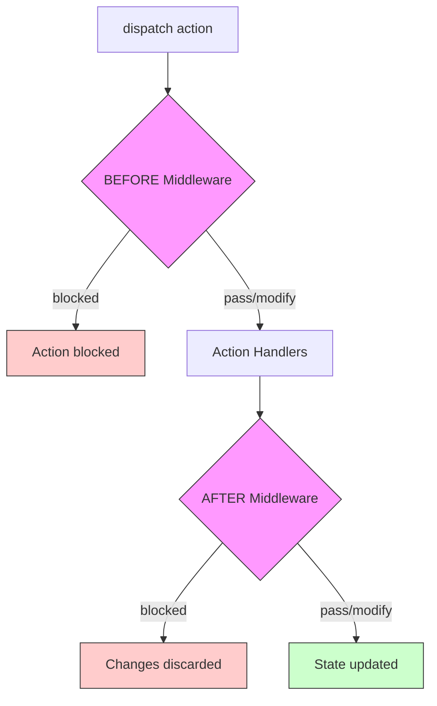

# Middleware

Middleware act as an intermediary step in your application to allow you to intercept, modify, or block state changes. They run either **before** or **after** your action handlers execute, giving you powerful control over state transitions.

## How Middleware Works

Middleware functions receive:
- The current state
- The dispatched action
- Optional settings you provide during registration

They can:
- **Transform state** by returning a new state object
- **Block actions** by returning `false`
- **Pass through** by returning `undefined` or nothing
- **Run asynchronously** by returning a Promise



## Creating Middleware

A middleware function has the following signature:

```typescript
import { IStateMiddleware } from '@aurelia/state';

// Basic middleware (no settings)
const loggingMiddleware: IStateMiddleware<MyState> = (state, action, settings) => {
  console.log('Action dispatched:', action);
  console.log('Current state:', state);
  // Return undefined to pass through without changes
};

// Middleware with settings
interface ValidationSettings {
  strict: boolean;
}

const validationMiddleware: IStateMiddleware<MyState, ValidationSettings> = (state, action, settings) => {
  if (settings.strict && !isValidAction(action)) {
    return false; // Block the action
  }
  // Pass through
};
```

## Registering Middleware

Use `registerMiddleware()` on the store to add middleware. Specify whether it should run `'before'` or `'after'` action handlers:

```typescript
import { resolve } from '@aurelia/kernel';
import { IStore } from '@aurelia/state';

export class MyComponent {
  private store = resolve(IStore);

  bound() {
    // Run before action handlers
    this.store.registerMiddleware(loggingMiddleware, 'before');

    // Run after action handlers, with settings
    this.store.registerMiddleware(validationMiddleware, 'after', { strict: true });
  }

  unbinding() {
    // Clean up middleware when component is destroyed
    this.store.unregisterMiddleware(loggingMiddleware);
    this.store.unregisterMiddleware(validationMiddleware);
  }
}
```

## Common Middleware Patterns

### Logging Middleware

```typescript
import { IStateMiddleware } from '@aurelia/state';

const loggerMiddleware: IStateMiddleware = (state, action) => {
  console.group('State Change');
  console.log('Action:', action);
  console.log('State before:', state);
  console.groupEnd();
  // Return undefined to pass through
};

// Register as 'before' to log before state changes
store.registerMiddleware(loggerMiddleware, 'before');
```

### Validation Middleware

```typescript
import { IStateMiddleware } from '@aurelia/state';

interface AppState {
  user: { name: string; email: string } | null;
  items: any[];
}

const validationMiddleware: IStateMiddleware<AppState> = (state, action) => {
  // Block actions when user is not authenticated
  if (!state.user && action.type !== 'LOGIN') {
    console.warn('Action blocked: User not authenticated');
    return false;
  }
  // Pass through
};

store.registerMiddleware(validationMiddleware, 'before');
```

### Transform Middleware

```typescript
import { IStateMiddleware } from '@aurelia/state';

// Add timestamps to state after every action
const timestampMiddleware: IStateMiddleware<AppState> = (state, action) => {
  return {
    ...state,
    lastUpdated: Date.now(),
    lastAction: action.type
  };
};

// Register as 'after' to transform state after handlers run
store.registerMiddleware(timestampMiddleware, 'after');
```

### Async Middleware

```typescript
import { IStateMiddleware } from '@aurelia/state';

// Async middleware that persists state to localStorage
const persistMiddleware: IStateMiddleware<AppState> = async (state, action) => {
  try {
    await localStorage.setItem('app-state', JSON.stringify(state));
  } catch (e) {
    console.error('Failed to persist state:', e);
  }
  // Return undefined to pass through unchanged
};

store.registerMiddleware(persistMiddleware, 'after');
```

### Analytics Middleware

```typescript
import { IStateMiddleware } from '@aurelia/state';

interface AnalyticsSettings {
  endpoint: string;
  enabled: boolean;
}

const analyticsMiddleware: IStateMiddleware<AppState, AnalyticsSettings> = async (state, action, settings) => {
  if (!settings.enabled) return;

  await fetch(settings.endpoint, {
    method: 'POST',
    body: JSON.stringify({
      action: action.type,
      timestamp: Date.now()
    })
  });
};

store.registerMiddleware(analyticsMiddleware, 'after', {
  endpoint: '/api/analytics',
  enabled: true
});
```

## Middleware Execution Order

When multiple middleware are registered for the same placement, they execute in registration order:

```typescript
store.registerMiddleware(middleware1, 'before'); // Runs first
store.registerMiddleware(middleware2, 'before'); // Runs second
store.registerMiddleware(middleware3, 'before'); // Runs third
```

Each middleware receives the state returned by the previous middleware:

```typescript
const addOneMiddleware: IStateMiddleware<{ count: number }> = (state) => {
  return { ...state, count: state.count + 1 };
};

const doubleMiddleware: IStateMiddleware<{ count: number }> = (state) => {
  return { ...state, count: state.count * 2 };
};

// If initial count is 5:
// addOneMiddleware runs → count becomes 6
// doubleMiddleware runs → count becomes 12
store.registerMiddleware(addOneMiddleware, 'after');
store.registerMiddleware(doubleMiddleware, 'after');
```

## Blocking Actions

Returning `false` from middleware prevents the action from completing:

- **Before middleware returns `false`**: Action handlers don't run, state isn't updated
- **After middleware returns `false`**: State changes from handlers are discarded

```typescript
const rateLimitMiddleware: IStateMiddleware = (() => {
  let lastDispatch = 0;

  return (state, action) => {
    const now = Date.now();
    if (now - lastDispatch < 100) {
      console.warn('Rate limited');
      return false; // Block rapid dispatches
    }
    lastDispatch = now;
  };
})();
```

## Type Safety

Use TypeScript generics for type-safe middleware:

```typescript
import { IStateMiddleware } from '@aurelia/state';

interface AppState {
  user: User | null;
  todos: Todo[];
  settings: Settings;
}

interface MiddlewareSettings {
  logLevel: 'debug' | 'info' | 'error';
}

// Fully typed middleware
const typedMiddleware: IStateMiddleware<AppState, MiddlewareSettings> = (state, action, settings) => {
  // state is typed as AppState
  // settings is typed as MiddlewareSettings
  if (settings.logLevel === 'debug') {
    console.log('User:', state.user?.name);
    console.log('Todo count:', state.todos.length);
  }
};
```

## Best Practices

1. **Keep middleware focused** — Each middleware should have a single responsibility
2. **Avoid side effects in 'before' middleware** — Save side effects (API calls, logging) for 'after' middleware when possible
3. **Clean up middleware** — Unregister middleware when components are destroyed to prevent memory leaks
4. **Handle errors gracefully** — Errors in middleware are caught and logged, but the state passes through unchanged
5. **Use settings for configuration** — Pass configuration via settings rather than closures for better testability
6. **Consider async implications** — Async middleware can delay state updates; use sparingly for time-sensitive operations
