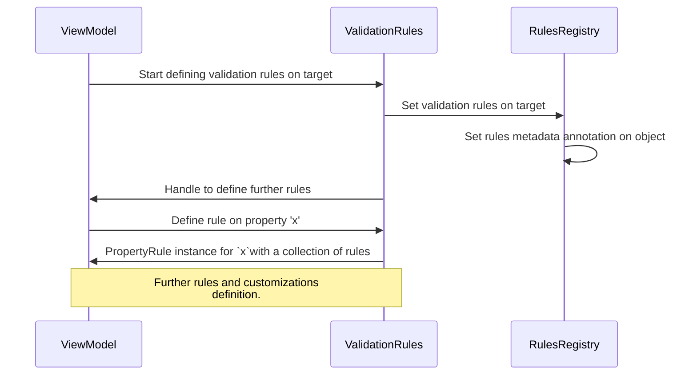
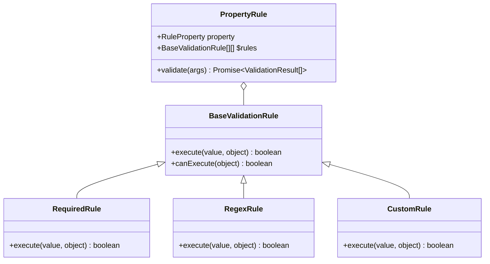
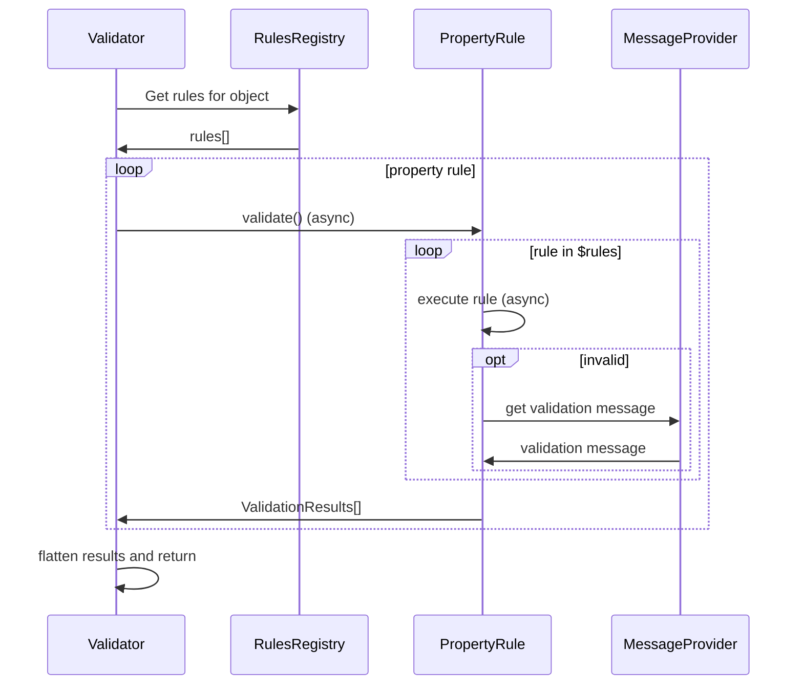
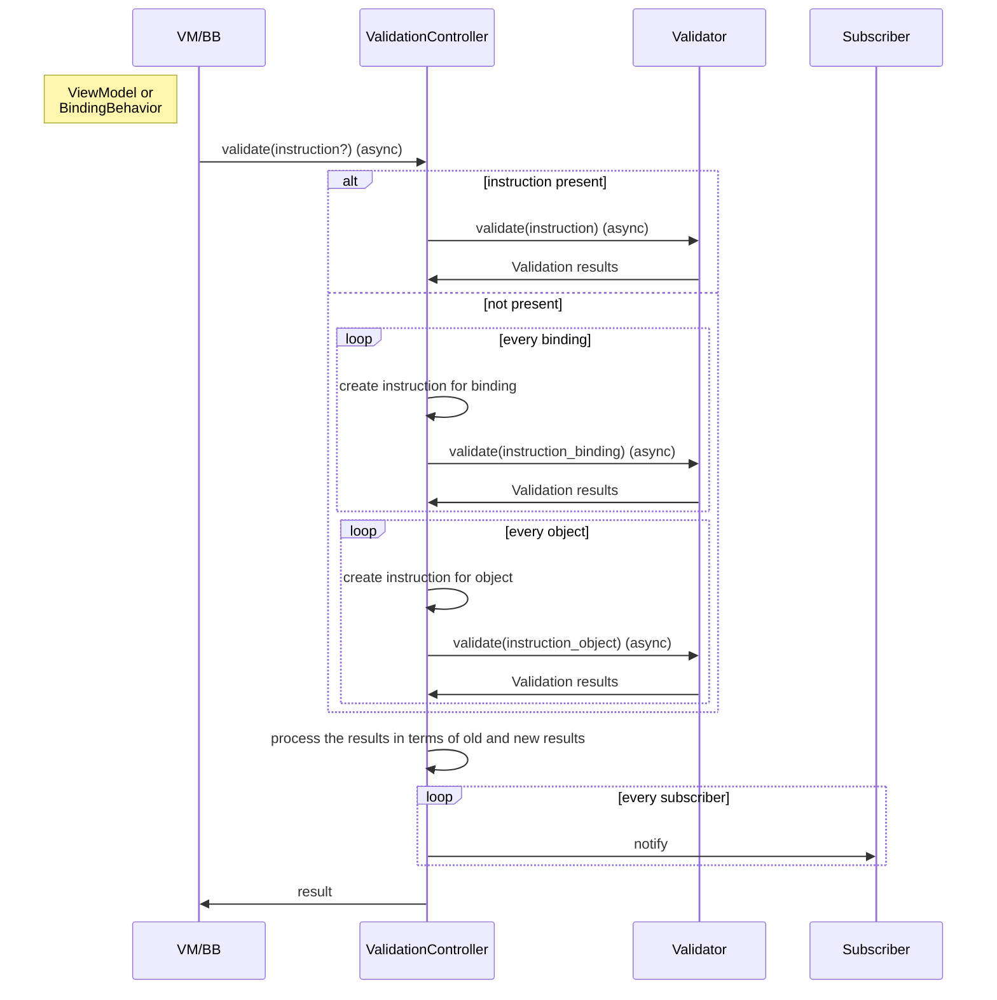

# Architecture

## Overview

There are three different interrelated packages for validation. The relation between the packages are depicted in the following diagram.

 (1) (1) (1) (1) (1) (1).svg>)

* `@aurelia/validation`: Provides the core validation functionality. Hosts the validator, out-of-the-box rule implementations, and the validation message provider.
* `@aurelia/validation-html`: Provides the view-specific functionalities such as validation controller, `validate` binding behavior, and subscribers. It wraps the `@aurelia/validation` package so that you do not need to register both packages.
* `@aurelia/validation-i18n`: Provides localized implementation of the validation message provider and validation controller. Wraps the `@aurelia/validation-html` package.

The rest of the document assumes that validation is view is more common scenario. For that reason, the demos are mostly integrated with view.

## How does it work

* The validationRules (`IValidationRules` instance) allows defining validation rules on a class or object/instance. The defined rules are stored as metadata in a global registry.

* The instance of `PropertyRule` instance hold the collection of rules defined for a property. In simplified terms it can be described by the diagram below.

* The validator (`IValidator` instance) allows you to execute a [validate instruction](broken-reference), which instructs which object and property needs to be validated. The validator gets the matching rules from the RulesRegistry (see the diagram above), and executes those.

* The last piece of the puzzle is to getting the rules executed on demand. For this the validation controller (`IValidationController` instance) is used along with the `validate` binding behavior (more on these later). The binding behavior registers the property binding with the validation controller, and on configured event, instructs the controller to validate the binding. The validation controller eventually ends up invoking the `IValidator#validate` with certain instruction which triggers the workflow shown in the last diagram. The following diagram shows a simplified version of this.

The following sections describe the API in more detail, which will help understanding the concepts further.
