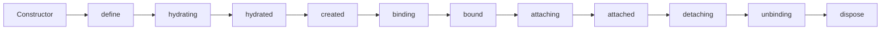

# Component lifecycles

Aurelia components offer a rich **lifecycle** that lets you hook into specific moments of a component's existence—from construction, through activation, to eventual disposal. Understanding the order and intent of each hook will help you write components that are predictable, testable, and memory-leak-free.


All lifecycle callbacks are **optional**. Implement only what you need. Hooks such as `binding`/`unbinding` or `attaching`/`detaching` are often implemented in pairs so you can clean up resources you set up in the first hook.



Lifecycle hooks apply to **custom elements** and **custom attributes**. Synthetic views (created by template controllers like `if`, `repeat`) do not have lifecycle hooks, but their child components do.


## Quick reference



| Phase | Hook | Runs | Child-parent order | Async? |
| ----- | ---- | ---- | ------------------ | ------ |
| Construction | `constructor` | once | – | – |
|  | `define` | once | **top ➞ down** | no |
|  | `hydrating` | once | **top ➞ down** | no |
|  | `hydrated` | once | **top ➞ down** | no |
|  | `created` | once | **bottom ➞ up** | no |
| Activation | `binding` | every activation | **top ➞ down** | yes (blocks children) |
|  | `bound` | every activation | **bottom ➞ up** | yes (awaits) |
|  | `attaching` | every activation | **top ➞ down** | yes (awaits before `attached`) |
|  | `attached` | every activation | **bottom ➞ up** | yes (awaits) |
| Deactivation | `detaching` | every deactivation | **bottom ➞ up** | yes (awaits before DOM removal) |
|  | `unbinding` | every deactivation | **bottom ➞ up** | yes (awaits) |
| Cleanup | `dispose` | when permanently discarded | – | – |

Legend
* **top ➞ down** – parent executes before its children
* **bottom ➞ up** – children execute before their parent

## Detailed walkthrough

### 1. Constructor

Executed when the instance is created. Inject services here and perform work that **does not** depend on bindable values.

```typescript
import { resolve } from 'aurelia';
import { IRouter } from '@aurelia/router-lite';

export class MyComponent {
  readonly router = resolve(IRouter);
}
```

### 2. Define

```typescript
define(
  controller: IDryCustomElementController<this>,
  hydrationContext: IHydrationContext | null,
  definition: CustomElementDefinition
): PartialCustomElementDefinition | void {}
```

* Opportunity to **modify the component definition** before hydration begins.
* Can return a partial definition to override aspects of the component's behavior.
* Runs **synchronously**, parent before children.

### 3. Hydrating

```typescript
hydrating(controller: IContextualCustomElementController<this>): void {}
```

* Opportunity to **register dependencies** in `controller.container` that are needed while **compiling** the view template.
* Runs **synchronously**, parent before children.

### 4. Hydrated

```typescript
hydrated(controller: ICompiledCustomElementController<this>): void {}
```

* View template has been compiled, child components are **not** yet created.
* Last chance to influence how the soon-to-be-created child components resolve their dependencies.

### 5. Created

```typescript
created(controller: ICustomElementController<this> | ICustomAttributeController<this>): void {}
```

* All child components are now constructed and hydrated.
* Executes **once** per instance, **children before parent**.
* Great for logic that must run after the whole subtree is constructed but **before binding**.

### 6. Binding

```typescript
// Custom Elements
binding(initiator: IHydratedController, parent: IHydratedController | null): void | Promise<void> {}

// Custom Attributes
binding(initiator: IHydratedController, parent: IHydratedController): void | Promise<void> {}
```

* Bindable properties have been set but **bindings in the view are not yet connected**.
* Runs **parent ➞ child**.
* Return a `Promise` (or mark the method `async`) to **block** binding/attaching of children until resolved.

### 7. Bound

```typescript
// Custom Elements
bound(initiator: IHydratedController, parent: IHydratedController | null): void | Promise<void> {}

// Custom Attributes
bound(initiator: IHydratedController, parent: IHydratedController): void | Promise<void> {}
```

* View-to-view-model bindings are active; `ref`, `let`, and `from-view` values are available.
* Executes **child ➞ parent**.

### 8. Attaching

```typescript
// Custom Elements
attaching(initiator: IHydratedController, parent: IHydratedController | null): void | Promise<void> {}

// Custom Attributes
attaching(initiator: IHydratedController, parent: IHydratedController): void | Promise<void> {}
```

* The component's host element is now in the DOM but **child components may still be attaching**.
* Queue animations or setup 3rd-party libraries here.
* A returned `Promise` is awaited **before** `attached` is invoked on this component **but does not block children**.

### 9. Attached

```typescript
attached(initiator: IHydratedController): void | Promise<void> {}
```

* The entire component subtree is mounted; safe to measure elements or call libraries that need actual layout information.
* Executes **child ➞ parent**.
* Note: Only receives the `initiator` parameter, **not** the parent.

### 10. Detaching

```typescript
// Custom Elements
detaching(initiator: IHydratedController, parent: IHydratedController | null): void | Promise<void> {}

// Custom Attributes
detaching(initiator: IHydratedController, parent: IHydratedController): void | Promise<void> {}
```

* Called when the framework removes the component's element from the DOM.
* Executes **child ➞ parent**. Any returned `Promise` (e.g., an outgoing animation) is awaited **in parallel** with sibling promises.

### 11. Unbinding

```typescript
// Custom Elements
unbinding(initiator: IHydratedController, parent: IHydratedController | null): void | Promise<void> {}

// Custom Attributes
unbinding(initiator: IHydratedController, parent: IHydratedController): void | Promise<void> {}
```

* Runs after `detaching` finishes and bindings have been disconnected.
* Executes **child ➞ parent**.

### 12. Dispose

```typescript
dispose(): void {}
```

* Invoked when the instance is **permanently discarded**—typically when removed from a repeater and the view cache is full, or when the application shuts down.
* Use to tear down long-lived resources, subscriptions, or manual observers to prevent memory leaks.

## Lifecycle hooks decorator (`@lifecycleHooks`)

For **cross-cutting concerns** like logging, analytics, or debugging, implement lifecycle hooks in a separate class using the `@lifecycleHooks` decorator. This keeps your component code focused while adding shared behavior.

```typescript
import { lifecycleHooks, ILifecycleHooks, ICustomElementController, IHydratedController } from 'aurelia';

@lifecycleHooks()
export class ComponentLogger implements ILifecycleHooks<MyComponent> {
  bound(vm: MyComponent, initiator: IHydratedController, parent: IHydratedController | null) {
    console.log(`${vm.constructor.name} bound with data:`, vm.someProperty);
  }

  detaching(vm: MyComponent, initiator: IHydratedController, parent: IHydratedController | null) {
    console.log(`${vm.constructor.name} detaching`);
  }
}
```

Multiple lifecycle hook classes can be registered; the framework executes them **in registration order** alongside the component's own lifecycle methods.

## Special cases

* **`<au-compose>`** components additionally support `activate` / `deactivate` hooks—see the [dynamic composition guide](../getting-to-know-aurelia/dynamic-composition.md).
* **Router hooks** such as `canLoad`, `loading`, `canUnload`, `unloading`, etc., are documented in the [routing lifecycle section](../router-lite/routing-lifecycle.md) and are available even if you do not use the router.

## Best practices

1. **Prefer early exits**—perform checks at the start of hooks and `return` early to minimise nesting.
2. **Clean up** observers, timeouts, event listeners, or 3rd-party widgets **in the opposite hook** (`unbinding`/`detaching` or `dispose`).
3. **Avoid heavy work in the constructor.** Move anything needing bindables or DOM to later hooks.
4. **Mark hooks `async`** and `await` your operations instead of manually creating Promises for clarity.
5. **Keep hooks fast**—expensive work can block the component hierarchy.
