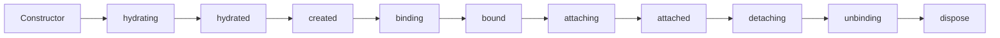

# Component lifecycles

Aurelia components offer a rich **lifecycle** that lets you hook into specific moments of a component's existence—from construction, through activation, to eventual disposal. Understanding the order and intent of each hook will help you write components that are predictable, testable, and memory-leak-free.


All lifecycle callbacks are **optional**. Implement only what you need. Hooks such as `binding`/`unbinding` or `attaching`/`detaching` are often implemented in pairs so you can clean up resources you set up in the first hook.



Lifecycle hooks apply to **custom elements** and **custom attributes**. Synthetic views (created by template controllers like `if`, `repeat`) do not have lifecycle hooks, but their child components do.


## Quick reference


```mermaid
flowchart LR
  ctor["Constructor"] --> hydrating --> hydrated --> created --> binding --> bound --> attaching --> attached --> detaching --> unbinding --> dispose
```

| Phase | Hook | Runs | Child-parent order | Async? |
| ----- | ---- | ---- | ------------------ | ------ |
| Construction | `constructor` | once | – | – |
|  | `hydrating` | once | **top ➞ down** | no |
|  | `hydrated` | once | **top ➞ down** | no |
|  | `created` | once | **bottom ➞ up** | no |
| Activation | `binding` | every activation | **top ➞ down** | yes (blocks children) |
|  | `bound` | every activation | **top ➞ down** | yes (awaits) |
|  | `attaching` | every activation | **top ➞ down** | yes (awaits before `attached`) |
|  | `attached` | every activation | **bottom ➞ up** | yes (awaits) |
| Deactivation | `detaching` | every deactivation | **bottom ➞ up** | yes (awaits before DOM removal) |
|  | `unbinding` | every deactivation | **bottom ➞ up** | yes (awaits) |
| Cleanup | `dispose` | when permanently discarded | **top ➞ down** | no |

Legend
* **top ➞ down** – parent executes before its children
* **bottom ➞ up** – children execute before their parent

## Detailed walkthrough

### 1. Constructor

Executed when the instance is created. Inject services here and perform work that **does not** depend on bindable values.

```typescript
import { resolve } from '@aurelia/kernel';
import { IRouter } from '@aurelia/router';

export class MyComponent {
  readonly router = resolve(IRouter);
}
```

### 2. Hydrating

```typescript
hydrating(controller: IContextualCustomElementController<this>): void {}
```

* Opportunity to **register dependencies** in `controller.container` that are needed while **compiling** the view template.
* Runs **synchronously**, parent before children.

### 3. Hydrated

```typescript
hydrated(controller: ICompiledCustomElementController<this>): void {}
```

* View template has been compiled, child components are **not** yet created.
* Last chance to influence how the soon-to-be-created child components resolve their dependencies.

### 4. Created

```typescript
created(controller: ICustomElementController<this> | ICustomAttributeController<this>): void {}
```

* All child components are now constructed and hydrated.
* Executes **once** per instance, **children before parent**.
* Great for logic that must run after the whole subtree is constructed but **before binding**.

### 5. Binding

```typescript
// Custom Elements
binding(initiator: IHydratedController, parent: IHydratedController | null): void | Promise<void> {}

// Custom Attributes
binding(initiator: IHydratedController, parent: IHydratedController): void | Promise<void> {}
```

* Bindable properties have been set but **bindings in the view are not yet connected**.
* Runs **parent ➞ child**.
* Return a `Promise` (or mark the method `async`) to **block** binding/attaching of children until resolved.

### 6. Bound

```typescript
// Custom Elements
bound(initiator: IHydratedController, parent: IHydratedController | null): void | Promise<void> {}

// Custom Attributes
bound(initiator: IHydratedController, parent: IHydratedController): void | Promise<void> {}
```

* View-to-view-model bindings are active; `ref`, `let`, and `from-view` values are available.
* Executes **parent ➞ child**.

### 7. Attaching

```typescript
// Custom Elements
attaching(initiator: IHydratedController, parent: IHydratedController | null): void | Promise<void> {}

// Custom Attributes
attaching(initiator: IHydratedController, parent: IHydratedController): void | Promise<void> {}
```

* The component's host element is now in the DOM but **child components may still be attaching**.
* Queue animations or setup 3rd-party libraries here.
* A returned `Promise` is awaited **before** `attached` is invoked on this component **but does not block children**.

### 8. Attached

```typescript
attached(initiator: IHydratedController): void | Promise<void> {}
```

* The entire component subtree is mounted; safe to measure elements or call libraries that need actual layout information.
* Executes **child ➞ parent**.
* Note: Only receives the `initiator` parameter, **not** the parent.

### 9. Detaching

```typescript
// Custom Elements
detaching(initiator: IHydratedController, parent: IHydratedController | null): void | Promise<void> {}

// Custom Attributes
detaching(initiator: IHydratedController, parent: IHydratedController): void | Promise<void> {}
```

* Called when the framework removes the component's element from the DOM.
* Executes **child ➞ parent**. Any returned `Promise` (e.g., an outgoing animation) is awaited **in parallel** with sibling promises.

### 10. Unbinding

```typescript
// Custom Elements
unbinding(initiator: IHydratedController, parent: IHydratedController | null): void | Promise<void> {}

// Custom Attributes
unbinding(initiator: IHydratedController, parent: IHydratedController): void | Promise<void> {}
```

* Runs after `detaching` finishes and before bindings are disconnected.
* Executes **child ➞ parent**.

### 11. Dispose

```typescript
dispose(): void {}
```

* Invoked when the instance is **permanently discarded**—typically when removed from a repeater and the view cache is full, or when the application shuts down.
* Use to tear down long-lived resources, subscriptions, or manual observers to prevent memory leaks.
* Runs synchronously, parent before children. `stop(true)` disposes an application root after deactivation.
* A thrown disposal error ends that disposal call and is reported directly.

## Lifecycle hooks decorator (`@lifecycleHooks`)

For **cross-cutting concerns** like logging, analytics, or debugging, implement lifecycle hooks in a separate class using the `@lifecycleHooks` decorator. This keeps your component code focused while adding shared behavior.

```typescript
import { lifecycleHooks, ILifecycleHooks, ICustomElementController, IHydratedController } from 'aurelia';

@lifecycleHooks()
export class ComponentLogger implements ILifecycleHooks<MyComponent> {
  bound(vm: MyComponent, initiator: IHydratedController, parent: IHydratedController | null) {
    console.log(`${vm.constructor.name} bound with data:`, vm.someProperty);
  }

  detaching(vm: MyComponent, initiator: IHydratedController, parent: IHydratedController | null) {
    console.log(`${vm.constructor.name} detaching`);
  }
}
```

Multiple lifecycle hook classes can be registered. Aurelia invokes their matching methods **in registration order**, followed by the component's matching hook. Aurelia waits for every Promise returned during that phase.

## Async completion and errors

Aurelia completes a lifecycle phase after the component and its descendants finish the work they started, including Promises returned by registered lifecycle hooks. Sibling work can settle in any order. If more than one hook fails, Aurelia reports the first according to lifecycle order.

A hook failure ends the affected lifecycle transition and reaches the caller as the original thrown or rejected value. Aurelia waits for all work that already started. The affected component or application is then in a terminal state. Fix the hook before creating and activating a replacement.

Router navigation is different. The router controls both the current route and its replacement, so it can discard a failed candidate and keep the current route active. See the [Router lifecycle](../router/routing-lifecycle.md) for its navigation behavior.

A controller runs one lifecycle transition at a time. Deactivation requested during activation cancels the remaining activation work and finishes inactive. Activation requested during teardown starts after successful cleanup. After several overlapping requests, the controller reaches the state requested most recently.

If a hook fails while activation is being cancelled, the shared transition reports that original error.

Return the Promise created by your hook when Aurelia should wait for that work:

```typescript
export class AnimatedPanel {
  public attaching(): Promise<void> {
    return this.animation.enter();
  }

  public detaching(): Promise<void> {
    return this.animation.leave();
  }
}
```

For low-level controller integrations, the Promise returned by a hook should represent only work that hook started. Returning the controller transition that is currently waiting for the hook creates a dependency cycle and reports [AUR0509](../developer-guides/error-messages/runtime-html/aur0509.md). Controller disposal begins after its lifecycle work settles. [AUR0510](../developer-guides/error-messages/runtime-html/aur0510.md) identifies an early disposal request.

## Special cases

* Values rendered by **`<au-compose>`** can implement `activate(model)`. Composed custom elements retain their standard `detaching`, `unbinding`, and `dispose` hooks. See the [dynamic composition guide](../getting-to-know-aurelia/dynamic-composition.md).
* **Router hooks** such as `canLoad`, `loading`, `canUnload`, `unloading`, etc., are documented in the [routing lifecycle section](../router/routing-lifecycle.md) and are available even if you do not use the router.

## Best practices

1. **Prefer early exits**—perform checks at the start of hooks and `return` early to minimise nesting.
2. **Clean up** observers, timeouts, event listeners, or 3rd-party widgets **in the opposite hook** (`unbinding`/`detaching` or `dispose`).
3. **Avoid heavy work in the constructor.** Move anything needing bindables or DOM to later hooks.
4. **Return the complete Promise for work started by the hook** so Aurelia waits for all of it. An `async` hook provides this naturally when it awaits all of its work.
5. **Keep hooks fast**—expensive work can block the component hierarchy.
