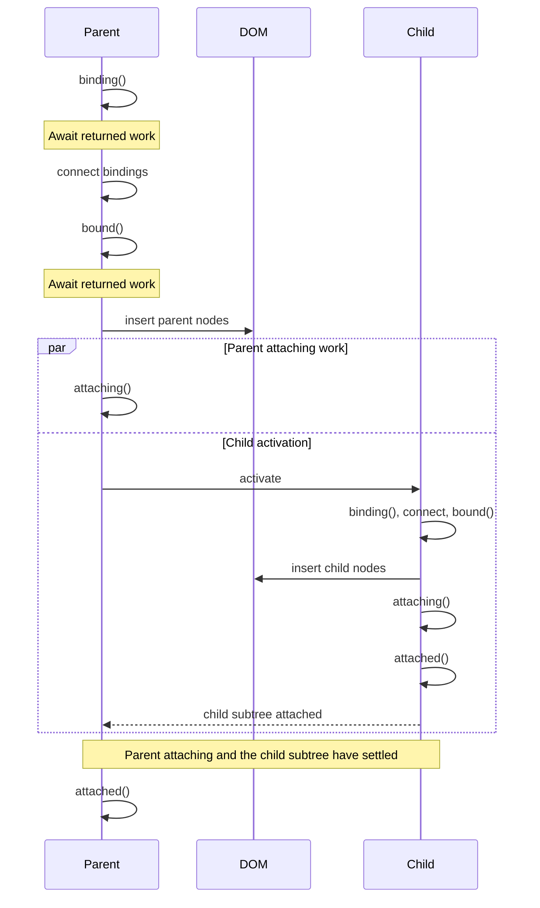
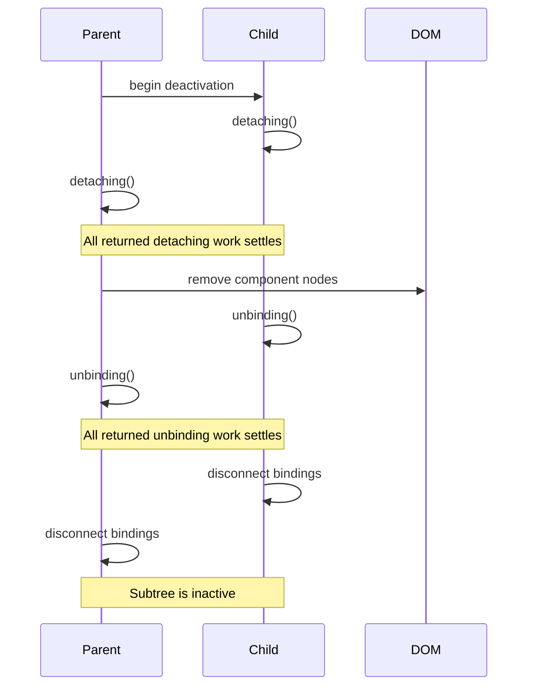
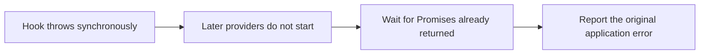

# Component lifecycle timing

These diagrams show the public timing guarantees for a component tree. See [Component lifecycles](component-lifecycles.md) for hook signatures and common uses.

## Activation

Activation proceeds from parent to child until the `attached` phase returns from the leaves.



For each controller:

1. `binding()` settles.
2. Aurelia connects that controller's bindings.
3. `bound()` settles.
4. Aurelia inserts the controller's nodes.
5. `attaching()` begins.
6. Child activation can proceed while the parent's `attaching()` Promise remains pending.
7. `attached()` runs after that controller's attaching work and descendant activation have settled. A descendant can reach `attached()` while an ancestor's `attaching()` Promise is still pending.

This produces the following tree order:

| Hook | Invocation order across the tree | When Aurelia continues |
| --- | --- | --- |
| `binding` | parent to child | each parent settles before its children begin |
| `bound` | parent to child | each controller settles before its attaching phase |
| `attaching` | parent to child | parent work can overlap descendant activation |
| `attached` | child to parent | each subtree settles before its own parent runs; ancestor `attaching` work can overlap |

Registered lifecycle-hook providers run in registration order for a controller. The component's matching hook follows them. Aurelia waits for every Promise returned during that phase.

## Deactivation

Deactivation gives every component a cleanup opportunity before disconnecting its bindings.



The phase order is stable:

1. Aurelia invokes `detaching()` from child to parent. The returned Promises can remain pending at the same time.
2. DOM removal begins after all returned detaching work settles.
3. Aurelia invokes `unbinding()` from child to parent while bindings remain connected.
4. Binding disconnection begins after all returned unbinding work settles.
5. The controller subtree reaches its inactive state.
6. Permanent cleanup invokes synchronous `dispose()` from parent to child.

An outgoing animation can retain the DOM by returning its Promise from `detaching()`:

```typescript
export class ToastMessage {
  public detaching(): Promise<void> {
    return this.animation.leave();
  }
}
```

## Error reporting

Lifecycle failures are terminal for the affected transition. Aurelia preserves the application error and waits for asynchronous work that already started.



When several registered providers have already returned Promises, their work can settle in any order. Aurelia uses provider registration order to select the reported failure, so reporting stays deterministic when Promises reject at different times.

A failed hook leaves the affected component or application in a terminal state. Fix the hook before creating and activating a replacement. Router navigation is different: the router can discard a failed route candidate and keep the current route active.

## Overlapping transition requests

A controller runs one lifecycle transition at a time. Requests that arrive during that transition either join it or wait for it to finish.

| Request | Result |
| --- | --- |
| Deactivate during activation | Aurelia cancels the remaining activation work and finishes inactive. |
| Activate during deactivation | Aurelia starts activation after successful teardown. |
| Repeat the current request | The caller joins the in-flight transition. |
| Alternate several requests | The controller reaches the state requested most recently. |

For low-level integrations, return the Promise for work started by the hook. Returning a controller transition that depends on the same hook creates a lifecycle dependency cycle and reports [AUR0509](../developer-guides/error-messages/runtime-html/aur0509.md).

## Waiting for startup and shutdown

Await application lifecycle calls in tests and in code that depends on the completed transition:

```typescript
await aurelia.start();

// Exercise the running application.

await aurelia.stop(true);
aurelia.dispose();
```

`start()` retains a synchronous fast path and therefore returns `void | Promise<void>`. The `await` expression handles both forms.
