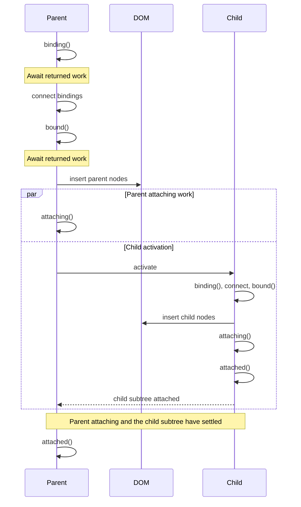
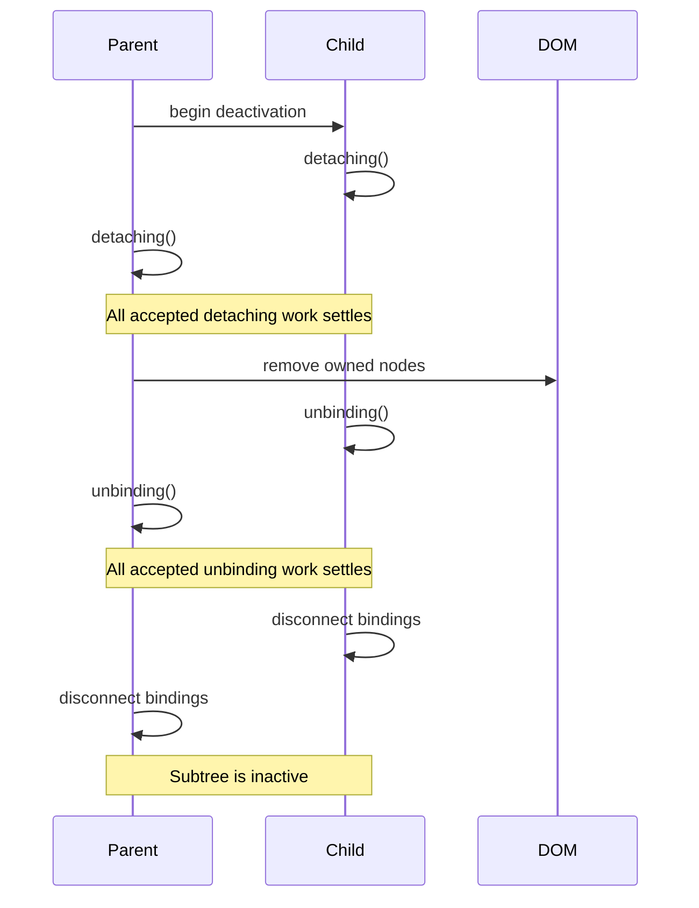
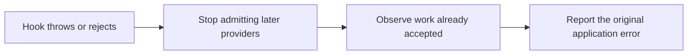

# Component lifecycle timing

These diagrams show the public timing guarantees for a component tree. See [Component lifecycles](component-lifecycles.md) for hook signatures and common uses.

## Activation

Activation proceeds from parent to child until the `attached` phase returns from the leaves.



For each controller:

1. `binding()` settles.
2. Aurelia connects that controller's bindings.
3. `bound()` settles.
4. Aurelia inserts the controller's nodes.
5. `attaching()` begins.
6. Child activation can proceed while the parent's `attaching()` Promise remains pending.
7. `attached()` runs after that controller's attaching work and descendant activation have settled. A descendant can reach `attached()` while an ancestor's `attaching()` Promise is still pending.

This produces the following tree order:

| Hook | Invocation order across the tree | Promise boundary |
| --- | --- | --- |
| `binding` | parent to child | each parent settles before its children begin |
| `bound` | parent to child | each controller settles before its attaching phase |
| `attaching` | parent to child | parent work can overlap descendant activation |
| `attached` | child to parent | each subtree settles before its own parent runs; ancestor `attaching` work can overlap |

Registered lifecycle-hook providers run in registration order for a controller. The component's matching hook follows them. Aurelia waits for all Promises accepted into that controller phase.

## Deactivation

Deactivation gives every component a cleanup opportunity before disconnecting its bindings.



The phase order is stable:

1. Aurelia invokes `detaching()` from child to parent. Returned Promises can overlap within the shared phase boundary.
2. DOM removal begins after accepted detaching work settles.
3. Aurelia invokes `unbinding()` from child to parent while bindings remain connected.
4. Binding disconnection begins after accepted unbinding work settles.
5. The controller subtree reaches its inactive state.
6. Permanent cleanup invokes synchronous `dispose()` from parent to child.

An outgoing animation can retain the DOM by returning its Promise from `detaching()`:

```typescript
export class ToastMessage {
  public detaching(): Promise<void> {
    return this.animation.leave();
  }
}
```

## Error reporting

Lifecycle failures are terminal for the affected transition. Aurelia preserves the application error and observes asynchronous work that the phase already accepted.



When several registered providers have already returned Promises, their work can settle in any order. Aurelia reports the first failure by provider registration order rather than rejection timing.

A failed core application or controller graph is terminal. Fix the reported hook before starting another lifecycle transition for that graph. Router navigation is the explicit transactional exception: it can tear down its failed candidate and retain the previous route.

## Overlapping transition requests

A controller keeps one owner for its active lifecycle operation. Requests that arrive during that operation join or queue around it.

| Request | Result |
| --- | --- |
| Deactivate during activation | Aurelia compensates accepted activation work and finishes inactive. |
| Activate during deactivation | Aurelia starts activation after successful teardown. |
| Repeat the current request | The caller joins the in-flight transition. |
| Alternate several requests | The controller converges on the latest requested active state. |

Low-level integrations should return the asynchronous work owned by their hook. Returning a controller transition that depends on the same hook creates a lifecycle dependency cycle and reports [AUR0509](../developer-guides/error-messages/runtime-html/aur0509.md).

## Awaiting application boundaries

Await application lifecycle calls in tests and in code that depends on the completed transition:

```typescript
await aurelia.start();

// Exercise the running application.

await aurelia.stop(true);
aurelia.dispose();
```

`start()` retains a synchronous fast path and therefore returns `void | Promise<void>`. The `await` expression handles both forms.
