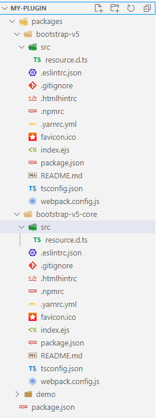

# Building plugins

One of the most important needs of users is to design custom plugins. In the following, we want to get acquainted with how to design a plugin in the form of a mono-repository structure with configuration.

### What is a mono-repository?

A monorepo (mono repository) is a single repository that stores all of your code and assets for every project. Using a monorepo is important for many reasons. It creates a single source of truth. It makes it easier to share code. It even makes it easier to refactor code.

### How NPM v7 helps us?

With `workspaces`. Workspaces are a set of features in the npm CLI that offer support for managing multiple packages within a single top-level, root package. NPM v7 has shipped with Node.js v15.

### What is the scenario?

To move forward with a practical example. We want to implement Bootstrap components in a custom mono-repository with a configuration to make it customizable.

### What is the library structure?

We want to separate our plugin into three packages.

* **bootstrap-v5-core**

We will add the Bootstrap 5 configurations to this package.

* **bootstrap-v5**

Our Bootstrap 5 components will define in this package. `bootstrap-v5` depends on `bootstrap-v5-core` packages.

* **demo**

We will use our plugin in this package as a demo. `demo` depends on `bootstrap-v5-core` and `bootstrap-v5`.

### How to configure NPM v7 workspaces?

To configure your monorepo, you should do as following:

Make sure you have installed NPM v7+

```bash
npm -v
```

Go to a folder that you want to make the project, for example `my-plugin`

Create a `packages` folder and `package.json` inside it.

```javascript
// package.json content

{
  "name": "@my-plugin",
  "workspaces": [
    "packages/**"
  ]
}
```

The mono repository's name is `@my-plugin`. We defined our workspaces (projects) under `packages` folder.

Open your `packages` folder and install the projects inside it.

```bash
npx makes aurelia bootstrap-v5-core -s typescript
npx makes aurelia bootstrap-v5 -s typescript
npx makes aurelia demo -s typescript
```

After creating, delete all files inside `src` folders of `bootstrap-v5-core` and `bootstrap-v5` but `resource.d.ts`. We will add our files there.



## How to manage dependencies?

As described in the structure section defined packages depend on each other. So, we link them together and add the other prerequisites for each. At the same time it is good to name them a bit better.

* **bootstrap-v5-core**

Go to its `package.json` and change the name to

```javascript
"name": "@my-plugin/bootstrap-v5-core"
```

As our core package, it has no dependency.

* **bootstrap-v5**

Go to its `package.json` and change the name to

```javascript
"name": "@my-plugin/bootstrap-v5"
```

Then, add the following dependencies:

```javascript
// bootstrap-v5/package.json
"dependencies": {    
    "aurelia": "latest",
    "bootstrap": "^5.0.0-beta2",    
    "@my-plugin/bootstrap-v5-core": "0.1.0"
},
```

* **demo**

Go to its `package.json` and change the name to

```javascript
"name": "@my-plugin/demo"
```

Then, add the following dependencies:

```javascript
// demo/package.json
"dependencies": {    
    "aurelia": "latest",    
    "@my-plugin/bootstrap-v5-core": "0.1.0",
    "@my-plugin/bootstrap-v5": "0.1.0"
},
```

**Note**: All created packages have `0.1.0` version so pay attention if the version changes, update it correctly.

Run the command below to install packages inside the `my-plugin` folder.

```bash
npm install
```

### How to define a plugin configuration?

Go to the `src` folder of `bootstrap-v5-core` package and create each of the below files there.

**Size**

As I mentioned before, I want to write a configurable Bootstrap plugin so create `src/Size.ts` file.

```javascript
// Size.ts

export enum Size {
    ExtraSmall = 'xs',
    Small = 'sm',
    Medium = 'md',
    Large = 'lg',
    ExtraLarge = 'xl',
}
```

I made a `Size` enum to handle all Bootstrap sizes. I want to make an option for those who use the plugin to define a global size for all Bootstrap components at first. Next, we manage our components according to size value.

**Bootstrap 5 Options**

Create `src/BootstrapV5Options.ts` file.

```javascript
// BootstrapV5Options.ts

import { Size } from "./Size";

export interface IBootstrapV5Options {
    defaultSize?: Size;
}
const defaultOptions: IBootstrapV5Options = {
    defaultSize: Size.Medium
};
```

You need to define your configurations via an interface with its default values as a constant.

**DI**

To register it via DI, you need to add codes below too:

```javascript
// BootstrapV5Options.ts

import { IContainer } from '@aurelia/kernel';
import { AppTask, DI, Registration } from 'aurelia';

function configure(container: IContainer, config: IBootstrapV5Options = defaultOptions) {
    return container.register(
        AppTask.hydrating(IContainer, async container => {
            if (config.enableSpecificOption) {
                const file = await import('file');
                cfg.register(Registration.instance(ISpecificOption, file.do());
            }
            Registration.instance(IBootstrapV5Options, config).register(container);
        })
    );
}

export const IBootstrapV5Options = DI.createInterface<IBootstrapV5Options>('IBootstrapV5Options');

export const BootstrapV5Configuration = {
    register(container: IContainer) {
        return configure(container);
    },
    customize(config: IBootstrapV5Options) {
        return {
            register(container: IContainer) {
                return configure(container, config);
            },
        };
    }
};
```

`configure` helps us to set the initial options or loading special files based on a specific option to DI system. To load specific files, you need to do this via `AppTask`.

The `AppTask` allows you to position when/where certain initialization should happen and also optionally block app rendering accordingly.

If you no need this feature replace it with:

```typescript
function configure(container: IContainer, config: IBootstrapV5Options = defaultOptions) {
    Registration.instance(IBootstrapV5Options, config).register(container);
}
```

`Registration.instance` helps us to register our default option into the container.

To use your option later inside your components, you should introduce it via `DI.createInterface`. The trick here is to create a resource name the same as what you want to inject. This is the reason I name it as `IBootstrapV5Options` constant.

Finally, you need to make sure that the user can determine the settings. This is the task of `BootstrapV5Configuration`.

`register` This method helps the user to use your plugin with default settings but `customize` is the method that allows the user to introduce their custom settings.

**Exports**

Create `src/index.ts` file.

```javascript
// index.ts

export * from './BootstrapV5Configuration';
export * from './Size';
```

Create new `index.ts` file inside `bootstrap-v5-core` package too.

```javascript
export * from './src';
```

### How to implement the custom plugin?

Go to the `src` folder of `bootstrap-v5` package, create a `button` folder then create each of the below files there.

* **View**

Create `bs-button.html` file.

```markup
<button class="btn btn-primary btn-${size}" ref="bsButtonTemplate">
    Primary Button
</button>
```

* **ViewModel**

Create `bs-button.ts` file.

```javascript
import { customElement, containerless, BindingMode, bindable } from "aurelia";
import template from "./bs-button.html";
import { IBootstrapV5Options, Size } from "@my-plugin/bootstrap-v5-core";

@customElement({ name: "bs-button", template })
@containerless
export class BootstrapButton {
    private bsButtonTemplate: Element;
    @bindable({ mode: BindingMode.toView }) public size?: Size = null;
    constructor(
        @IBootstrapV5Options private options: IBootstrapV5Options
    ) {
    }
    attached() {
        this.applySize();
    }
    private applySize() {
        if (this.options.defaultSize && !this.size) {
            switch (this.options.defaultSize) {
                case Size.ExtraSmall:
                case Size.Small:
                    this.resetSize();
                    this.size = Size.Small;
                    break;
                case Size.Large:
                case Size.ExtraLarge:
                    this.resetSize();
                    this.size = Size.Large;
                    break;
                default:
                    this.resetSize();
                    this.size = Size.Medium;
            }
        }
    }
    private resetSize() {
        this.bsButtonTemplate.classList.remove("btn-sm", "btn-lg");
    }
}
```

As you can see we are able to access to plugin options easy via `ctor` (DI) and react appropriately to its values.

```typescript
@IBootstrapV5Options private options: IBootstrapV5Options
```

In this example, I get the size from the user and apply it to the button component. If the user does not define a value, the default value will be used.

**Exports**

Create files below correctly:

Create `src/button/index.ts` file.

```javascript
export * from './bs-button';
```

Create `src/index.ts` file.

```javascript
export * from './button';
```

Create new `index.ts` file inside `bootstrap-v5` package.

```javascript
import 'bootstrap/dist/css/bootstrap.min.css';
export * from './src';
```

### How to use it?

Open `demo` package and go to the `src` and update `main.ts`.

```javascript
// main.ts

import Aurelia from 'aurelia';
import { MyApp } from './my-app';
import { BootstrapV5Configuration } from '@my-plugin/bootstrap-v5-core';
import * as BsComponents from '@my-plugin/bootstrap-v5';

Aurelia
  .register(BsComponents, BootstrapV5Configuration)
  .app(MyApp)
  .start();
```

Importing is available for whole components

```javascript
import * as BsComponents from '@my-plugin/bootstrap-v5';
```

Or just a component

```javascript
import { BootstrapButton } from '@my-plugin/bootstrap-v5';
```

To register your components you should add them to `register` method.

```javascript
.register(BsComponents) // For whole components
// Or
.register(BootstrapButton) // For a component
```

We support configuration so we should introduce it to `register` method too.

```javascript
 // With default options
.register(BootstrapV5Configuration)
// Or with a custom option
.register(BootstrapV5Configuration.customize({
  defaultSize: Size.Small // Components loads with small size.
}))
```

Now, You are able to use your `bs-button` inside `src/my-app.html`.

```markup
<bs-button></bs-button>
<bs-button size="lg"></bs-button>
```

To run the `demo` easily, go to the `my-plugin` root folder and add the following script section to the `package.json`.

```bash
{
  "name": "@my-plugin",
  "workspaces": [
    "packages/**"
  ],
  "scripts": {
    "start": "npm run --prefix packages/demo start"
  }
}
```

Then, call the command

```shell
npm run start
npm start
```
