# Template Concepts: Visual Guide

Visual diagrams to help understand Aurelia's templating system. Every diagram below is rendered with GitBook-friendly Mermaid so it stays legible in dark and light modes.

## Data Binding Flow

### One-Way Binding (View Model → View)

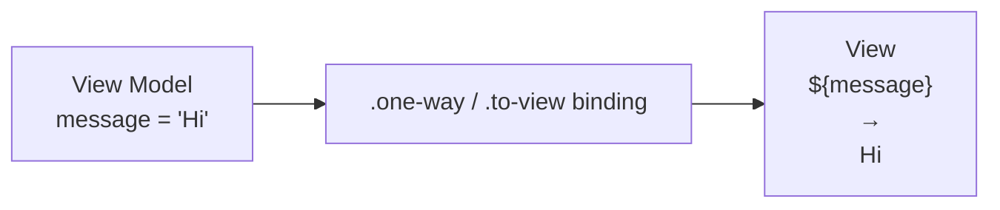

Use one-way bindings for read-only flows or whenever the DOM only needs to reflect state.

### Two-Way Binding (View Model ↔ View)

```mermaid
flowchart LR
    VM["View Model<br/>name = 'Bob'"]
    binding[".bind (.two-way)"]
    view["<input value.bind='name'>"]
    VM <-->|"property updates"| binding
    binding <-->|"user typing"| view
```

Two-way bindings keep inputs and view-model properties in sync. Typing "Alice" updates `name`, which in turn refreshes every binding that depends on it.

### From-View Binding (View → View Model)

```mermaid
flowchart LR
    view["<input value.from-view='query'>"]
    binding[".from-view binding"]
    VM["View Model<br/>query = ''"]
    view --> binding --> VM
```

`.from-view` captures user input without pushing view-model changes back into the DOM—handy for debounced searches or analytics where the DOM already mirrors the value elsewhere.

## Binding Mode Decision Tree

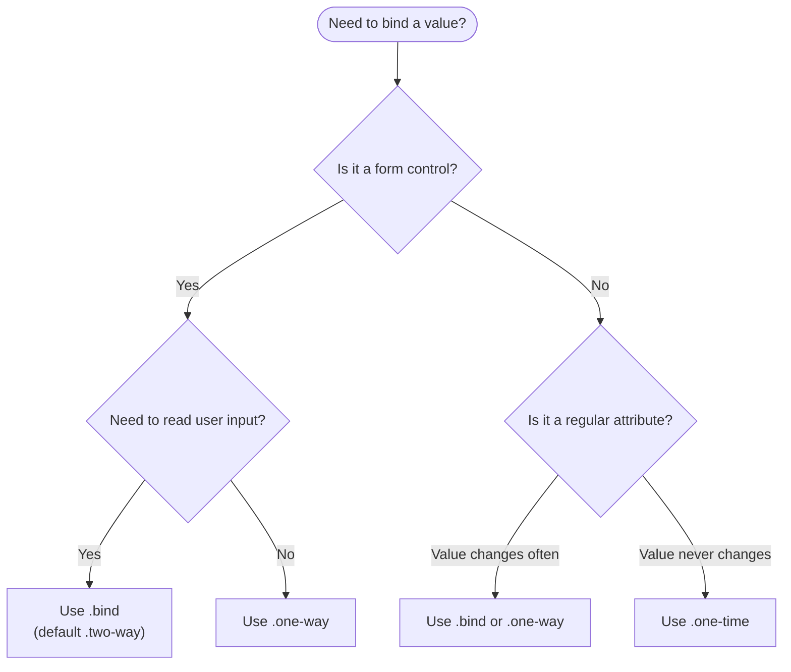

## Conditional Rendering: if vs show

### if.bind – Adds/Removes from the DOM

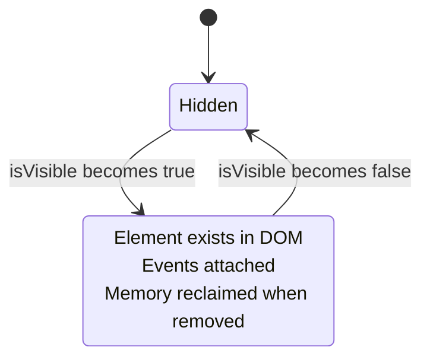

`if.bind` creates and disposes the DOM subtree. It frees memory and automatically detaches listeners any time the condition flips back to `false`.

### show.bind – CSS Display Toggle

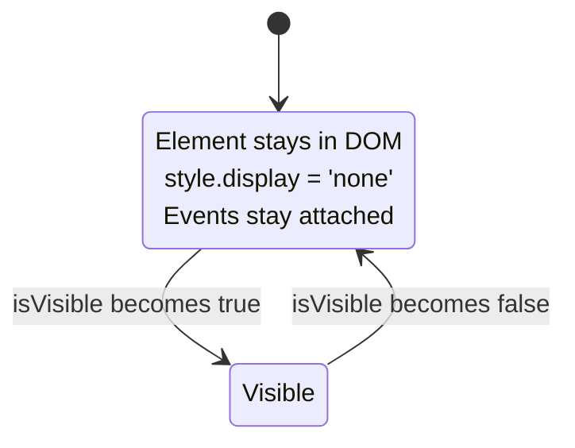

`show.bind` toggles `display: none` without touching the DOM tree. It is ideal for frequently toggled sections that should keep their internal state alive.

### Decision Matrix

| Capability        | `if.bind`            | `show.bind`                    |
|-------------------|----------------------|--------------------------------|
| DOM manipulation  | Create/destroy nodes | Toggle CSS display             |
| Memory            | Released when hidden | Always allocated               |
| Toggle speed      | Slightly slower      | Instant                        |
| Event cleanup     | Automatic            | Handled manually if needed     |
| Component init    | Runs every attach    | Runs once                      |
| Best for          | Rare toggles         | Frequent toggles               |

## List Rendering with repeat.for

### Basic Flow

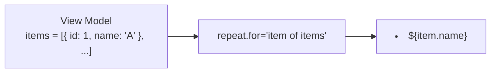

### With Keys for Efficient Updates

By default, the repeat controller tracks scopes by the actual item reference. When you insert `X` in between existing objects (`[A, B, C] → [A, X, B, C]`), Aurelia reuses the same scopes for `A`, `B`, and `C` because their references are unchanged; only `X` produces a new view. The `_scopeMap` maintained inside `packages/runtime-html/src/resources/template-controllers/repeat.ts` (see `_createScopes` and `_applyIndexMap`) stores either the raw item reference or your explicit key, which is why Aurelia can diff without re-rendering.

Provide a `key` only when you recreate objects between refreshes (for example, mapping API data into new literals) or when the list contains primitives. In those cases a property such as `id` gives Aurelia a stable identity to match.

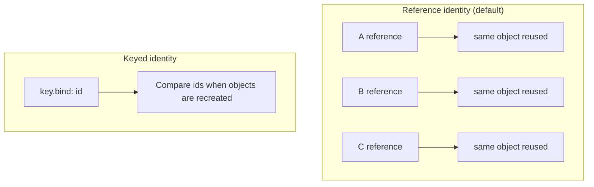

### Contextual Properties

| Property | Description                           | Example Values (list of 3) |
|----------|---------------------------------------|-----------------------------|
| `$index` | Zero-based index                      | `0`, `1`, `2`               |
| `$first` | True only for the first item          | `true`, `false`, `false`    |
| `$last`  | True only for the last item           | `false`, `false`, `true`    |
| `$even`  | True when `$index % 2 === 0`          | `true`, `false`, `true`     |
| `$odd`   | True when `$index % 2 === 1`          | `false`, `true`, `false`    |
| `$length`| Total length of the iterable          | `3`                         |
| `item`   | Current iteration value               | `'Apple'`, `'Banana'`, `'Cherry'` |

## Event Binding: Trigger vs Capture

### Bubbling Phase (.trigger)

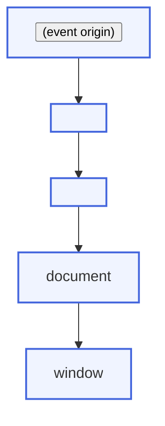

`.trigger` listens during the bubble phase as the event travels from the target back toward the window.

### Capturing Phase (.capture)

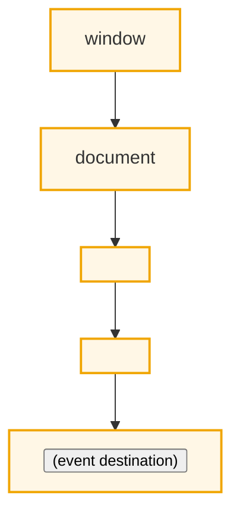

`.capture` intercepts the event on its way down the DOM tree before child handlers run.

### Event Flow Complete Picture

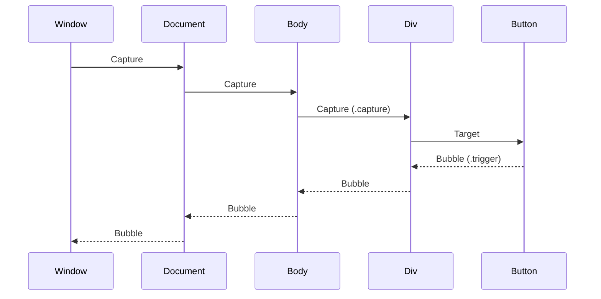

## Value Converters Pipeline

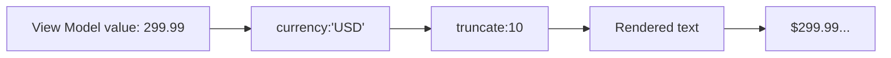

### Converter Flow Detail

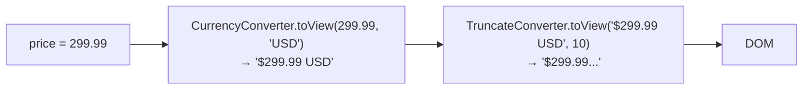

## Component Communication

### Parent → Child (Bindable Properties)

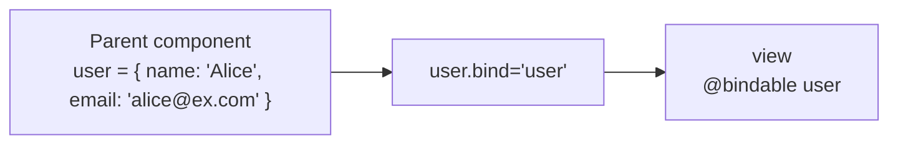

```html
<user-card user.bind="user"></user-card>
```

### Child → Parent (Callback Binding)

Use `.bind` to pass a callback reference to the child now that the deprecated `.call` binding command is gone.

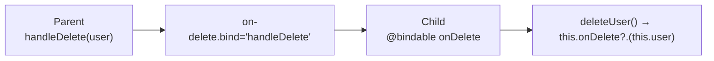

```html
<!-- Parent template -->
<user-card user.bind="user" on-delete.bind="handleDelete"></user-card>

// Child view-model
import { bindable } from '@aurelia/runtime-html';

export class UserCard {
  @bindable() public onDelete: (user: User) => void;

  deleteUser(): void {
    this.onDelete?.(this.user);
  }
}
```

## Form Checkbox Collections

```mermaid
flowchart TD
    products["products = [{ id:1, name:'Mouse' }, { id:2, name:'Keyboard' }]"] --> repeat["<label repeat.for='p of products'>"]
    repeat --> checkbox["<input type=checkbox<br/>model.bind='p.id'<br/>checked.bind='selectedIds'>"]
    checkbox --> logic{Checked?}
    logic -->|Yes| add[Add model value to selectedIds]
    logic -->|No| remove[Remove model value from selectedIds]
```

When the user checks "Keyboard", Aurelia pushes `2` into `selectedIds`. Unchecking "Mouse" removes `1`, keeping the array aligned with the checked boxes.

## Template Lifecycle

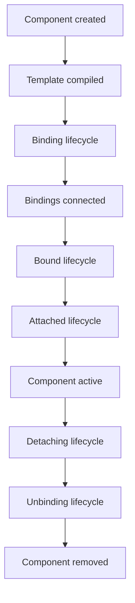

## Performance: Binding Modes Comparison

| Binding Mode | Setup Cost | Updates | Memory Footprint | Typical Use |
|--------------|------------|---------|------------------|-------------|
| `.one-time`  | Set value once | Never updates | No observers hooked up | Static text that never changes |
| `.one-way` / `.to-view` | Set value + observer | Whenever property changes | One source observer | Displaying reactive state |
| `.bind` (.two-way) | Bidirectional observers | View ↔ ViewModel | Source observer + DOM listener | Form controls that read/write |

Internals note: the `PropertyBinding.bind` implementation wires observers based on the binding mode flags. `.one-time` evaluates the expression once without connecting, `.one-way` connects the source side so it can re-run when dependencies change, and `.bind`/`.two-way` also subscribes to the target observer (for example, an input element) so user input flows back to the view model. This mirrors the logic in `packages/runtime-html/src/binding/property-binding.ts` where `toView`, `fromView`, and `oneTime` determine which observers are created.

## Computed Properties Reactivity

```ts
items = [
  { price: 10, qty: 2 },
  { price: 20, qty: 1 }
];

get total() {
  return this.items.reduce((sum, item) => sum + item.price * item.qty, 0);
}
```

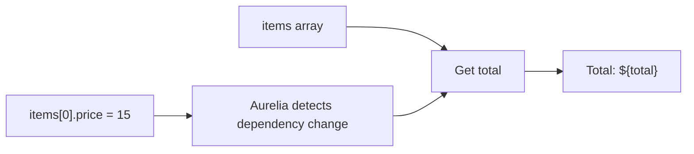

Aurelia re-runs getters whenever any accessed dependency (the array itself or a member property) mutates, then propagates the new value into the DOM.

## Related Documentation

- [Template Syntax Overview](template-syntax/overview.md)
- [Cheat Sheet](CHEAT_SHEET.md)
- [Conditional Rendering](conditional-rendering.md)
- [List Rendering](repeats-and-list-rendering.md)
- [Event Binding](template-syntax/event-binding.md)
- [Value Converters](value-converters.md)
