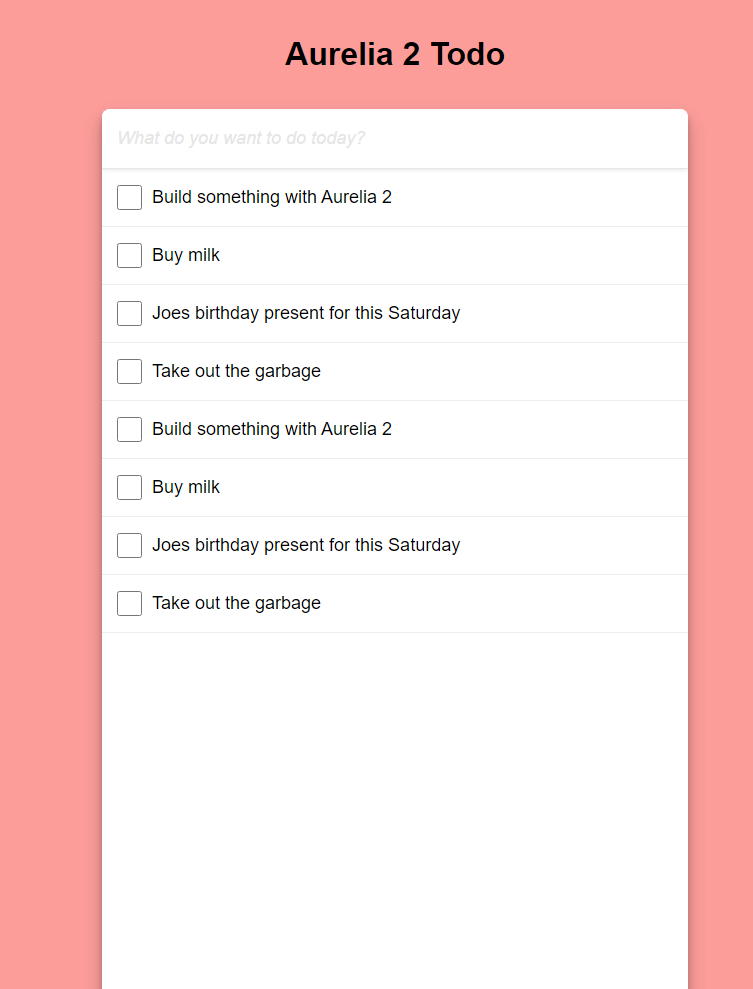

# Building a todo application


**Just want the code?** You can find the code for this tutorial on GitHub [here](https://github.com/Vheissu/aurelia2-todo). Feel free to use this code as a guide or even starting point for your own Aurelia applications.


Todo applications are overdone, but it is hard to argue that they do not showcase some common Javascript framework or library features. For example, working with collections of data, binding to events, calling functions, and mutating values.

## What we will be building

A todo application comprised of the following features:

* Displays a list of one or more todo items
* Todo items can be completed (a strikethrough will denote a completed todo)
* Todo items can be deleted
* Todo items can be added and will be pushed to the top of the list.


See what you are getting yourself into before you continue. There is a working example of this application [here](https://upbeat-clarke-fe622b.netlify.app/).


## Prerequisites

Before going any further, you should be familiar with some basic Aurelia concepts and some fundamental Javascript ones. While **these are not hard prerequisites**, please know that some concepts used in this tutorial out of context might be confusing or difficult to understand.

* You have familiarized yourself with the [Aurelia template syntax](../templates/template-syntax.md).
* You have familiarized yourself with [components in Aurelia](../components/components.md).
* You are familiar with [Dependency Injection](../getting-to-know-aurelia/dependency-injection-di/). You don't need to be a master of it; you just need to be familiar with its existence and why it matters in Aurelia.

## Create the app

When creating a new Aurelia 2 application, using the CLI is considered best practice. You can type `npx makes aurelia` to do this, but we will give you the shorthand syntax to do this faster for this tutorial.

```bash
npx makes aurelia new-project-name -s dev
```

Unlike other tutorials in the Aurelia 2 docs, we will not use any CSS preprocessors, only plain old Javascript instead of TypeScript (Aurelia can support both). This tutorial highlights just how basic an Aurelia application can be: CSS, Javascript and HTML.

## Add some base styling

Because this is an Aurelia tutorial, we are not going to delve into the CSS. To provide you with a beautiful todo list, all styling is provided.

Copy and paste the following CSS and add it into `my-app.css`, which should have been created as part of the CLI generation (if not, create it). This just gives us a nice font and some CSS grid styling for the layout to make our todo application look like a proper app and not a backyard DIY job.

```css
@import url('https://fonts.googleapis.com/css2?family=Roboto:ital,wght@0,400;0,700;1,400;1,700&display=swap');

*, *:before, *:after {
  box-sizing: border-box;
  margin: 0;
  padding: 0;
}

.todo {
  background: #FC9D9A;
  display: grid;
  grid-template-columns: 1fr 550px 1fr;
  grid-template-rows: 110px 9fr 1fr;
  font-family: 'Roboto', sans-serif;
  height: 100vh;
  width: 100vw;
}

.todo h1 {
  align-self: center;
  grid-column: 2;
  justify-self: center;
}

button {
  background: none;
  border: none;
  color: #333;
  font-size: 28px;
}
```

## Create the todo component

The todo component will be the main part of our application. It will contain the logic and markup for our entire app, with a singular child component for the todo items themselves being the only other component (we will create that one next).

Create three new files inside of a folder called `components`

* **todo-component.html**
* **todo-component.js**
* **todo-component.css**

The todo-component.html file is our view, todo-component.js is our view model, and todo-component.css is the styling that gets automatically included because it matches our component name.

### Create the view model

Open up `todo-component.js` first as this will contain the most code and some example todos as well:

```javascript
export class TodoComponent {
    todo = '';

    todos = [
        { completed: false, text: 'Build something with Aurelia 2' },
        { completed: false, text: 'Buy milk' },
        { completed: false, text: 'Joes birthday present for this Saturday' },
        { completed: false, text: 'Take out the garbage' },
        { completed: false, text: 'Build something with Aurelia 2' },
        { completed: false, text: 'Buy milk' },
        { completed: false, text: 'Joes birthday present for this Saturday' },
        { completed: false, text: 'Take out the garbage' }
    ];

    newTodo(event) {
        if (event.which === 13) {
            this.todos.unshift({ completed: false, text: this.todo });
            this.todo = '';
        }

        return true;
    }

    deleteTodo(index) {
        this.todos.splice(index, 1);
    }
}
```

**Let's go over this view model code line-by-line:**

* We export a class, which is the name of our component
* **Line 2:** We create an empty string called `todo`. This is where any todos we author are stored temporarily
* **Line 4:** an array of todo items (and any new ones that get added)
* **Line 15:** `newTodo` is a function that gets called on keypress in the view
  * We check if the key pressed is enter (keycode 13)
  * If it is, we `unshift` our todo into the `todos` array
  * We then reset the `todo` property
* **Line 21:** Aurelia will prevent all events by default when you bind to them, so we need to return true outside of our if statement or typing will break in our input field
* **Line 24:** `deleteTodo` will remove a todo from our `todos` array and is passed an index
  * We call Array.splice on the `todos` array and tell it we want to delete one item

Believe it or not, this view model code forms the basis for adding and deleting todos. The code would be much smaller if we didn't have example todos in there.

### Create the view

The view is the most simple part of our application. Inside of `todo-component.html` add in the following HTML, and then we'll explain what is going on.

```html
<import from="./todo-item.html"></import>

<div class="todo">
    <h1>Aurelia 2 Todo</h1>

    <div class="todo-container">
        <div class="todo-compose">
            <input type="text" value.bind="todo" keypress.trigger="newTodo($event)" placeholder="What do you want to do today?">
        </div>

        <div class="todo-items">
            <todo-item repeat.for="todo of todos" todo.bind="todo" index.bind="$index" delete-todo.bind="() => deleteTodo($index)"></todo-item>
        </div>
    </div>
</div>
```

* **Line 1:** importing an as-of-yet nonexistent todo-item component
* **Line 8:** we define a text input field and bind its value to `todo` and also a `keypress.trigger` to listen to keyboard events (we want to know when the user hits enter)
* **Line 12:** using a repeater, we are looping over the todos in our view model and binding them onto the `todo-item` element
  * `todo.bind="todo"` we have a bindable property defined on the `todo-item` element called todo
  * `index.bind="$index"` another bindable property defined in the `todo-item` element, we pass in the current loop index denoted by its special simple prefix `$index`
  * `delete-todo.bind="() => deleteTodo($index)"` this is a callback function that will call `deleteTodo` when a todo is deleted from inside of the `todo-item`

Let's now quickly add in some styling for our todo component. Open up `todo-component.css` and add in the following. This will make our todo items pretty and sit nicely. We are using CSS Grid for this part.

```css
.todo-container {
    background: white;
    border-radius: 8px;
    box-shadow: 0 10px 20px rgba(0, 0, 0, 0.19), 0 6px 6px rgba(0, 0, 0, 0.23);
    display: grid;
    grid-template-rows: 60px 1fr;
    grid-column: 2;
    grid-row: 2;
    overflow: auto;
    margin-right: -18px;
    margin-left: -18px;
}

.todo-compose {
    align-items: stretch;
    box-shadow: 0 -1px 6px rgba(0, 0, 0, 0.19);
    border-bottom: 1px solid #e6e6e6;
    display: grid;
    grid-template-columns: 1fr;
    grid-template-rows: 60px;
}

    .todo-compose button {
        color: #e6e6e6;
        justify-self: stretch;
        text-align: center;
    }

    .todo-compose input {
        border: none;
        border-bottom: 1px solid #e6e6e6;
        font-size: 18px;
        outline: none;
        padding: 15px;
    }

.todo-items {
    display: grid;
    grid-auto-columns: 1fr;
    grid-auto-rows: max-content;
    list-style-type: none;
    overflow: auto;
}

::placeholder {
    color: #e6e6e6;
    font-style: italic;
  }
```

## Create the todo item component using HTML only

We have created our main todo component, but you might have noticed we were importing a file that doesn't exist yet `todo-item.html`. Let's create that right now.

For this component, we are going to be creating an HTML-only component. It means it'll just be HTML. No view model needed:

```html
<bindable name="todo"></bindable>
<bindable name="index"></bindable>
<bindable name="deleteTodo"></bindable>

<div class="todo-item" completed.class="todo.completed">
    <input type="checkbox" checked.bind="todo.completed">
    <p contenteditable="true" spellcheck="false">${todo.text}</p>
    <button type="button" click.trigger="deleteTodo()">x</button>
</div>
```

* **Lines 1,2 & 3:** The bindable attribute allows us to specify bindable properties for our custom element. This allows us to bind to these values and read them inside of our view. The `deleteTogo` bindable is interesting because it is bindable for a function that gets passed in.
* **Line 5:** we use the `.class` binding to add a class to our element of `completed` if the `todo.completed` property is true or remove it if it's false.
* **Line 6:** We bind the native checkbox `checked` event to the `completed` property, which sets it to true or false
* **Line 7:** We are making our paragraph element a `contenteditable` element, which allows it to be edited (it doesn't save, but we can temporarily edit our text). We also display the text value using our interpolation `${}`
* **Line 8:** Lastly, we have a `click.trigger` to call our passed-in `deleteTodo` bindable function callback when clicked

## Styling for our todo item component

Even though our `todo-item.html` component is HTML only and has no view model, Aurelia's default conventions still work. This means creating a CSS file called `todo-item.css` it will automatically be included when we reference our element.

Create a new file `todo-item.css` in the `components` directory and add the following:

```css
.todo-item {
    align-items: center;
    border-bottom: 1px solid #ededed;
    display: grid;
    grid-template-columns: 50px 450px 50px;
    word-wrap: break-word;
}

.todo-item input[type="checkbox"] {
    height: 25px;
    margin-left: 15px;
    width: 25px;
}

.todo-item.completed {
    color: #D9D9DD;
    text-decoration: line-through;
}

.todo-item p {
    box-shadow: none;
    font-size: 18px;
    outline: none;
    padding: 18px 0;
}

.todo-item p:focus {
    font-weight: bold;
}

.todo-item button {
    color: red;
    cursor: pointer;
    font-size: 24px;
    justify-self: end;
    visibility: hidden;
}

.todo-item:hover button {
    visibility: visible;
}
```

## Bringing it together and running your app

To round it all off, let's open up `my-app.html` and add the following:

```html
<import from="./components/todo-component"></import>

<todo-component></todo-component>
```

This forms the basis of our application. The `todo-component` custom element is the main application container for our app. We import it and then reference it by its HTML tag name.

Now, let's run the app: `npm start` on the command line and wait for the browser to open. You should see a functioning todo list application. It should look something like the following screenshot. Type into the todo input field and hit enter to see it works.



If you missed the link initially, a working example can be seen [here](https://upbeat-clarke-fe622b.netlify.app/). The code for this tutorial can also be found [on GitHub here](https://github.com/Vheissu/aurelia2-todo).
