# Micro-frontends with Module Federation

Module Federation enables independent deployment and development of micro-frontends by allowing different Aurelia applications to share code and components at runtime. This guide covers implementing Module Federation with both Webpack 5 and Vite for maximum flexibility.

## Understanding Module Federation

Module Federation allows you to:
- **Share components** between Aurelia applications at runtime
- **Deploy independently** without coordinating releases
- **Load modules dynamically** from remote applications
- **Avoid code duplication** across micro-frontends
- **Mix technology stacks** (Aurelia with React, Vue, etc.)

## Architecture Overview

```mermaid
graph TB
    Shell["🏠 Shell App<br/>(Host)<br/><br/>• Router<br/>• Navigation<br/>• Shared UI"]
    Product["📦 Product App<br/>(Remote)<br/><br/>• ProductList<br/>• ProductDetail"]
    User["👤 User App<br/>(Remote)<br/><br/>• UserProfile<br/>• UserSettings"]

    Shell <--> Product
    Shell --> User

    classDef hostApp fill:#e1f5fe,stroke:#01579b,stroke-width:3px,color:#000
    classDef remoteApp fill:#f3e5f5,stroke:#4a148c,stroke-width:2px,color:#000

    class Shell hostApp
    class Product,User remoteApp
```



## Webpack 5 Module Federation

### 1. Install Dependencies

```bash
npm install webpack@5 webpack-cli webpack-dev-server html-webpack-plugin
npm install aurelia ts-loader html-loader
```

### 2. Configure the Remote Application (Product App)

**webpack.config.js:**

```javascript
const { ModuleFederationPlugin } = require('webpack').container;
const HtmlWebpackPlugin = require('html-webpack-plugin');

module.exports = {
  mode: 'development',
  devServer: {
    port: 4001,
    headers: {
      'Access-Control-Allow-Origin': '*',
    },
  },
  module: {
    rules: [
      {
        test: /\.ts$/,
        use: 'ts-loader',
        exclude: /node_modules/,
      },
      {
        test: /\.html$/i,
        use: 'html-loader',
      },
    ],
  },
  plugins: [
    new ModuleFederationPlugin({
      name: 'productApp',
      filename: 'remoteEntry.js',
      exposes: {
        './ProductList': './src/components/product-list',
        './ProductDetail': './src/components/product-detail',
        './ProductModule': './src/product-module',
      },
      shared: {
        aurelia: {
          singleton: true,
          requiredVersion: '^2.0.0',
        },
      },
    }),
    new HtmlWebpackPlugin({
      template: './src/index.html',
    }),
  ],
  resolve: {
    extensions: ['.ts', '.js'],
  },
};
```

### 3. Create Exposed Components

**src/components/product-list.ts:**

```typescript
import { customElement, bindable } from 'aurelia';

export interface Product {
  id: number;
  name: string;
  price: number;
}

@customElement({
  name: 'product-list',
  template: `
    <template>
      <div class="product-grid">
        <div class="product-card" repeat.for="product of products">
          <h3>\${product.name}</h3>
          <p>$\${product.price}</p>
          <button click.trigger="selectProduct(product)">
            View Details
          </button>
        </div>
      </div>
    </template>
  `
})
export class ProductList {
  @bindable public products: Product[] = [];
  @bindable public onProductSelect?: (product: Product) => void;

  public selectProduct(product: Product): void {
    this.onProductSelect?.(product);
  }
}
```

**src/product-module.ts:**

```typescript
import { IContainer, IRegistry } from 'aurelia';
import { ProductList } from './components/product-list';
import { ProductDetail } from './components/product-detail';

export const ProductModule: IRegistry = {
  register(container: IContainer): void {
    container.register(ProductList, ProductDetail);
  }
};
```

### 4. Configure the Host Application (Shell App)

**webpack.config.js:**

```javascript
const { ModuleFederationPlugin } = require('webpack').container;
const HtmlWebpackPlugin = require('html-webpack-plugin');

module.exports = {
  mode: 'development',
  devServer: {
    port: 4000,
    historyApiFallback: true,
  },
  module: {
    rules: [
      {
        test: /\.ts$/,
        use: 'ts-loader',
        exclude: /node_modules/,
      },
      {
        test: /\.html$/i,
        use: 'html-loader',
      },
    ],
  },
  plugins: [
    new ModuleFederationPlugin({
      name: 'shell',
      remotes: {
        productApp: 'productApp@http://localhost:4001/remoteEntry.js',
        userApp: 'userApp@http://localhost:4002/remoteEntry.js',
      },
      shared: {
        aurelia: {
          singleton: true,
          requiredVersion: '^2.0.0',
        },
      },
    }),
    new HtmlWebpackPlugin({
      template: './src/index.html',
    }),
  ],
  resolve: {
    extensions: ['.ts', '.js'],
  },
};
```

### 5. Dynamic Loading in Host Application

**src/components/micro-frontend-loader.ts:**

```typescript
import { customElement, bindable, IContainer } from 'aurelia';

@customElement({
  name: 'micro-frontend-loader',
  template: `
    <template>
      <div if.bind="loading">Loading micro-frontend...</div>
      <div if.bind="error" class="error">
        Failed to load micro-frontend: \${error}
      </div>
      <div if.bind="!loading && !error" ref="container"></div>
    </template>
  `
})
export class MicroFrontendLoader {
  @bindable public remoteName: string = '';
  @bindable public moduleName: string = '';
  @bindable public componentName: string = '';

  private container!: HTMLElement;
  private loading = false;
  private error: string | null = null;

  constructor(private aurelia: IContainer) {}

  public async attached(): Promise<void> {
    if (!this.remoteName || !this.moduleName) {
      this.error = 'Remote name and module name are required';
      return;
    }

    await this.loadMicroFrontend();
  }

  private async loadMicroFrontend(): Promise<void> {
    this.loading = true;
    this.error = null;

    try {
      // Dynamic import from remote
      const remoteModule = await import(
        `${this.remoteName}/${this.moduleName}`
      );

      if (this.componentName) {
        // Load specific component
        const ComponentClass = remoteModule[this.componentName];
        if (ComponentClass) {
          // Register and render component
          this.aurelia.register(ComponentClass);
          // Custom rendering logic here
        }
      } else {
        // Load entire module registry
        const moduleRegistry = remoteModule.default || remoteModule[this.moduleName];
        if (moduleRegistry && typeof moduleRegistry.register === 'function') {
          moduleRegistry.register(this.aurelia);
        }
      }
    } catch (err) {
      console.error('Failed to load micro-frontend:', err);
      this.error = err instanceof Error ? err.message : 'Unknown error';
    } finally {
      this.loading = false;
    }
  }
}
```

**src/my-app.ts:**

```typescript
import { route } from '@aurelia/router';

@route({
  routes: [
    { path: '', redirectTo: 'home' },
    { path: 'home', component: () => import('./views/home') },
    {
      path: 'products',
      component: () => import('./views/products-shell'),
      title: 'Products'
    },
    {
      path: 'users',
      component: () => import('./views/users-shell'),
      title: 'Users'
    }
  ]
})
export class MyApp {
  public message = 'Shell Application';
}
```

**src/views/products-shell.html:**

```html
<template>
  <div class="products-page">
    <h2>Products (Micro-frontend)</h2>
    <micro-frontend-loader
      remote-name="productApp"
      module-name="ProductList"
      component-name="ProductList">
    </micro-frontend-loader>
  </div>
</template>
```

## Vite Module Federation

### 1. Install Dependencies

```bash
npm install vite @vitejs/plugin-legacy
npm install @originjs/vite-plugin-federation
# Alternative: npm install @module-federation/vite
```

### 2. Configure Remote Application

**vite.config.ts:**

```typescript
import { defineConfig } from 'vite';
import federation from '@originjs/vite-plugin-federation';

export default defineConfig({
  plugins: [
    federation({
      name: 'productApp',
      filename: 'remoteEntry.js',
      exposes: {
        './ProductList': './src/components/product-list.ts',
        './ProductModule': './src/product-module.ts',
      },
      shared: {
        aurelia: {
          singleton: true,
        },
      },
    }),
  ],
  server: {
    port: 4001,
    cors: true,
  },
  build: {
    target: 'esnext',
    minify: false,
    cssCodeSplit: false,
  },
});
```

### 3. Configure Host Application

**vite.config.ts:**

```typescript
import { defineConfig } from 'vite';
import federation from '@originjs/vite-plugin-federation';

export default defineConfig({
  plugins: [
    federation({
      name: 'shell',
      remotes: {
        productApp: 'http://localhost:4001/assets/remoteEntry.js',
        userApp: 'http://localhost:4002/assets/remoteEntry.js',
      },
      shared: {
        aurelia: {
          singleton: true,
        },
      },
    }),
  ],
  server: {
    port: 4000,
  },
  build: {
    target: 'esnext',
    minify: false,
    cssCodeSplit: false,
  },
});
```

## Advanced Patterns

### Error Boundaries and Fallbacks

**src/components/micro-frontend-boundary.ts:**

```typescript
import { customElement, bindable } from 'aurelia';

@customElement({
  name: 'micro-frontend-boundary',
  template: `
    <template>
      <div if.bind="hasError" class="error-boundary">
        <h3>Something went wrong</h3>
        <p>\${errorMessage}</p>
        <button click.trigger="retry()">Retry</button>
      </div>
      <div if.bind="!hasError">
        <slot></slot>
      </div>
    </template>
  `
})
export class MicroFrontendBoundary {
  @bindable public onError?: (error: Error) => void;

  private hasError = false;
  private errorMessage = '';

  public handleError(error: Error): void {
    this.hasError = true;
    this.errorMessage = error.message;
    this.onError?.(error);
    console.error('Micro-frontend error:', error);
  }

  public retry(): void {
    this.hasError = false;
    this.errorMessage = '';
    // Trigger re-render of child content
  }
}
```

### Shared State Management

**src/services/micro-frontend-state.ts:**

```typescript
import { IEventAggregator, singleton } from 'aurelia';

export interface MicroFrontendMessage {
  source: string;
  type: string;
  payload: any;
}

@singleton()
export class MicroFrontendState {
  constructor(private eventAggregator: IEventAggregator) {}

  public publish(message: MicroFrontendMessage): void {
    this.eventAggregator.publish('micro-frontend:message', message);
  }

  public subscribe(callback: (message: MicroFrontendMessage) => void): void {
    this.eventAggregator.subscribe('micro-frontend:message', callback);
  }

  public shareData(key: string, data: any): void {
    (window as any).__SHARED_STATE__ = (window as any).__SHARED_STATE__ || {};
    (window as any).__SHARED_STATE__[key] = data;
  }

  public getData(key: string): any {
    return (window as any).__SHARED_STATE__?.[key];
  }
}
```

## Performance Optimizations

### Preloading Remote Modules

```typescript
// Preload critical micro-frontends
const preloadModules = async () => {
  try {
    // Preload but don't execute
    await import(/* webpackPreload: true */ 'productApp/ProductModule');
  } catch (error) {
    console.warn('Failed to preload module:', error);
  }
};

// Call during app initialization
preloadModules();
```

### Lazy Loading Strategy

```typescript
@customElement({
  name: 'lazy-micro-frontend',
  template: `
    <template>
      <div class="intersection-observer" ref="trigger">
        <div if.bind="visible">
          <micro-frontend-loader
            remote-name.bind="remoteName"
            module-name.bind="moduleName">
          </micro-frontend-loader>
        </div>
      </div>
    </template>
  `
})
export class LazyMicroFrontend {
  @bindable public remoteName: string = '';
  @bindable public moduleName: string = '';

  private trigger!: HTMLElement;
  private visible = false;

  public attached(): void {
    const observer = new IntersectionObserver((entries) => {
      if (entries[0].isIntersecting) {
        this.visible = true;
        observer.disconnect();
      }
    });

    observer.observe(this.trigger);
  }
}
```

## Best Practices

### 1. Versioning Strategy
- Use semantic versioning for shared dependencies
- Pin major versions to avoid breaking changes
- Test compatibility across micro-frontends

### 2. Development Workflow
```bash
# Start all micro-frontends in development
npm run dev:shell    # Port 4000
npm run dev:products # Port 4001
npm run dev:users    # Port 4002
```

### 3. Production Deployment
- Deploy each micro-frontend independently
- Use CDN for shared dependencies
- Implement health checks for remote modules
- Set up monitoring for failed module loads

### 4. Testing Strategy
- Unit test components in isolation
- Integration test the shell application
- E2E test critical user journeys
- Contract testing between micro-frontends

This Module Federation setup enables scalable micro-frontend architectures with Aurelia 2, supporting both Webpack 5 and Vite build systems while maintaining independent development and deployment capabilities.
